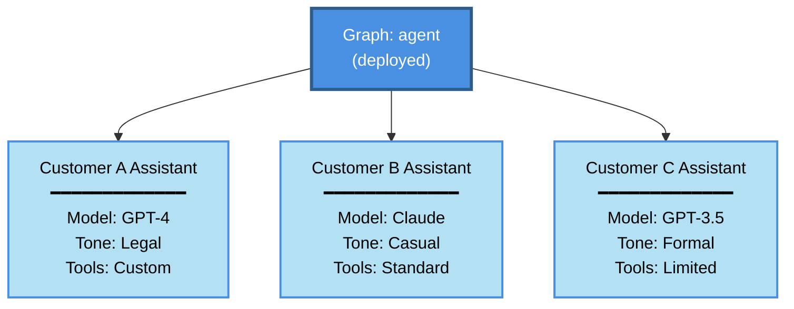
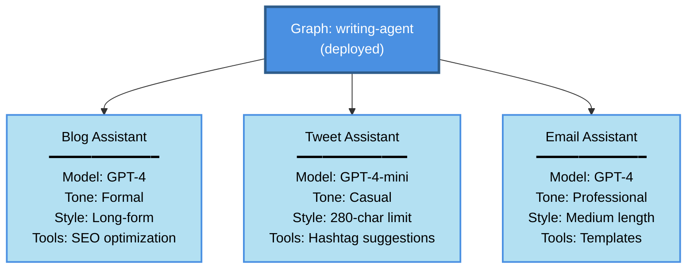
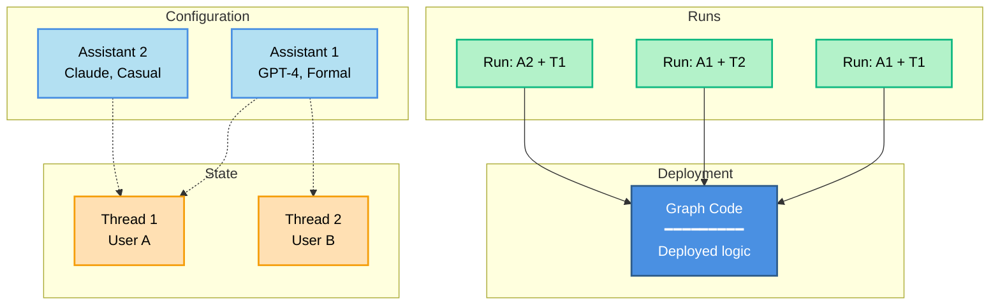

_Assistants_ allow you to manage configurations (e.g., prompts, LLM selection, tools) separately from your graph's core logic. This enables you to create multiple, specialized versions of the same graph architecture with different behavior at runtime. Through configuration variations (rather than structural graph changes), each assistant is optimized for a different [use case](#when-to-use-assistants).

For example, imagine a general-purpose writing agent built on a common graph architecture. While the structure remains the same, different writing styles—such as blog posts and tweets—require tailored configurations to optimize performance. To support these variations, you can create multiple assistants (e.g., one for blogs and another for tweets) that share the underlying graph but differ in model selection and system prompt.


The Agent Server API provides several endpoints for creating and managing assistants and their versions. See the [API reference](/langsmith/server-api-ref) for more details.

<Info>
Assistants are a [LangSmith Deployment](/langsmith/deployments) concept. They are not available in the open source LangGraph library.
</Info>

## When to use assistants

Assistants are ideal when you need to deploy the same graph architecture with different configurations. Common use cases include:

- **User-level personalization**
  - Customize model selection, system prompts, or tool availability per user.
  - Store user preferences and apply them automatically to each interaction.
  - Enable users to choose between different AI personalities or expertise levels.

- **Customer or organization-specific configurations**
  - Maintain separate configurations for different customers or organizations.
  - Customize behavior for each client without deploying separate infrastructure.
  - Isolate configuration changes to specific customers.



- **Environment-specific configurations**
  - Use different models or settings for development, staging, and production.
  - Test configuration changes in staging before promoting to production.
  - Reduce costs in non-production environments with smaller models.

- **A/B testing and experimentation**
  - Compare different prompts, models, or parameter settings.
  - Roll out configuration changes gradually to a subset of users.
  - Measure performance differences between configuration variants.

- **Specialized task variants**
  - Create domain-specific versions of a general-purpose agent.
  - Optimize configurations for different languages, regions, or industries.
  - Maintain consistent graph logic while varying the execution details.



## How assistants work with deployments

When you deploy a graph with LangSmith Deployment, [Agent Server](/langsmith/agent-server) automatically creates a **default assistant** tied to that graph's default configuration. You can then create additional assistants for the same graph, each with its own configuration.

If your deployment defines multiple graphs in [`langgraph.json`](/langmsith/application-structure#configuration-file), each graph gets its own default assistant:

```json
{
    "graphs": {
        "graph_id_1": "path_to_graph_id_1",  // default assistant created for graph_id_1
        "graph_id_2": "path_to_graph_id_2"   // default assistant created for graph_id_2
    }
}
```

That is, there can be multiple default assistants—one for each graph defined in your deployment.

Assistants have several key features:

- **[Managed via API and UI](/langsmith/configuration-cloud)**: Create, list, update, version, and get assistants using the Agent Server/LangGraph SDKs or the [LangSmith UI](https://smith.langchain.com).
- **One graph, multiple assistants**: A single deployed graph can support multiple assistants, each with different configurations (e.g., prompts, models, tools).
- **[Versioned](#versioning) configurations**: Each assistant maintains its own configuration history through versioning. Editing an assistant creates a new version, and you can promote or roll back to any version.
- **[Configuration](#configuration) updates without graph changes**: Update prompts, model selection, and other settings through assistant configurations, enabling rapid iteration without modifying or redeploying your graph code.

<Note>
When invoking an assistant, you can specify either in [`langgraph.json`](/langsmith/application-structure#configuration-file):
- A **graph ID** (e.g., `"agent"`): Uses the default assistant for that graph
- An **assistant ID** (UUID): Uses a specific assistant configuration

This flexibility allows you to quickly test with default settings or precisely control which configuration is used.
</Note>

### Configuration

Assistants build on the LangGraph open source concept of [configuration](/oss/python/langgraph/graph-api#runtime-context).

While configuration is available in the open source LangGraph library, assistants are only present in [LangSmith Deployment](/langsmith/deployments) because they are tightly coupled to your deployed graph. Upon deployment, [Agent Server](/langsmith/agent-server) will automatically create a default assistant for each graph using the graph's default configuration settings.

In practice, an assistant is just an _instance_ of a graph with a specific configuration. Therefore, multiple assistants can reference the same graph but can contain different configurations (e.g. prompts, models, tools). The LangSmith Deployment API provides several endpoints for creating and managing assistants. See the [API reference](/langsmith/server-api-ref) and [this how-to](/langsmith/configuration-cloud) for more details on how to create assistants.

### Versioning

Assistants support versioning to track changes over time. Once you've created an assistant, subsequent edits will automatically create new versions.

- Each update creates a new version of the assistant.
- You can promote any version to be the active version.
- Rolling back to a previous version is as simple as setting it as active.
- All versions remain available for reference and rollback.

<Warning>
When updating an assistant, you must provide the entire configuration payload. The update endpoint creates new versions from scratch and does not merge with previous versions. Make sure to include all configuration fields you want to retain.
</Warning>

For more details on how to manage assistant versions, refer to the [Manage assistants guide](/langsmith/configuration-cloud#create-a-new-version-for-your-assistant).

### Execution

A _run_ is an invocation of an assistant. When you execute a run, you specify which assistant to use (either by graph ID for the default assistant or by assistant ID for a specific configuration).



This diagram shows how a **run** combines an assistant with a thread to execute the graph:

- **Graph** (blue): The deployed code containing your agent's logic
- **Assistants** (light blue): Configuration options (model, prompts, tools)
- **Threads** (orange): State containers for conversation history
- **Runs** (green): Executions that pair an assistant + thread

**Example combinations:**
- **Run: A1 + T1**: Assistant 1 configuration applied to User A's conversation
- **Run: A1 + T2**: Same assistant serving User B (different conversation)
- **Run: A2 + T1**: Different assistant applied to User A's conversation (configuration switch)

When executing a run:

- Each run may have its own input, configuration overrides, and metadata.
- Runs can be stateless (no thread) or stateful (executed on a [thread](/oss/python/langgraph/persistence#threads) for conversation persistence).
- Multiple runs can use the same assistant configuration.
- The assistant's configuration affects how the underlying graph executes.

The Agent Server API provides several endpoints for creating and managing runs. For more details, refer to the [API reference](/langsmith/server-api-ref)).

---

<Callout icon="pen-to-square" iconType="regular">
    [Edit this page on GitHub](https://github.com/langchain-ai/docs/edit/main/src/langsmith/assistants.mdx) or [file an issue](https://github.com/langchain-ai/docs/issues/new/choose).
</Callout>
<Tip icon="terminal" iconType="regular">
    [Connect these docs](/use-these-docs) to Claude, VSCode, and more via MCP for real-time answers.
</Tip>
