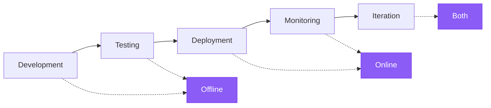

LLM outputs are non-deterministic, which makes response quality hard to assess. Evaluations (evals) are a way to breakdown what "good" looks like and measure it. LangSmith Evaluation provides a framework for measuring quality throughout the application lifecycle, from pre-deployment testing to production monitoring.

## What to evaluate

Before building evaluations, identify what matters for your application. Break down your system into its critical components—LLM calls, retrieval steps, tool invocations, output formatting—and determine quality criteria for each.

**Start with manually curated examples.** Create 5-10 examples of what "good" looks like for each critical component. These examples serve as your ground truth and inform which evaluation approaches to use. For instance:
- **RAG system**: Examples of good retrievals (relevant documents) and good answers (accurate, complete).
- **Agent**: Examples of correct tool selection and proper argument formatting or trajectory that the agent took.
- **Chatbot**: Examples of helpful, on-brand responses that address user intent.

Once you've defined "good" through examples, you can measure how often your system produces similar quality outputs.

## Offline and online evaluations

LangSmith supports two types of evaluations that serve different purposes in your development workflow:

### Offline evaluations

<Icon icon="flask" iconType="solid" /> Use offline evaluations for **pre-deployment testing**:
- **Benchmarking**: Compare multiple versions to find the best performer.
- **Regression testing**: Ensure new versions don't degrade quality.
- **Unit testing**: Verify correctness of individual components.
- **Backtesting**: Test new versions against historical data.

Offline evaluations target [_examples_](#examples) from [_datasets_](#datasets)—curated test cases with reference outputs that define what "good" looks like.

### Online evaluations

<Icon icon="radar" iconType="solid" /> Use online evaluations for **production monitoring**:
- **Real-time monitoring**: Track quality continuously on live traffic.
- **Anomaly detection**: Flag unusual patterns or edge cases.
- **Production feedback**: Identify issues to add to offline datasets.

Online evaluations target [_runs_](#runs) and [_threads_](#threads) from [tracing](/langsmith/observability-quickstart)—real production traces without reference outputs.

This difference in targets determines what you can evaluate: offline evaluations can check correctness against expected answers, while online evaluations focus on quality patterns, safety, and real-world behavior.

## Evaluation lifecycle

As you develop and [deploy your application](/langsmith/deployments), your evaluation strategy evolves from pre-deployment testing to production monitoring. During development and testing, offline evaluations validate functionality against curated datasets. After deployment, online evaluations monitor production behavior on live traffic. As applications mature, both evaluation types work together in an iterative feedback loop to improve quality continuously.

### 1. Development with offline evaluation

Before production deployment, use offline evaluations to validate functionality, benchmark different approaches, and build confidence.

Follow the [quickstart](/langsmith/evaluation-quickstart) to run your first offline evaluation.

### 2. Initial deployment with online evaluation

After deployment, use online evaluations to monitor production quality, detect unexpected issues, and collect real-world data.

Learn how to [configure online evaluations](/langsmith/online-evaluations-llm-as-judge) for production monitoring.

### 3. Continuous improvement

Use both evaluation types together in an iterative feedback loop. Online evaluations surface issues that become offline test cases, offline evaluations validate fixes, and online evaluations confirm production improvements.

## Core evaluation targets

Evaluations run on different targets depending on whether they are offline or online.

### Targets for offline evaluation

Offline evaluations run on datasets and examples. The presence of reference outputs enables comparison between expected and actual results.

#### Datasets

A dataset is a _collection of examples_ used for evaluating an application. An example is a test input, reference output pair.

#### Examples

Each example consists of:

- **Inputs**: a dictionary of input variables to pass to your application.
- **Reference outputs** (optional): a dictionary of reference outputs. These do not get passed to your application, they are only used in evaluators.
- **Metadata** (optional): a dictionary of additional information that can be used to create filtered views of a dataset.

Learn more about [managing datasets](/langsmith/manage-datasets).

#### Experiment

An _experiment_ represents the results of evaluating a specific application version on a dataset. Each experiment captures outputs, evaluator scores, and execution traces for every example in the dataset.

Multiple experiments typically run on a given dataset to test different application configurations (e.g., different prompts or LLMs). LangSmith displays all experiments associated with a dataset and supports [comparing multiple experiments](/langsmith/compare-experiment-results) side-by-side.

Learn [how to analyze experiment results](/langsmith/analyze-an-experiment).

### Targets for online evaluation

Online evaluations run on runs and threads from production traffic. Without reference outputs, evaluators focus on detecting issues, anomalies, and quality degradation in real-time.

#### Runs

A _run_ is a single execution trace from your [deployed application](/langsmith/deployments). Each run contains:
- **Inputs**: The actual user inputs your application received.
- **Outputs**: What your application actually returned.
- **Intermediate steps**: All the child runs (tool calls, LLM calls, and so on).
- **Metadata**: Tags, user feedback, latency metrics, etc.

Unlike examples in datasets, runs do not include reference outputs. Online evaluators must assess quality without knowing what the "correct" answer should be, relying instead on quality heuristics, safety checks, and reference-free evaluation techniques.

Learn more about [runs and traces in the Observability concepts](/langsmith/observability-concepts#runs).

#### Threads

_Threads_ are collections of related runs representing multi-turn conversations. Online evaluators can run at the thread level to evaluate entire conversations rather than individual turns. This enables assessment of conversation-level properties like coherence across turns, topic maintenance, and user satisfaction throughout an interaction.

## Evaluators

_Evaluators_ are functions that score application performance. They provide the measurement layer for both offline and online evaluation, adapting their inputs based on what data is available.

Run evaluators using the LangSmith SDK ([Python](https://docs.smith.langchain.com/reference/python/reference) and [TypeScript](https://docs.smith.langchain.com/reference/js)), via the [Prompt Playground](/langsmith/observability-concepts#prompt-playground), or by configuring [rules](/langsmith/rules) to run them automatically on tracing projects or datasets.

### Evaluator inputs

Evaluator inputs differ based on evaluation type:

**Offline evaluators** receive:
- [Example](#examples): The example from your [dataset](#datasets), containing inputs, reference outputs, and metadata.
- [Run](/langsmith/observability-concepts#runs): The actual outputs and intermediate steps from running the application on the example inputs.

**Online evaluators** receive:
- [Run](/langsmith/observability-concepts#runs): The production trace containing inputs, outputs, and intermediate steps (no reference outputs available).

### Evaluator outputs

Evaluators return **feedback**, which is the scores from evaluation. Feedback is a dictionary or list of dictionaries. Each dictionary contains:

- `key`: The metric name.
- `score` | `value`: The metric value (`score` for numerical metrics, `value` for categorical metrics).
- `comment` (optional): Additional reasoning or explanation for the score.

### Evaluation techniques

LangSmith supports several evaluation approaches:

- [Human](#human)
- [Code](#code)
- [LLM-as-judge](#llm-as-judge)
- [Pairwise](#pairwise)

#### Human

_Human evaluation_ involves manual review of application outputs and execution traces. This approach is [often an effective starting point for evaluation](https://hamel.dev/blog/posts/evals/#looking-at-your-traces). LangSmith provides tools to review application outputs and traces (all intermediate steps).

**Annotation queues**

[Annotation queues](/langsmith/annotation-queues) streamline structured collection of human feedback on runs. They complement [inline annotation](/langsmith/annotate-traces-inline) by providing organized workflows with prescribed rubrics, team collaboration features, and progress tracking.

LangSmith supports two queue types:

- **Single-run queues**: Review one run at a time against custom rubric items. Useful for triaging issues or building datasets from production traces.
- **Pairwise queues**: Compare two runs side-by-side to judge which is better. Designed for fast A/B comparisons between experiments.

Key features include configuring multiple reviewers per run, enabling reservations to prevent conflicts, and exporting annotated runs directly to datasets for future evaluations.

#### Code

_Code evaluators_ are deterministic, rule-based functions. They work well for checks such as verifying the structure of a chatbot's response is not empty, that generated code compiles, or that a classification matches exactly.

#### LLM-as-judge

_LLM-as-judge evaluators_ use LLMs to score application outputs. The grading rules and criteria are typically encoded in the LLM prompt. These evaluators can be:

- **Reference-free**: Check if output contains offensive content or adheres to specific criteria.
- **Reference-based**: Compare output to a reference (e.g., check factual accuracy relative to the reference).

LLM-as-judge evaluators require careful review of scores and prompt tuning. Few-shot evaluators, which include examples of inputs, outputs, and expected grades in the grader prompt, often improve performance.

Learn about [how to define an LLM-as-a-judge evaluator](/langsmith/llm-as-judge).

#### Pairwise

_Pairwise evaluators_ compare outputs from two application versions using heuristics (e.g., which response is longer), LLMs (with pairwise prompts), or human reviewers.

Pairwise evaluation works well when directly scoring an output is difficult but comparing two outputs is straightforward. For example, in summarization tasks, choosing the more informative of two summaries is often easier than assigning an absolute score to a single summary.

Learn [how run pairwise evaluations](/langsmith/evaluate-pairwise).

### Reference-free vs reference-based evaluators

Understanding whether an evaluator requires reference outputs is essential for determining when it can be used.

**Reference-free evaluators** assess quality without comparing to expected outputs. These work for both offline and online evaluation:
- **Safety checks**: Toxicity detection, PII detection, content policy violations
- **Format validation**: JSON structure, required fields, schema compliance
- **Quality heuristics**: Response length, latency, specific keywords
- **Reference-free LLM-as-judge**: Clarity, coherence, helpfulness, tone

**Reference-based evaluators** require reference outputs and only work for offline evaluation:
- **Correctness**: Semantic similarity to reference answer
- **Factual accuracy**: Fact-checking against ground truth
- **Exact match**: Classification tasks with known labels
- **Reference-based LLM-as-judge**: Comparing output quality to a reference

When designing an evaluation strategy, reference-free evaluators provide consistency across both offline testing and online monitoring, while reference-based evaluators enable more precise correctness checks during development.

## Evaluation types

LangSmith supports various evaluation approaches for different stages of development and deployment. Understanding when to use each type helps build a comprehensive evaluation strategy.

Offline and online evaluations serve different purposes:
- **Offline evaluation types** test pre-deployment on curated datasets with reference outputs
- **Online evaluation types** monitor production behavior on live traffic without reference outputs

Learn more about [evaluation types and when to use each](/langsmith/evaluation-types).

## Best practices

### Building datasets

There are various strategies for building datasets:

**Manually curated examples**

This is the recommended starting point. Create 10–20 high-quality examples covering common scenarios and edge cases. These examples define what "good" looks like for your application.

**Historical traces**

Once in production, convert real traces into examples. For high-traffic applications:
- **User feedback**: Add runs that received negative feedback to test against.
- **Heuristics**: Identify interesting runs (e.g., long latency, errors).
- **LLM feedback**: Use LLMs to detect noteworthy conversations.

**Synthetic data**

Generate additional examples from existing ones. Works best when starting with several high-quality, hand-crafted examples as templates.

### Dataset organization

**Splits**

Partition datasets into subsets for targeted evaluation. Use splits for performance optimization (smaller splits for rapid iteration) and interpretability (evaluate different input types separately).

Learn how to [create and manage dataset splits](/langsmith/manage-datasets-in-application#create-and-manage-dataset-splits).

**Versions**

LangSmith automatically creates dataset [versions](/langsmith/manage-datasets#version-a-dataset) when examples change. [Tag versions](/langsmith/manage-datasets#tag-a-version) to mark important milestones. Target specific versions in CI pipelines to ensure dataset updates don't break workflows.

### Human feedback collection

Human feedback often provides the most valuable assessment, particularly for subjective quality dimensions.

**Annotation queues**

[Annotation queues](/langsmith/annotation-queues) enable structured collection of human feedback. Flag specific runs for review, collect annotations in a streamlined interface, and transfer annotated runs to datasets for future evaluations.

Annotation queues complement [inline annotation](/langsmith/annotate-traces-inline) by offering additional capabilities: grouping runs, specifying criteria, and configuring reviewer permissions.

### Evaluations vs testing

Testing and evaluation are similar but distinct concepts.

**Evaluation measures performance according to metrics.** Metrics can be fuzzy or subjective, and prove more useful in relative terms. They typically compare systems against each other.

**Testing asserts correctness.** A system can only be deployed if it passes all tests.

Evaluation metrics can be converted into tests. For example, regression tests can assert that new versions must outperform baseline versions on relevant metrics. Run tests and evaluations together for efficiency when systems are expensive to run.

Evaluations can be written using standard testing tools like [pytest](/langsmith/pytest) or [Vitest/Jest](/langsmith/vitest-jest).

## Quick reference: Offline vs online evaluation

The following table summarizes the key differences between offline and online evaluations:

| | **Offline Evaluation** | **Online Evaluation** |
|---|---|---|
| **Runs on** | Dataset (Examples) | Tracing Project (Runs/Threads) |
| **Data access** | Inputs, Outputs, Reference Outputs | Inputs, Outputs only |
| **When to use** | Pre-deployment, during development | Production, post-deployment |
| **Primary use cases** | Benchmarking, unit testing, regression testing, backtesting | Real-time monitoring, production feedback, anomaly detection |
| **Evaluation timing** | Batch processing on curated test sets | Real-time or near real-time on live traffic |
| **Setup location** | Evaluation tab (SDK, UI, Prompt Playground) | [Observability tab](/langsmith/online-evaluations-llm-as-judge) (automated rules) |
| **Data requirements** | Requires dataset curation | No dataset needed, evaluates live traces |

---

<Callout icon="pen-to-square" iconType="regular">
    [Edit this page on GitHub](https://github.com/langchain-ai/docs/edit/main/src/langsmith/evaluation-concepts.mdx) or [file an issue](https://github.com/langchain-ai/docs/issues/new/choose).
</Callout>
<Tip icon="terminal" iconType="regular">
    [Connect these docs](/use-these-docs) to Claude, VSCode, and more via MCP for real-time answers.
</Tip>
