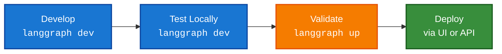

This is a conceptual guide for developing and testing [Agent Server](/langsmith/agent-server) applications locally. Learn about the local development tools available, when to use each one, and how they fit into your workflow from initial development through to [deploying](/langsmith/deployments) Agent Server in production.

The [LangGraph CLI](/langsmith/cli) provides two commands for local development, each optimized for different stages of your workflow:

- [`langgraph dev`](#langgraph-dev): A lightweight development server for rapid iteration.
- [`langgraph up`](#langgraph-up): A production-like testing environment for validation.

| Feature | `langgraph dev` | `langgraph up` |
|---------|----------------|----------------|
| **Docker required** | No | Yes |
| **Installation** | `pip install langgraph-cli[inmem]` | `pip install langgraph-cli` |
| **Primary use case** | Rapid development & testing | Production-like validation |
| **State persistence** | In-memory & pickled to local directory | PostgreSQL |
| **Hot reloading** | Yes (default) | Optional (`--watch` flag) |
| **Default port** | `2024` | `8123` |
| **Resource usage** | Lightweight | Heavier (build and run separate docker containers for the server, PostgreSQL, and Redis) |
| **IDE Debugging** | Built-in [DAP](https://microsoft.github.io/debug-adapter-protocol/) support | Regular container debugging |
| **Custom auth** | Yes | Yes (with license key) |

<Tip>
For full reference details, refer to the [LangGraph CLI reference](/langsmith/cli) page.
</Tip>

## Development

Here's the typical workflow when building applications:



| Stage | Tool | Purpose |
|-------|------|---------|
| **Develop & Test Locally** | [`langgraph dev`](/langsmith/cli#dev) | Write and iterate on your graph with hot reloading |
| **Validate** | [`langgraph up`](/langsmith/cli#up) | Test production-like behavior with full stack |
| **Deploy** | [LangSmith UI](/langsmith/deployment-quickstart) or [Control Plane API](/langsmith/api-ref-control-plane) | Deploy to production with confidence |

### Recommended workflow

1. **Daily development**: Use `langgraph dev` for rapid iteration.
1. **Periodic validation**: Test major changes with `langgraph up`.
1. **Pre-deployment check**: Run `langgraph up --recreate` for a fresh build.
1. **Deploy**: Push to production via the [LangSmith UI](/langsmith/deployment-quickstart) or [Control Plane API](/langsmith/api-ref-control-plane).

## `langgraph dev`

The [`langgraph dev`](/langsmith/cli#dev) command runs a lightweight server directly in your environment, designed for speed and convenience during active development. The key features include:

- **No Docker required**: Runs directly in your environment.
- **Hot reloading**: Automatically reloads when you change code.
- **Fast startup**: Ready in seconds.
- **Built-in [Debug Adapter Protocol](https://microsoft.github.io/debug-adapter-protocol/) support**: Attach your IDE debugger to the server for line-level breakpoints & debugging.
- **Local storage**: State persisted to local directory.

<Note>
The `dev` server is tested with the same integration test suite as production to ensure its behavior is the same during development while using minimal resources.
</Note>

### Get started

```bash
# Install with inmem extra
pip install -U "langgraph-cli[inmem]"

# Start dev server
langgraph dev
```

Your server starts at `http://localhost:2024` with hot reloading enabled by default.

### Use cases

Use `langgraph dev` as your primary development tool for:

- **Daily feature development**: Make changes to your code and the server automatically reloads. Test immediately without rebuilding containers—perfect for fast iteration cycles.
- **Quick prototyping and experiments**: Spin up a server in seconds to test ideas without Docker setup overhead.
- **Environments without Docker**: In CI/CD pipelines or lightweight VMs where Docker isn't available:
    ```bash
    langgraph dev --no-browser
    ```

- **Debugger attachment**: Use `--debug-port` to attach your IDE debugger for step-through debugging during development.

## `langgraph up`

The [`langgraph up`](/langsmith/cli#up) command orchestrates a full Docker-based stack that mirrors production infrastructure, helping catch deployment issues before production. The key features include:

- **Verify build & dependencies**: Tests your build process and dependencies.
- **Isolated networking**: Realistic container networking.
- **Production validation**: Verifies deployment readiness.

### Get started

```bash
# Ensure Docker is running
docker ps

# Start production-like stack
langgraph up
```

Your server starts at `http://localhost:8123` with full persistent storage.

### Use cases

Use `langgraph up` for validation and production-readiness testing:

- **Pre-deployment validation**: Before deploying to production, you can run a final check with a fresh build to ensure your dependencies are all correctly specified.

    ```bash
    langgraph up --recreate
    ```
    This catches issues related to dependency resolution in containers and any other build process problems.

- **Major feature validation**: After implementing significant changes, test with the full production stack periodically to ensure everything works in a containerized environment.
- **Docker troubleshooting**: When debugging container-specific issues, networking problems, or environment variable configurations that only appear in production.

## Pre-deployment checklist

Before deploying an application, verify the following with `langgraph up`:

- All [dependencies](/langsmith/setup-app-requirements-txt) install correctly in the container.
- Application starts without errors.
- Graph executes successfully.
- All [environment variables](/langsmith/env-var) work correctly.
- [Authentication/authorization](/langsmith/cli#adding-custom-authentication) works as expected.

## Dependencies configuration

Both `langgraph dev` and `langgraph up` read your application's [dependencies](/langsmith/application-structure#dependencies) from your [configuration files](/langsmith/application-structure#configuration-file), but they run in different environments:

- **`langgraph dev`** runs your code directly in your local environment (Python or Node.js) without Docker.
- **`langgraph up`** builds a Docker container and runs your code inside that isolated container.

Properly configuring your dependencies ensures both commands work correctly and that what you test locally matches what gets deployed to production.

### `langgraph.json` file

The `dependencies` field tells the [CLI](/langsmith/cli) **where** to find your application code. The `dependencies` field can point to:
- **A directory with package config** (containing `pyproject.toml`, `setup.py`, `requirements.txt`, or `package.json`)
- **A specific subdirectory**: `"dependencies": ["./my_agent"]`
- **A specific package**: `"dependencies": ["my-package==1.0.0"]` (Python) or `"dependencies": ["my-package@1.0.0"]` (JavaScript)

<Tabs>
<Tab title="Python">
```json
{
  "dependencies": ["."],
  "graphs": {
    "my_agent": "./my_agent/agent.py:graph"
  },
  "env": "./.env"
}
```
</Tab>
<Tab title="JavaScript">
```json
{
  "dependencies": ["."],
  "graphs": {
    "my_agent": "./my_agent/agent.js:graph"
  },
  "env": "./.env"
}
```
</Tab>
</Tabs>

### Package dependency files

These files define **what** packages your application needs:

<Tabs>
<Tab title="Python">
**pyproject.toml example:**
```toml
[project]
name = "my-agent"
version = "0.1.0"
dependencies = [
    "langchain-openai",
    "langchain-anthropic",
    "langgraph",
]
```

**requirements.txt example:**
```
langchain-openai
langchain-anthropic
langgraph
```
</Tab>
<Tab title="JavaScript">
**package.json example:**
```json
{
  "name": "my-agent",
  "version": "1.0.0",
  "dependencies": {
    "@langchain/openai": "^0.3.0",
    "@langchain/anthropic": "^0.3.0",
    "@langchain/langgraph": "^0.2.0"
  }
}
```
</Tab>
</Tabs>

### Dependency resolution process

When you run [`langgraph up`](/langsmith/cli#up), the CLI follows these steps to install your application's dependencies:

1. [`langgraph.json`](/langsmith/application-structure#configuration-file) tells the CLI **where** to look for your application code. The `dependencies: ["."]` field points to the current directory.
1. **Find package configuration**: The CLI looks in that directory for a package configuration file ([`pyproject.toml`](/langsmith/setup-pyproject), [`requirements.txt`](/langsmith/setup-app-requirements-txt), or [`package.json`](/langsmith/setup-javascript)).
1. **Read dependencies list**: The CLI reads the list of packages from the configuration file.
1. **Install packages**: The CLI installs all the packages using the appropriate package manager for your language (`uv` or `pip` for Python, `npm` for JavaScript).

This two-file approach separates concerns: `langgraph.json` handles application structure and location, while the package configuration file handles language-specific package dependencies.

For more information on the installer, refer to [CLI configuration file](/langsmith/cli#configuration-file).

### Troubleshooting

If you encounter issues with dependency installation, try switching to `pip`:

```json
{
  "dependencies": ["."],
  "pip_installer": "pip"
}
```

Then rebuild:
```bash
langgraph up --recreate
```

## Debug your local Docker setup

Production deployment might succeed even when `langgraph up` fails on your local machine. This happens because production uses managed infrastructure while `langgraph up` runs the full stack locally on your computer.

The following are common local environment issues that don't affect production.

### Docker configuration issues

`langgraph up` requires Docker locally:

```bash
# Check if Docker is running
docker ps
```

[Cloud deployments](/langsmith/cloud) don't use your local Docker.

**Solution**: Install Docker, or use `langgraph dev` for local testing.

### Port conflicts

`langgraph up` uses ports `8123`, `5432`, and `6379` that might be occupied:

```bash
# Check for conflicts
lsof -i :8123  # API server
lsof -i :5432  # PostgreSQL
lsof -i :6379  # Redis
```

**Solution**: Stop conflicting services or use the [`--port`](/langsmith/cli#options) flag.

### Resource constraints

`langgraph up` requires more RAM and disk for:

- PostgreSQL container
- Redis container
- API server container

**Solution**: Free up resources or use `langgraph dev`.

### Network configuration

VPN connections, firewall rules, or corporate proxy settings can affect local Docker networking.

**Solution**: Test with `langgraph dev` or temporarily disable VPN/firewall to isolate the issue.

## Related resources

- [CLI Reference](/langsmith/cli): Detailed documentation for all CLI commands
- [Application Structure](/langsmith/application-structure): How to structure your LangGraph application
- [Local Development](/langsmith/local-server): Getting started with local development
- [Troubleshooting](/langsmith/troubleshooting-studio): Common issues and solutions
- [Setting up with pyproject.toml](/langsmith/setup-pyproject): Configure Python dependencies
- [Setting up with requirements.txt](/langsmith/setup-app-requirements-txt): Alternative dependency configuration

---

<Callout icon="pen-to-square" iconType="regular">
    [Edit this page on GitHub](https://github.com/langchain-ai/docs/edit/main/src/langsmith/local-dev-testing.mdx) or [file an issue](https://github.com/langchain-ai/docs/issues/new/choose).
</Callout>
<Tip icon="terminal" iconType="regular">
    [Connect these docs](/use-these-docs) to Claude, VSCode, and more via MCP for real-time answers.
</Tip>
