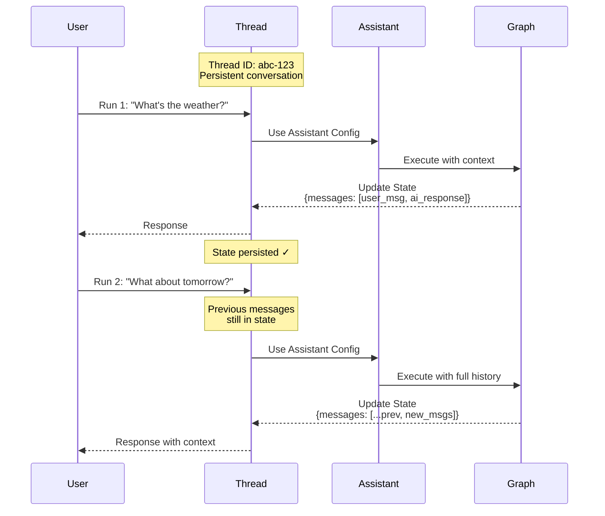

This guide shows you how to create, view, and inspect _threads_. Threads work with [assistants](/langsmith/assistants) to enable [stateful](/oss/python/langgraph/persistence) execution of your [deployed graphs](/langsmith/deployments).

## Understand threads

A thread is a persistent conversation container that maintains state across multiple runs. Each time you execute a run on a thread, the graph processes the input with the thread's current state and updates that state with new information.

Threads enable stateful interactions by preserving conversation history and context between runs. Without threads, each run would be stateless, with no memory of previous interactions. Threads are particularly useful for:

- Multi-turn conversations where the assistant needs to remember what was discussed.
- Long-running tasks that require maintaining context across multiple steps.
- User-specific state management where each user has their own conversation history.

The diagram illustrates how a thread maintains state across two runs. The second run has access to the messages from the first run, allowing the assistant to understand that the context of "What about tomorrow?" refers to the weather query from the first run:



- A thread maintains a persistent conversation with a unique thread ID.
- Each run applies the assistant's configuration to the graph execution.
- State is updated after each run and persists for subsequent runs.
- Later runs have access to the full conversation history.

<Note>
- **[Assistants](/langsmith/assistants)** define the configuration (model, prompts, tools) for how your graph executes. When creating a run, you can specify either a **graph ID** (e.g., `"agent"`) to use the default assistant, or an **assistant ID** (UUID) to use a specific configuration.
- **Threads** maintain the state and conversation history.
- **Runs** combine an assistant and thread to execute your graph with a specific configuration and state.
</Note>

<Tip>
Best practice: When tracing runs in a thread (conversation), ensure that `thread_id` is set on all runs—both parent and child runs. This is required for thread filtering, token counting, and thread-level evaluations to work correctly.
</Tip>

## Create a thread

To run your graph with state persistence, you must first create a thread:

<Tabs>
<Tab title="SDK">

### Empty thread

To create a new thread, use one of:

<CodeGroup>
```python Python
from langgraph_sdk import get_client

# Initialize the client with your deployment URL
client = get_client(url=<DEPLOYMENT_URL>)

# Create an empty thread
# This creates a new thread with no initial state
thread = await client.threads.create()

print(thread)
```

```javascript JavaScript
import { Client } from "@langchain/langgraph-sdk";

// Initialize the client with your deployment URL
const client = new Client({ apiUrl: <DEPLOYMENT_URL> });

// Create an empty thread
// This creates a new thread with no initial state
const thread = await client.threads.create();

console.log(thread);
```

```bash cURL
curl --request POST \
    --url <DEPLOYMENT_URL>/threads \
    --header 'Content-Type: application/json' \
    --data '{}'
```
</CodeGroup>

For more information, refer to the [Python](https://reference.langchain.com/python/langsmith/deployment/sdk/#langgraph_sdk.client.ThreadsClient.create) and [JS](https://reference.langchain.com/python/langsmith/deployment/sdk/#langgraph_sdk.client.ThreadsClient.create) SDK docs, or the [REST API](/langsmith/agent-server-api/threads/create-thread) reference.

Output:

```json
{
  "thread_id": "123e4567-e89b-12d3-a456-426614174000",
  "created_at": "2025-05-12T14:04:08.268Z",
  "updated_at": "2025-05-12T14:04:08.268Z",
  "metadata": {},
  "status": "idle",
  "values": {}
}
```

### Copy thread

Alternatively, if you already have a thread in your application whose state you wish to copy, you can use the `copy` method. This will create an independent thread whose history is identical to the original thread at the time of the operation:

<CodeGroup>
```python Python
# Copy an existing thread
# The new thread will have the same state as the original at the time of copying
copied_thread = await client.threads.copy(thread["thread_id"])
```

```javascript JavaScript
// Copy an existing thread
// The new thread will have the same state as the original at the time of copying
const copiedThread = await client.threads.copy(thread["thread_id"]);
```

```bash cURL
curl --request POST --url <DEPLOYMENT_URL>/threads/thread["thread_id"]/copy \
--header 'Content-Type: application/json'
```
</CodeGroup>

For more information, refer to the [Python](https://reference.langchain.com/python/langsmith/deployment/sdk/#langgraph_sdk.client.ThreadsClient.copy) and [JS](https://reference.langchain.com/python/langsmith/deployment/sdk/#langgraph_sdk.client.ThreadsClient.copy) SDK docs, or the [REST API](/langsmith/agent-server-api/threads/copy-thread) reference.

### Prepopulated state

You can create a thread with an arbitrary pre-defined state by providing a list of `supersteps` into the `create` method. The `supersteps` describe a sequence of state updates that establish the initial state of the thread. This is useful when you want to:

- Create a thread with existing conversation history.
- Migrate conversations from another system.
- Set up test scenarios with specific initial states.
- Resume conversations from a previous session.

For more information on checkpoints and state management, refer to the [LangGraph persistence documentation](/oss/python/langgraph/persistence).

<CodeGroup>
```python Python
from langgraph_sdk import get_client

# Initialize the client
client = get_client(url=<DEPLOYMENT_URL>)

# Create a thread with pre-populated conversation history
# The supersteps define a sequence of state updates that build up the initial state
thread = await client.threads.create(
  graph_id="agent",  # Specify which graph this thread is for
  supersteps=[
    {
      updates: [
        {
          values: {},
          as_node: '__input__',  # Initial input node
        },
      ],
    },
    {
      updates: [
        {
          values: {
            messages: [
              {
                type: 'human',
                content: 'hello',
              },
            ],
          },
          as_node: '__start__',  # User's first message
        },
      ],
    },
    {
      updates: [
        {
          values: {
            messages: [
              {
                content: 'Hello! How can I assist you today?',
                type: 'ai',
              },
            ],
          },
          as_node: 'call_model',  # Assistant's response
        },
      ],
    },
  ])

print(thread)
```

```javascript JavaScript
import { Client } from "@langchain/langgraph-sdk";

// Initialize the client
const client = new Client({ apiUrl: <DEPLOYMENT_URL> });

// Create a thread with pre-populated conversation history
// The supersteps define a sequence of state updates that build up the initial state
const thread = await client.threads.create({
    graphId: 'agent',  // Specify which graph this thread is for
    supersteps: [
    {
      updates: [
        {
          values: {},
          asNode: '__input__',  // Initial input node
        },
      ],
    },
    {
      updates: [
        {
          values: {
            messages: [
              {
                type: 'human',
                content: 'hello',
              },
            ],
          },
          asNode: '__start__',  // User's first message
        },
      ],
    },
    {
      updates: [
        {
          values: {
            messages: [
              {
                content: 'Hello! How can I assist you today?',
                type: 'ai',
              },
            ],
          },
          asNode: 'call_model',  // Assistant's response
        },
      ],
    },
  ],
});

console.log(thread);
```

```bash cURL
curl --request POST \
    --url <DEPLOYMENT_URL>/threads \
    --header 'Content-Type: application/json' \
    --data '{"metadata":{"graph_id":"agent"},"supersteps":[{"updates":[{"values":{},"as_node":"__input__"}]},{"updates":[{"values":{"messages":[{"type":"human","content":"hello"}]},"as_node":"__start__"}]},{"updates":[{"values":{"messages":[{"content":"Hello\u0021 How can I assist you today?","type":"ai"}]},"as_node":"call_model"}]}]}'
```
</CodeGroup>

Output:

```json
{
  "thread_id": "f15d70a1-27d4-4793-a897-de5609920b7d",
  "created_at": "2025-05-12T15:37:08.935038+00:00",
  "updated_at": "2025-05-12T15:37:08.935046+00:00",
  "metadata": {
    "graph_id": "agent"
  },
  "status": "idle",
  "config": {},
  "values": {
    "messages": [
      {
        "content": "hello",
        "additional_kwargs": {},
        "response_metadata": {},
        "type": "human",
        "name": null,
        "id": "8701f3be-959c-4b7c-852f-c2160699b4ab",
        "example": false
      },
      {
        "content": "Hello! How can I assist you today?",
        "additional_kwargs": {},
        "response_metadata": {},
        "type": "ai",
        "name": null,
        "id": "4d8ea561-7ca1-409a-99f7-6b67af3e1aa3",
        "example": false,
        "tool_calls": [],
        "invalid_tool_calls": [],
        "usage_metadata": null
      }
    ]
  }
}
```

</Tab>
<Tab title="UI">

You can also create threads directly from the [LangSmith UI](https://smith.langchain.com):

1. Navigate to your [deployment](/langsmith/deployments).
2. Select the **Threads** tab.
3. Click **+ New thread**.
4. Optionally provide metadata or initial state for the thread.
5. Click **Create thread**.

The newly created thread will appear in the threads table and can be used for runs immediately.

</Tab>
</Tabs>

## List threads

<Tabs>
<Tab title="SDK">

To list threads, use the `search` method. This will list the threads in the application that match the provided filters:

### Filter by thread status

Use the `status` field to filter threads based on their status. Supported values are `idle`, `busy`, `interrupted`, and `error`. For example, to view `idle` threads:

<CodeGroup>
```python Python
# Search for idle threads
# The status filter accepts: idle, busy, interrupted, error
print(await client.threads.search(status="idle", limit=1))
```

```javascript JavaScript
// Search for idle threads
// The status filter accepts: idle, busy, interrupted, error
console.log(await client.threads.search({ status: "idle", limit: 1 }));
```

```bash cURL
curl --request POST \
--url <DEPLOYMENT_URL>/threads/search \
--header 'Content-Type: application/json' \
--data '{"status": "idle", "limit": 1}'
```
</CodeGroup>

For more information, refer to the [Python](https://reference.langchain.com/python/langsmith/deployment/sdk/#langgraph_sdk.client.ThreadsClient.search) and [JS](https://reference.langchain.com/python/langsmith/deployment/sdk/#langgraph_sdk.client.ThreadsClient.search) SDK docs, or the [REST API](/langsmith/agent-server-api/threads/search-threads) reference.

Output:

```json
[
  {
    "thread_id": "cacf79bb-4248-4d01-aabc-938dbd60ed2c",
    "created_at": "2024-08-14T17:36:38.921660+00:00",
    "updated_at": "2024-08-14T17:36:38.921660+00:00",
    "metadata": {
      "graph_id": "agent"
    },
    "status": "idle",
    "config": {
      "configurable": {}
    }
  }
]
```

### Filter by metadata

The `search` method allows you to filter on metadata. This is useful for finding threads associated with specific graphs, users, or custom metadata you've added to threads:

<CodeGroup>
```python Python
# Search for threads with specific metadata
# Metadata filtering is useful for organizing threads by graph, user, or custom tags
print((await client.threads.search(metadata={"graph_id":"agent"}, limit=1)))
```

```javascript JavaScript
// Search for threads with specific metadata
// Metadata filtering is useful for organizing threads by graph, user, or custom tags
console.log((await client.threads.search({ metadata: { "graph_id": "agent" }, limit: 1 })));
```

```bash cURL
curl --request POST \
--url <DEPLOYMENT_URL>/threads/search \
--header 'Content-Type: application/json' \
--data '{"metadata": {"graph_id":"agent"}, "limit": 1}'
```
</CodeGroup>

Output:

```json
[
  {
    "thread_id": "cacf79bb-4248-4d01-aabc-938dbd60ed2c",
    "created_at": "2024-08-14T17:36:38.921660+00:00",
    "updated_at": "2024-08-14T17:36:38.921660+00:00",
    "metadata": {
      "graph_id": "agent"
    },
    "status": "idle",
    "config": {
      "configurable": {}
    }
  }
]
```

### Sorting

The SDK also supports sorting threads by `thread_id`, `status`, `created_at`, and `updated_at` using the `sort_by` and `sort_order` parameters.

</Tab>
<Tab title="UI">

You can also view and manage threads in a deployment via the [LangSmith UI](https://smith.langchain.com):

1. Navigate to your [deployment](/langsmith/deployments).
2. Select the **Threads** tab.

This will load a table of all threads in your deployment.

**Filter by thread status:** Select a status in the top bar to filter threads by `idle`, `busy`, `interrupted`, or `error`.

**Sort threads:** Click on the arrow icon for any column header to sort by that property (`thread_id`, `status`, `created_at`, or `updated_at`).

</Tab>
</Tabs>

## Inspect threads

<Tabs>
<Tab title="SDK">

### Get thread

To view a specific thread given its `thread_id`, use the [`get`](https://reference.langchain.com/python/langsmith/deployment/sdk/#langgraph_sdk.client.ThreadsClient.get) method:

<CodeGroup>
```python Python
# Retrieve a specific thread by its ID
# Returns the thread metadata including status, creation time, and metadata
print((await client.threads.get(thread["thread_id"])))
```

```javascript JavaScript
// Retrieve a specific thread by its ID
// Returns the thread metadata including status, creation time, and metadata
console.log((await client.threads.get(thread["thread_id"])));
```

```bash cURL
curl --request GET \
--url <DEPLOYMENT_URL>/threads/thread["thread_id"] \
--header 'Content-Type: application/json'
```
</CodeGroup>

Output:

```json
{
  "thread_id": "cacf79bb-4248-4d01-aabc-938dbd60ed2c",
  "created_at": "2024-08-14T17:36:38.921660+00:00",
  "updated_at": "2024-08-14T17:36:38.921660+00:00",
  "metadata": {
    "graph_id": "agent"
  },
  "status": "idle",
  "config": {
    "configurable": {}
  }
}
```

For more information, refer to the [Python](https://reference.langchain.com/python/langsmith/deployment/sdk/#langgraph_sdk.client.ThreadsClient.get) and [JS](https://reference.langchain.com/python/langsmith/deployment/sdk/#langgraph_sdk.client.ThreadsClient.get) SDK docs, or the [REST API](/langsmith/agent-server-api/threads/get-thread) reference.

### Inspect thread state

To view the current state of a given thread, use the [`get_state`](https://reference.langchain.com/python/langsmith/deployment/sdk/#langgraph_sdk.client.ThreadsClient.get_state) method. This returns the current values, next nodes to execute, and checkpoint information:

<CodeGroup>
```python Python
# Get the current state of a thread
# Returns values, next nodes, tasks, checkpoint info, and metadata
print((await client.threads.get_state(thread["thread_id"])))
```

```javascript JavaScript
// Get the current state of a thread
// Returns values, next nodes, tasks, checkpoint info, and metadata
console.log((await client.threads.getState(thread["thread_id"])));
```

```bash cURL
curl --request GET \
--url <DEPLOYMENT_URL>/threads/thread["thread_id"]/state \
--header 'Content-Type: application/json'
```
</CodeGroup>

Output:

```json
{
  "values": {
    "messages": [
      {
        "content": "hello",
        "additional_kwargs": {},
        "response_metadata": {},
        "type": "human",
        "name": null,
        "id": "8701f3be-959c-4b7c-852f-c2160699b4ab",
        "example": false
      },
      {
        "content": "Hello! How can I assist you today?",
        "additional_kwargs": {},
        "response_metadata": {},
        "type": "ai",
        "name": null,
        "id": "4d8ea561-7ca1-409a-99f7-6b67af3e1aa3",
        "example": false,
        "tool_calls": [],
        "invalid_tool_calls": [],
        "usage_metadata": null
      }
    ]
  },
  "next": [],
  "tasks": [],
  "metadata": {
    "thread_id": "f15d70a1-27d4-4793-a897-de5609920b7d",
    "checkpoint_id": "1f02f46f-7308-616c-8000-1b158a9a6955",
    "graph_id": "agent_with_quite_a_long_name",
    "source": "update",
    "step": 1,
    "writes": {
      "call_model": {
        "messages": [
          {
            "content": "Hello! How can I assist you today?",
            "type": "ai"
          }
        ]
      }
    },
    "parents": {}
  },
  "created_at": "2025-05-12T15:37:09.008055+00:00",
  "checkpoint": {
    "checkpoint_id": "1f02f46f-733f-6b58-8001-ea90dcabb1bd",
    "thread_id": "f15d70a1-27d4-4793-a897-de5609920b7d",
    "checkpoint_ns": ""
  },
  "parent_checkpoint": {
    "checkpoint_id": "1f02f46f-7308-616c-8000-1b158a9a6955",
    "thread_id": "f15d70a1-27d4-4793-a897-de5609920b7d",
    "checkpoint_ns": ""
  },
  "checkpoint_id": "1f02f46f-733f-6b58-8001-ea90dcabb1bd",
  "parent_checkpoint_id": "1f02f46f-7308-616c-8000-1b158a9a6955"
}
```

For more information, refer to the [Python](https://reference.langchain.com/python/langsmith/deployment/sdk/#langgraph_sdk.client.ThreadsClient.get_state) and [JS](https://reference.langchain.com/python/langsmith/deployment/sdk/#langgraph_sdk.client.ThreadsClient.get_state) SDK docs, or the [REST API](/langsmith/agent-server-api/threads/get-thread-state) reference.

Optionally, to view the state of a thread at a given checkpoint, pass in the checkpoint ID. This is useful for inspecting the thread state at a specific point in its execution history.

First, get the checkpoint ID from the thread's history:

<CodeGroup>
```python Python
# Get the thread history to find checkpoint IDs
history = await client.threads.get_history(thread_id=thread["thread_id"])
checkpoint_id = history[0]["checkpoint_id"]  # Get the most recent checkpoint
```

```javascript JavaScript
// Get the thread history to find checkpoint IDs
const history = await client.threads.getHistory(thread["thread_id"]);
const checkpointId = history[0].checkpoint_id;  // Get the most recent checkpoint
```

```bash cURL
# Get the thread history to find checkpoint IDs
curl --request POST \
--url <DEPLOYMENT_URL>/threads/thread["thread_id"]/history \
--header 'Content-Type: application/json' \
--data '{"limit": 1}'
```
</CodeGroup>

Then use the checkpoint ID to get the state at that specific point:

<CodeGroup>
```python Python
# Get thread state at a specific checkpoint
# Useful for inspecting historical state or debugging
thread_state = await client.threads.get_state(
  thread_id=thread["thread_id"],
  checkpoint_id=checkpoint_id
)
```

```javascript JavaScript
// Get thread state at a specific checkpoint
// Useful for inspecting historical state or debugging
const threadState = await client.threads.getState(thread["thread_id"], checkpointId);
```

```bash cURL
curl --request GET \
--url <DEPLOYMENT_URL>/threads/thread["thread_id"]/state/<CHECKPOINT_ID> \
--header 'Content-Type: application/json'
```
</CodeGroup>

### Inspect full thread history

To view a thread's history, use the [`get_history`](https://reference.langchain.com/python/langsmith/deployment/sdk/#langgraph_sdk.client.ThreadsClient.get_history) method. This returns a list of every state the thread experienced, allowing you to trace the full execution path:

<CodeGroup>
```python Python
# Get the full history of a thread
# Returns a list of all state snapshots from the thread's execution
history = await client.threads.get_history(
  thread_id=thread["thread_id"],
  limit=10  # Optional: limit the number of states returned
)

for state in history:
    print(f"Checkpoint: {state['checkpoint_id']}")
    print(f"Step: {state['metadata']['step']}")
```

```javascript JavaScript
// Get the full history of a thread
// Returns a list of all state snapshots from the thread's execution
const history = await client.threads.getHistory(
  thread["thread_id"],
  {
    limit: 10  // Optional: limit the number of states returned
  }
);

for (const state of history) {
  console.log(`Checkpoint: ${state.checkpoint_id}`);
  console.log(`Step: ${state.metadata.step}`);
}
```

```bash cURL
curl --request POST \
--url <DEPLOYMENT_URL>/threads/thread["thread_id"]/history \
--header 'Content-Type: application/json' \
--data '{"limit": 10}'
```
</CodeGroup>

This method is particularly useful for:
- Debugging execution flow by seeing how state evolved.
- Understanding decision points in your graph's execution.
- Auditing conversation history and state changes.
- Replaying or analyzing past interactions.

For more information, refer to the [Python](https://reference.langchain.com/python/langsmith/deployment/sdk/#langgraph_sdk.client.ThreadsClient.get_history) and [JS](https://reference.langchain.com/python/langsmith/deployment/sdk/#langgraph_sdk.client.ThreadsClient.get_history) SDK docs, or the [REST API](/langsmith/agent-server-api/threads/get-thread-history) reference.

</Tab>
<Tab title="UI">

You can also view and inspect threads in the [LangSmith UI](https://smith.langchain.com):

1. Navigate to your [deployment](/langsmith/deployments).
2. Select the **Threads** tab to view all threads.
3. Click on a thread to inspect its current state.

To view the full thread history and perform detailed debugging, click **Open in Studio** to open the thread in [Studio](/langsmith/studio). Studio provides a visual interface for exploring the thread's execution history, state changes, and checkpoint details.

</Tab>
</Tabs>

---

<Callout icon="pen-to-square" iconType="regular">
    [Edit this page on GitHub](https://github.com/langchain-ai/docs/edit/main/src/langsmith/use-threads.mdx) or [file an issue](https://github.com/langchain-ai/docs/issues/new/choose).
</Callout>
<Tip icon="terminal" iconType="regular">
    [Connect these docs](/use-these-docs) to Claude, VSCode, and more via MCP for real-time answers.
</Tip>
