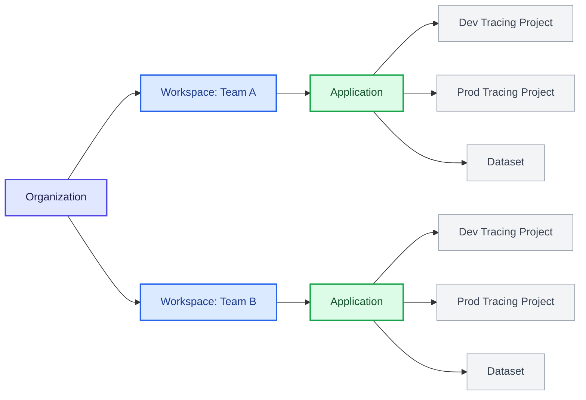
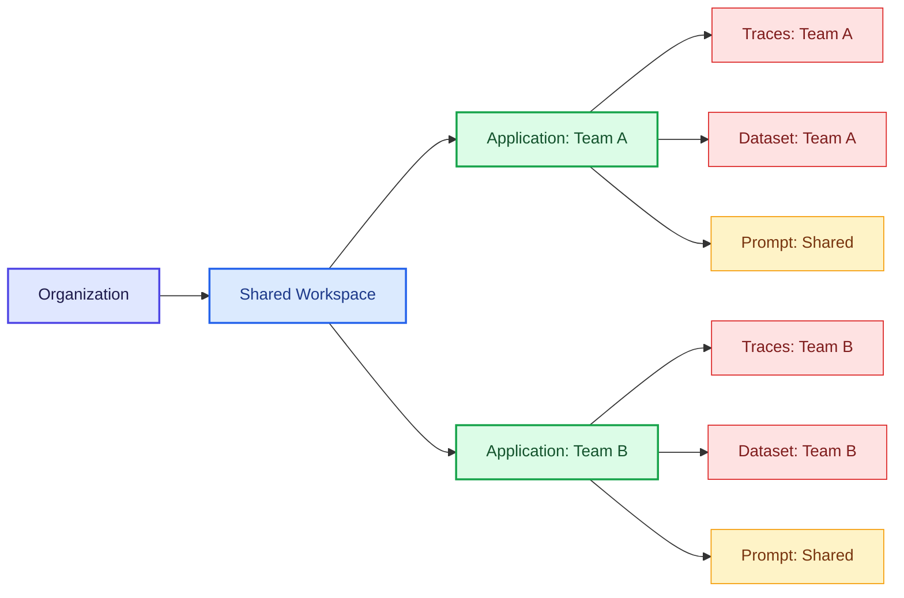
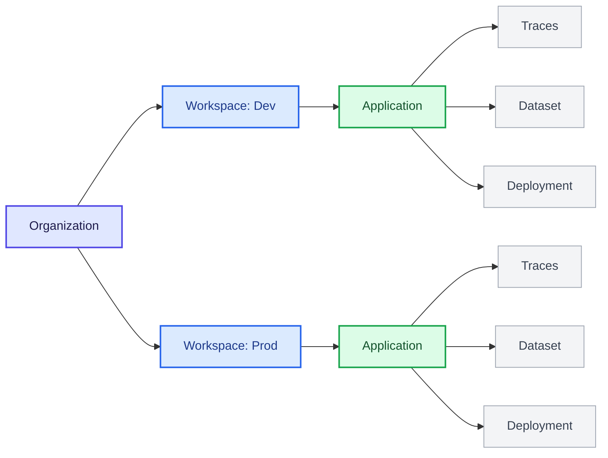

LangSmith uses a hierarchical structure to organize your work: [_organizations_](/langsmith/administration-overview#organizations), [_workspaces_](/langsmith/administration-overview#workspaces), [_applications_](/langsmith/administration-overview#applications), and [_resources_](/langsmith/administration-overview#resources). This structure lets you balance collaboration with access control, allowing you to choose the right level of isolation for your team's needs.

The LangSmith permission system builds on this hierarchy. With [role-based access control (RBAC)](/langsmith/rbac), user [permissions](/langsmith/organization-workspace-operations) are scoped to one or more workspaces, enforcing isolation between workspaces. With more fine-grained [attribute-based access control](/langsmith/organization-workspace-operations#access-policies) (ABAC in private beta), access can be further restricted or granted based on attributes such as tags or applications within a workspace (for example, allowing users to access only development resources or only resources associated with a specific application).

This page explains three common approaches to organizing workspaces based on your team's isolation requirements:

- [Team-centric workspaces](#team-centric-workspaces): Single workspace per team (recommended for most customers)
- [Collaborative workspaces](#collaborative-workspaces): Multiple teams per workspace
- [Project-isolated workspaces](#project-isolated-workspaces): Multiple workspaces per team (for strict isolation requirements)

<Tip>
For details on setting up organizations and workspaces, refer to [Set up hierarchy](/langsmith/set-up-hierarchy).
</Tip>

## Team-centric workspaces

<Callout icon="check" iconType="solid" color="#C7D2FE">
This is the default model and recommended choice for most customers.
</Callout>

This model (single workspace per team) uses a single organization as the top-level boundary. Within the organization, multiple workspaces are used to isolate different teams or business units. Each workspace represents a logical boundary for a specific team and governs which data and resources that team can access. Within a workspace, teams use multiple applications to group together resources that support the same agent. An application may also contain distinct resources, such as separate tracing projects, for development and production environments.

- **Pros:** A single workspace allows all team resources to be shared, making collaboration and iteration within a team straightforward. It also simplifies promotion from development to production. For example, the same [prompt](/langsmith/prompt-engineering) can be versioned and promoted to production using tags, without copying or duplication.
- **Cons:** The primary trade-off is limited isolation between environments of the same team. Development, test, and production resources coexist within the same application, so teams must rely on tagging and conventions to avoid accidental impact on production. [RBAC](/langsmith/rbac) is scoped at the workspace level. [ABAC](/langsmith/organization-workspace-operations#access-policies) (private beta) provides more granular permissions within a workspace by restricting access based on resource attributes, such as allowing a user to access only development resources.

## Collaborative workspaces

In this model (multiple teams per workspace), multiple teams share a single workspace within an organization and use applications and [ABAC](/langsmith/organization-workspace-operations#access-policies) (private beta) to separate resources and govern access. As a result, shared resources such as [prompts](/langsmith/prompt-engineering) and [deployments](/langsmith/deployments) can be reused across teams, while access to sensitive resources like [traces](/langsmith/observability-concepts#traces) and [datasets](/langsmith/evaluation-concepts#datasets) is limited to the owning team.

- **Pros:** Common resources such as prompts and deployments can be shared and reused across teams, increasing collaboration and reducing duplicated work. Unlike the team-centric workspace model, collaboration is not limited to a single team and can span all teams within the workspace.
- **Cons:** Isolation between teams and environments is weaker than in multi-workspace models and depends on correct use of ABAC. Misconfigured tags or policies can expose sensitive [traces](/langsmith/observability-concepts#traces) or [datasets](/langsmith/evaluation-concepts#datasets) across teams, and managing permissions across multiple teams adds operational complexity.

## Project-isolated workspaces

<Callout icon="check" iconType="solid" color="#C7D2FE">
This approach should be used only when strict isolation is required.
</Callout>

In this model (multiple workspaces per team), isolation is increased by creating multiple workspaces for a single team. Workspaces may be organized by project or by environment, such as separate development and production workspaces. Each workspace is fully isolated, with its own users, data, and resources, and access is strictly scoped to that workspace.

- **Pros:** Strong isolation between teams, projects, and environments. Users with only access to the development workspace cannot view or access production data or any production resources, reducing the risk of accidental changes or cross-environment misuse.
- **Cons:** Resources cannot be shared across workspaces. Reusing [prompts](/langsmith/prompt-engineering), [datasets](/langsmith/evaluation-concepts#datasets), or [experiments](/langsmith/evaluation-concepts#experiment), even when promoting an agent from development to production, requires manual copying between workspaces, which introduces friction and duplication.

---

<Callout icon="pen-to-square" iconType="regular">
    [Edit this page on GitHub](https://github.com/langchain-ai/docs/edit/main/src/langsmith/workload-isolation.mdx) or [file an issue](https://github.com/langchain-ai/docs/issues/new/choose).
</Callout>
<Tip icon="terminal" iconType="regular">
    [Connect these docs](/use-these-docs) to Claude, VSCode, and more via MCP for real-time answers.
</Tip>
