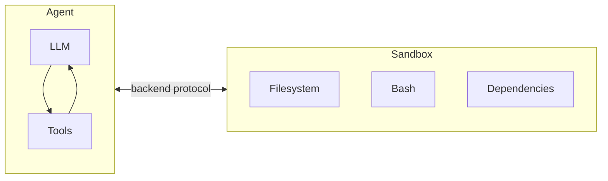
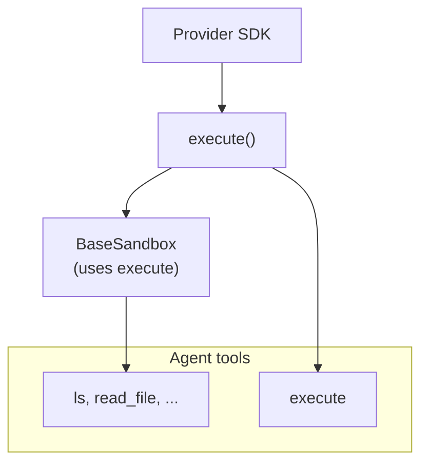
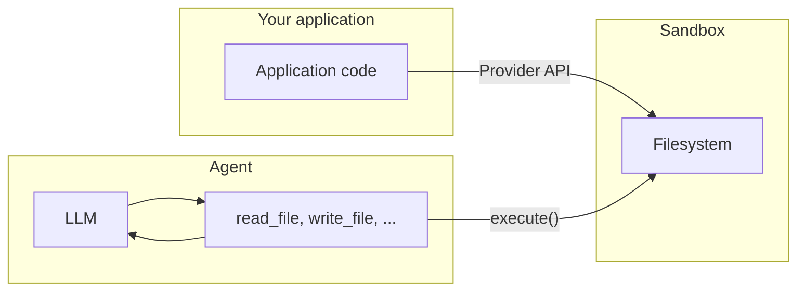

import SandboxBasicPy from '/snippets/deepagents-sandbox-basic-py.mdx';
import SandboxBasicJs from '/snippets/deepagents-sandbox-basic-js.mdx';

Agents generate code, interact with filesystems, and run shell commands. Because we can't predict what an agent might do, it's important that its environment is isolated so it can't access credentials, files, or the network. Sandboxes provide this isolation by creating a boundary between the agent's execution environment and your host system.

In deep agents, **sandboxes are [backends](/oss/javascript/deepagents/backends)** that define the environment where the agent operates. Unlike other backends (State, Filesystem, Store) which only expose file operations, sandbox backends also give the agent an `execute` tool for running shell commands. When you configure a sandbox backend, the agent gets:

- All standard filesystem tools (`ls`, `read_file`, `write_file`, `edit_file`, `glob`, `grep`)
- The `execute` tool for running arbitrary shell commands in the sandbox
- A secure boundary that protects your host system



## Why use sandboxes?

- **Security**: Code runs in isolation - can't access your credentials, files, or network
- **Clean environments**: Use specific dependencies or OS configurations without local setup
- **Reproducibility**: Consistent execution environments across teams
- **Flexibility**: Switch between cloud providers or use local VFS for development

## Available providers

<CardGroup cols={2}>
    <Card title="Modal" icon="/images/providers/modal-icon.svg" href="/oss/javascript/integrations/providers/modal">
        ML/AI workloads, GPU access, Python.
    </Card>
    <Card title="Daytona" icon="/images/providers/daytona-icon.svg" href="/oss/javascript/integrations/providers/daytona">
        TypeScript/Python development, fast cold starts.
    </Card>
    <Card title="Deno" icon="/images/providers/deno-icon.svg" href="/oss/javascript/integrations/providers/deno">
        Deno/JavaScript workloads, microVMs.
    </Card>
    <Card title="Node VFS" icon="/images/providers/nodejs-icon.svg" href="/oss/javascript/integrations/providers/node-vfs">
        Local development, testing, no cloud required.
    </Card>
</CardGroup>


## Basic usage

<SandboxBasicJs />


## How sandboxes work

### Isolation boundaries

All sandbox providers protect your host system from the agent's filesystem and shell operations. The agent cannot read your local files, access environment variables on your machine, or interfere with other processes. However, sandboxes alone do **not** protect against:

- **Context injection** — An attacker who controls part of the agent's input can instruct it to run arbitrary commands inside the sandbox. The sandbox is isolated, but the agent has full control within it.
- **Network exfiltration** — Unless network access is blocked, a context-injected agent can send data out of the sandbox over HTTP or DNS. Some providers support blocking network access (e.g., `blockNetwork: true` on Modal).

See [security considerations](#security-considerations) for how to handle secrets and mitigate these risks.

### The `execute` method

Sandbox backends have a simple architecture: the only method a provider must implement is `execute()`, which runs a shell command and returns its output. Every other filesystem operation — `read`, `write`, `edit`, `ls`, `glob`, `grep` — is built on top of `execute()` by the `BaseSandbox` base class, which constructs scripts and runs them inside the sandbox via `execute()`.



This design means:
- **Adding a new provider is straightforward.** Implement `execute()` — the base class handles everything else.
- **The `execute` tool is conditionally available.** On every model call, the harness checks whether the backend implements `SandboxBackendProtocol`. If not, the tool is filtered out and the agent never sees it.

When the agent calls the `execute` tool, it provides a `command` string and gets back the combined stdout/stderr, exit code, and a truncation notice if the output was too large.

You can also call the backend `execute()` method directly in your application code.


For example:

```
4
[Command succeeded with exit code 0]
```

```
bash: foobar: command not found
[Command failed with exit code 127]
```

If a command produces very large output, the result is automatically saved to a file and the agent is instructed to use `read_file` to access it incrementally. This prevents context window overflow.

### Two planes of file access

There are two distinct ways files move in and out of a sandbox, and it's important to understand when to use each:

**Agent filesystem tools** — `read_file`, `write_file`, `edit_file`, `ls`, `glob`, `grep`, and `execute` are the tools the LLM calls during its execution. These go through `execute()` inside the sandbox. The agent uses them to read code, write files, and run commands as part of its task.

**File transfer APIs** — the `uploadFiles()` and `downloadFiles()` methods that your application code calls. These use the provider's native file transfer APIs (not shell commands) and are designed for moving files between your host environment and the sandbox. Use these to:
- **Seed the sandbox** with source code, configuration, or data before the agent runs
- **Retrieve artifacts** (generated code, build outputs, reports) after the agent finishes
- **Pre-populate dependencies** that the agent will need



## Working with files

### Seeding the sandbox

Use `uploadFiles()` to populate the sandbox before the agent runs. File contents are provided as `Uint8Array`:

```typescript
const encoder = new TextEncoder();
const responses = await sandbox.uploadFiles([
  ["src/index.js", encoder.encode("console.log('Hello')")],
  ["package.json", encoder.encode('{"name": "my-app"}')],
]);

// Each response indicates success or failure
for (const res of responses) {
  if (res.error) {
    console.error(`Failed to upload ${res.path}: ${res.error}`);
  }
}
```

### Retrieving artifacts

Use `downloadFiles()` to retrieve files from the sandbox after the agent finishes:

```typescript
const results = await sandbox.downloadFiles(["src/index.js", "output.txt"]);

const decoder = new TextDecoder();
for (const result of results) {
  if (result.content) {
    console.log(`${result.path}: ${decoder.decode(result.content)}`);
  } else {
    console.error(`Failed to download ${result.path}: ${result.error}`);
  }
}
```

<Note>
Inside the sandbox, the agent uses its own filesystem tools (`read_file`, `write_file`) — not `uploadFiles` or `downloadFiles`. Those methods are for your application code to move files across the boundary between your host and the sandbox.
</Note>


## Lifecycle and reconnection

### Basic lifecycle

All sandbox implementations follow a create → use → close pattern:

```typescript
// Create and initialize
const sandbox = await ModalSandbox.create(options);

// Use the sandbox (directly or via an agent)
const result = await sandbox.execute("echo hello");

// Clean up when done
await sandbox.close();
```

Always call `close()` when you're done. Cloud sandboxes consume resources (and cost money) until they're shut down. Use `try/finally` to ensure cleanup even if the agent throws an error.

### Sandbox patterns

When integrating sandboxes with `createDeepAgent`, you have two patterns:

**Reuse a sandbox** across multiple agent invocations. Create the sandbox once and pass it to the agent:

```typescript
const sandbox = await DenoSandbox.create({ memoryMb: 1024 });

const agent = createDeepAgent({
  model,
  systemPrompt: "You are a coding assistant.",
  backend: sandbox,
});

// Multiple invocations share the same sandbox
await agent.invoke({ messages: [...] });
await agent.invoke({ messages: [...] }); // Same sandbox, same files

await sandbox.close(); // You manage the lifecycle
```

**Create a fresh sandbox** per invocation. Use a function that provisions a new sandbox each time:

```typescript
const agent = createDeepAgent({
  model: new ChatAnthropic({ model: "claude-opus-4-6" }),
  systemPrompt: "You are a coding assistant.",
  backend: () => DenoSandbox.create({ memoryMb: 1024 }),
});

// Multiple invocations get their own sandbox
const sandbox1 = await sandbox.create();
const sandbox2 = await sandbox.create();
```

Use the reuse pattern when you want continuity (e.g., installed dependencies persist across turns). Use the fresh pattern when you want clean isolation between tasks.


## Provider integrations

If you are looking for provider-specific setup and lifecycle details, see:


<CardGroup cols={2}>
    <Card title="Modal" icon="/images/providers/modal-icon.svg" href="/oss/javascript/integrations/providers/modal" />
    <Card title="Daytona" icon="/images/providers/daytona-icon.svg" href="/oss/javascript/integrations/providers/daytona" />
    <Card title="Deno" icon="/images/providers/deno-icon.svg" href="/oss/javascript/integrations/providers/deno" />
    <Card title="Node VFS" icon="/images/providers/nodejs-icon.svg" href="/oss/javascript/integrations/providers/node-vfs" />
</CardGroup>


## Security considerations

Sandboxes isolate code execution from your host system, but they don't protect against **context injection**. An attacker who controls part of the agent's input can instruct it to read files, run commands, or exfiltrate data from within the sandbox. This makes credentials inside the sandbox especially dangerous.

<Warning>
**Never put secrets inside a sandbox.** API keys, tokens, database credentials, and other secrets injected into a sandbox (via environment variables, mounted files, or the `secrets` option) can be read and exfiltrated by a context-injected agent. This applies even to short-lived or scoped credentials — if an agent can access them, so can an attacker.
</Warning>

### Handling secrets safely

If your agent needs to call authenticated APIs or access protected resources, you have two options:

1. **Keep secrets in tools outside the sandbox.** Define tools that run in your host environment (not inside the sandbox) and handle authentication there. The agent calls these tools by name, but never sees the credentials. This is the recommended approach.

2. **Use a network proxy that injects credentials.** Some sandbox providers support proxies that intercept outgoing HTTP requests from the sandbox and attach credentials (e.g., `Authorization` headers) before forwarding them. The agent never sees the secret — it just makes plain requests to a URL. This approach is not yet widely available across providers.

<Warning>
If you must inject secrets into a sandbox (not recommended), take these precautions:

- Enable [human-in-the-loop](/oss/javascript/deepagents/human-in-the-loop) approval for **all** tool calls, not just sensitive ones
- Block or restrict network access from the sandbox to limit exfiltration paths
- Use the narrowest possible credential scope and shortest possible lifetime
- Monitor sandbox network traffic for unexpected outbound requests

Even with these safeguards, this remains an unsafe workaround. A sufficiently creative enough context injection attack can bypass output filtering and HITL review.
</Warning>

### General best practices

- Review sandbox outputs before acting on them in your application
- Block sandbox network access when not needed
- Use [middleware](/oss/javascript/deepagents/middleware) to filter or redact sensitive patterns in tool outputs
- Treat everything produced inside the sandbox as untrusted input

---

<Callout icon="pen-to-square" iconType="regular">
    [Edit this page on GitHub](https://github.com/langchain-ai/docs/edit/main/src/oss/deepagents/sandboxes.mdx) or [file an issue](https://github.com/langchain-ai/docs/issues/new/choose).
</Callout>
<Tip icon="terminal" iconType="regular">
    [Connect these docs](/use-these-docs) to Claude, VSCode, and more via MCP for real-time answers.
</Tip>
