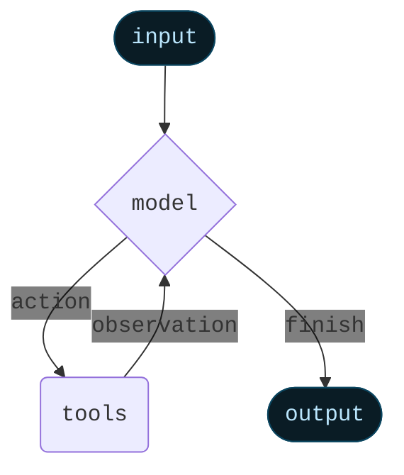

Agents combine language models with [tools](/oss/javascript/langchain/tools) to create systems that can reason about tasks, decide which tools to use, and iteratively work towards solutions.


`createAgent()` provides a production-ready agent implementation.


[An LLM Agent runs tools in a loop to achieve a goal](https://simonwillison.net/2025/Sep/18/agents/).
An agent runs until a stop condition is met - i.e., when the model emits a final output or an iteration limit is reached.



<Info>


`createAgent()` builds a **graph**-based agent runtime using [LangGraph](/oss/javascript/langgraph/overview). A graph consists of nodes (steps) and edges (connections) that define how your agent processes information. The agent moves through this graph, executing nodes like the model node (which calls the model), the tools node (which executes tools), or middleware.


Learn more about the [Graph API](/oss/javascript/langgraph/graph-api).

</Info>

## Core components

### Model

The [model](/oss/javascript/langchain/models) is the reasoning engine of your agent. It can be specified in multiple ways, supporting both static and dynamic model selection.

#### Static model

Static models are configured once when creating the agent and remain unchanged throughout execution. This is the most common and straightforward approach.

To initialize a static model from a <Tooltip tip="A string that follows the format `provider:model` (e.g. openai:gpt-5)" cta="See mappings" href="https://reference.langchain.com/python/langchain/models/#langchain.chat_models.init_chat_model(model)">model identifier string</Tooltip>:


```ts wrap
import { createAgent } from "langchain";

const agent = createAgent({
  model: "openai:gpt-5",
  tools: []
});
```


Model identifier strings use the format `provider:model` (e.g. `"openai:gpt-5"`). You may want more control over the model configuration, in which case you can initialize a model instance directly using the provider package:

```ts wrap
import { createAgent } from "langchain";
import { ChatOpenAI } from "@langchain/openai";

const model = new ChatOpenAI({
  model: "gpt-4.1",
  temperature: 0.1,
  maxTokens: 1000,
  timeout: 30
});

const agent = createAgent({
  model,
  tools: []
});
```

Model instances give you complete control over configuration. Use them when you need to set specific parameters like `temperature`, `max_tokens`, `timeouts`, or configure API keys, `base_url`, and other provider-specific settings. Refer to the [API reference](/oss/javascript/integrations/providers/) to see available params and methods on your model.


#### Dynamic model

Dynamic models are selected at <Tooltip tip="The execution environment of your agent, containing immutable configuration and contextual data that persists throughout the agent's execution (e.g., user IDs, session details, or application-specific configuration).">runtime</Tooltip> based on the current <Tooltip tip="The data that flows through your agent's execution, including messages, custom fields, and any information that needs to be tracked and potentially modified during processing (e.g., user preferences or tool usage stats).">state</Tooltip> and context. This enables sophisticated routing logic and cost optimization.


To use a dynamic model, create middleware with `wrapModelCall` that modifies the model in the request:

```ts
import { ChatOpenAI } from "@langchain/openai";
import { createAgent, createMiddleware } from "langchain";

const basicModel = new ChatOpenAI({ model: "gpt-4.1-mini" });
const advancedModel = new ChatOpenAI({ model: "gpt-4.1" });

const dynamicModelSelection = createMiddleware({
  name: "DynamicModelSelection",
  wrapModelCall: (request, handler) => {
    // Choose model based on conversation complexity
    const messageCount = request.messages.length;

    return handler({
        ...request,
        model: messageCount > 10 ? advancedModel : basicModel,
    });
  },
});

const agent = createAgent({
  model: "gpt-4.1-mini", // Base model (used when messageCount ≤ 10)
  tools,
  middleware: [dynamicModelSelection],
});
```

For more details on middleware and advanced patterns, see the [middleware documentation](/oss/javascript/langchain/middleware).


<Tip>
For model configuration details, see [Models](/oss/javascript/langchain/models). For dynamic model selection patterns, see [Dynamic model in middleware](/oss/javascript/langchain/middleware#dynamic-model).
</Tip>

### Tools

Tools give agents the ability to take actions. Agents go beyond simple model-only tool binding by facilitating:

- Multiple tool calls in sequence (triggered by a single prompt)
- Parallel tool calls when appropriate
- Dynamic tool selection based on previous results
- Tool retry logic and error handling
- State persistence across tool calls

For more information, see [Tools](/oss/javascript/langchain/tools).

#### Static tools

Static tools are defined when creating the agent and remain unchanged throughout execution. This is the most common and straightforward approach.

To define an agent with static tools, pass a list of the tools to the agent.


```ts wrap
import * as z from "zod";
import { createAgent, tool } from "langchain";

const search = tool(
  ({ query }) => `Results for: ${query}`,
  {
    name: "search",
    description: "Search for information",
    schema: z.object({
      query: z.string().describe("The query to search for"),
    }),
  }
);

const getWeather = tool(
  ({ location }) => `Weather in ${location}: Sunny, 72°F`,
  {
    name: "get_weather",
    description: "Get weather information for a location",
    schema: z.object({
      location: z.string().describe("The location to get weather for"),
    }),
  }
);

const agent = createAgent({
  model: "gpt-4.1",
  tools: [search, getWeather],
});
```


If an empty tool list is provided, the agent will consist of a single LLM node without tool-calling capabilities.

#### Dynamic tools

With dynamic tools, the set of tools available to the agent is modified at runtime rather than defined all upfront. Not every tool is appropriate for every situation. Too many tools may overwhelm the model (overload context) and increase errors; too few limit capabilities. Dynamic tool selection enables adapting the available toolset based on authentication state, user permissions, feature flags, or conversation stage.

There are two approaches depending on whether tools are known ahead of time:

<Tabs>
  <Tab title="Filtering pre-registered tools">

    When all possible tools are known at agent creation time, you can pre-register them and dynamically filter which ones are exposed to the model based on state, permissions, or context.

    <Tabs>
      <Tab title="State">
        Enable advanced tools only after certain conversation milestones:


        ```typescript
        import { createMiddleware, tool } from "langchain";
        import { createDeepAgent } from "deepagents";

        const stateBasedTools = createMiddleware({
            name: "StateBasedTools",
            wrapModelCall: (request, handler) => {
                // Read from State: check authentication and conversation length
                const state = request.state as typeof request.state & {
                    authenticated?: boolean;
                };
                const isAuthenticated = state.authenticated ?? false;
                const messageCount = state.messages.length;

                let filteredTools = request.tools;

                // Only enable sensitive tools after authentication
                if (!isAuthenticated) {
                    filteredTools = request.tools.filter(
                        (t: any) => typeof t.name === "string" && t.name.startsWith("public_"),
                    );
                } else if (messageCount < 5) {
                    filteredTools = request.tools.filter(
                        (t: any) => typeof t.name === "string" && t.name !== "advanced_search",
                    );
                }

                return handler({ ...request, tools: filteredTools });
            },
        });

        const agent = await createDeepAgent({
            model: "claude-sonnet-4-20250514",
            tools: tools,
            middleware: [stateBasedTools] as any,
        });
        ```


      </Tab>

      <Tab title="Store">
        Filter tools based on user preferences or feature flags in Store:


        ```typescript
        import { createMiddleware } from "langchain";
        import { createDeepAgent } from "deepagents";
        import * as z from "zod";
        import {
        InMemoryStore,
        } from "@langchain/langgraph";


        const contextSchema = z.object({
        userId: z.string(),
        });

        const storeBasedTools = createMiddleware({
        name: "StoreBasedTools",
        contextSchema,
        wrapModelCall: async (request, handler) => {
            const userId =
            (request.runtime?.context as { userId?: string } | undefined)?.userId ??
            "user-123";

            // Read from Store: get user's enabled features
            const runtimeStore = request.runtime?.store as InMemoryStore | undefined;
            const rawFlags = (await runtimeStore?.get(
            ["features"],
            userId as string
            )) as unknown;
            const featureFlags = rawFlags as FeatureFlags | undefined;

            let filteredTools = request.tools;

            if (featureFlags) {
            const enabledFeatures = featureFlags.enabledTools || [];
            filteredTools = request.tools.filter((t) =>
                enabledFeatures.includes(t.name as string)
            );
            }

            return handler({ ...request, tools: filteredTools });
        },
        });

        const agent = await createDeepAgent({
        model: "claude-sonnet-4-20250514",
        backend: backendFactory,
        store,
        checkpointer,
        tools,
        middleware: [storeBasedTools] as any,
        });
        ```


      </Tab>

      <Tab title="Runtime Context">
        Filter tools based on user permissions from Runtime Context:


        ```typescript
        import * as z from "zod";
        import { createMiddleware } from "langchain";
        import { createDeepAgent } from "deepagents";

        const contextSchema = z.object({
        userRole: z.string(),
        });

        const contextBasedTools = createMiddleware({
        name: "ContextBasedTools",
        contextSchema,
        wrapModelCall: (request, handler) => {
            // Read from Runtime Context: get user role
            const userRole = request.runtime.context.userRole;

            let filteredTools = request.tools;

            if (userRole === "admin") {
            // Admins get all tools
            } else if (userRole === "editor") {
            filteredTools = request.tools.filter(t => t.name !== "delete_data");
            } else {
            filteredTools = request.tools.filter(
                (t) => (t.name as string).startsWith("read_")
            );
            }

            return handler({ ...request, tools: filteredTools });
        },
        });

        const agent = await createDeepAgent({
        model: "claude-sonnet-4-20250514",
        store,
        checkpointer,
        tools,
        middleware: [contextBasedTools] as any,
        });
        ```


      </Tab>
    </Tabs>

    This approach is best when:
    - All possible tools are known at compile/startup time
    - You want to filter based on permissions, feature flags, or conversation state
    - Tools are static but their availability is dynamic

    See [Dynamically selecting tools](/oss/javascript/langchain/middleware/custom#dynamically-selecting-tools) for more examples.

  </Tab>

  <Tab title="Runtime tool registration">

    When tools are discovered or created at runtime (e.g., loaded from an MCP server, generated based on user data, or fetched from a remote registry), you need to both register the tools and handle their execution dynamically.

    This requires two middleware hooks:
    1. `wrap_model_call` - Add the dynamic tools to the request
    2. `wrap_tool_call` - Handle execution of the dynamically added tools


    ```typescript
    import { createAgent, createMiddleware, tool } from "langchain";
    import * as z from "zod";

    // A tool that will be added dynamically at runtime
    const calculateTip = tool(
      ({ billAmount, tipPercentage = 20 }) => {
        const tip = billAmount * (tipPercentage / 100);
        return `Tip: $${tip.toFixed(2)}, Total: $${(billAmount + tip).toFixed(2)}`;
      },
      {
        name: "calculate_tip",
        description: "Calculate the tip amount for a bill",
        schema: z.object({
          billAmount: z.number().describe("The bill amount"),
          tipPercentage: z.number().default(20).describe("Tip percentage"),
        }),
      }
    );

    const dynamicToolMiddleware = createMiddleware({
      name: "DynamicToolMiddleware",
      wrapModelCall: (request, handler) => {
        // Add dynamic tool to the request
        // This could be loaded from an MCP server, database, etc.
        return handler({
          ...request,
          tools: [...request.tools, calculateTip],
        });
      },
      wrapToolCall: (request, handler) => {
        // Handle execution of the dynamic tool
        if (request.toolCall.name === "calculate_tip") {
          return handler({ ...request, tool: calculateTip });
        }
        return handler(request);
      },
    });

    const agent = createAgent({
      model: "gpt-4o",
      tools: [getWeather], // Only static tools registered here
      middleware: [dynamicToolMiddleware],
    });

    // The agent can now use both getWeather AND calculateTip
    const result = await agent.invoke({
      messages: [{ role: "user", content: "Calculate a 20% tip on $85" }],
    });
    ```


    This approach is best when:
    - Tools are discovered at runtime (e.g., from an MCP server)
    - Tools are generated dynamically based on user data or configuration
    - You're integrating with external tool registries

    <Note>
    The `wrap_tool_call` hook is required for runtime-registered tools because the agent needs to know how to execute tools that weren't in the original tool list. Without it, the agent won't know how to invoke the dynamically added tool.
    </Note>

  </Tab>
</Tabs>

<Tip>
To learn more about tools, see [Tools](/oss/javascript/langchain/tools).
</Tip>

#### Tool error handling


To customize how tool errors are handled, use the `wrapToolCall` hook in a custom middleware:

```ts wrap
import { createAgent, createMiddleware, ToolMessage } from "langchain";

const handleToolErrors = createMiddleware({
  name: "HandleToolErrors",
  wrapToolCall: async (request, handler) => {
    try {
      return await handler(request);
    } catch (error) {
      // Return a custom error message to the model
      return new ToolMessage({
        content: `Tool error: Please check your input and try again. (${error})`,
        tool_call_id: request.toolCall.id!,
      });
    }
  },
});

const agent = createAgent({
  model: "gpt-4.1",
  tools: [
    /* ... */
  ],
  middleware: [handleToolErrors],
});
```

The agent will return a [`ToolMessage`](https://reference.langchain.com/javascript/classes/_langchain_core.messages.ToolMessage.html) with the custom error message when a tool fails.


#### Tool use in the ReAct loop

Agents follow the ReAct ("Reasoning + Acting") pattern, alternating between brief reasoning steps with targeted tool calls and feeding the resulting observations into subsequent decisions until they can deliver a final answer.

<Accordion title="Example of ReAct loop">
**Prompt:** Identify the current most popular wireless headphones and verify availability.

```
================================ Human Message =================================

Find the most popular wireless headphones right now and check if they're in stock
```

* **Reasoning**: "Popularity is time-sensitive, I need to use the provided search tool."
* **Acting**: Call `search_products("wireless headphones")`

```
================================== Ai Message ==================================
Tool Calls:
  search_products (call_abc123)
 Call ID: call_abc123
  Args:
    query: wireless headphones
```
```
================================= Tool Message =================================

Found 5 products matching "wireless headphones". Top 5 results: WH-1000XM5, ...
```

* **Reasoning**: "I need to confirm availability for the top-ranked item before answering."
* **Acting**: Call `check_inventory("WH-1000XM5")`

```
================================== Ai Message ==================================
Tool Calls:
  check_inventory (call_def456)
 Call ID: call_def456
  Args:
    product_id: WH-1000XM5
```
```
================================= Tool Message =================================

Product WH-1000XM5: 10 units in stock
```

* **Reasoning**: "I have the most popular model and its stock status. I can now answer the user's question."
* **Acting**: Produce final answer

```
================================== Ai Message ==================================

I found wireless headphones (model WH-1000XM5) with 10 units in stock...
```
</Accordion>

### System prompt


You can shape how your agent approaches tasks by providing a prompt. The `systemPrompt` parameter can be provided as a string:


```ts wrap
const agent = createAgent({
  model,
  tools,
  systemPrompt: "You are a helpful assistant. Be concise and accurate.",
});
```


When no `systemPrompt` is provided, the agent will infer its task from the messages directly.

The `systemPrompt` parameter accepts either a `string` or a `SystemMessage`. Using a `SystemMessage` gives you more control over the prompt structure, which is useful for provider-specific features like [Anthropic's prompt caching](/oss/javascript/integrations/chat/anthropic#prompt-caching):

```ts wrap
import { createAgent } from "langchain";
import { SystemMessage, HumanMessage } from "@langchain/core/messages";

const literaryAgent = createAgent({
  model: "anthropic:claude-sonnet-4-5",
  systemPrompt: new SystemMessage({
    content: [
      {
        type: "text",
        text: "You are an AI assistant tasked with analyzing literary works.",
      },
      {
        type: "text",
        text: "<the entire contents of 'Pride and Prejudice'>",
        cache_control: { type: "ephemeral" }
      }
    ]
  })
});

const result = await literaryAgent.invoke({
  messages: [new HumanMessage("Analyze the major themes in 'Pride and Prejudice'.")]
});
```

The `cache_control` field with `{ type: "ephemeral" }` tells Anthropic to cache that content block, reducing latency and costs for repeated requests that use the same system prompt.


#### Dynamic system prompt

For more advanced use cases where you need to modify the system prompt based on runtime context or agent state, you can use [middleware](/oss/javascript/langchain/middleware).


```typescript wrap
import * as z from "zod";
import { createAgent, dynamicSystemPromptMiddleware } from "langchain";

const contextSchema = z.object({
  userRole: z.enum(["expert", "beginner"]),
});

const agent = createAgent({
  model: "gpt-4.1",
  tools: [/* ... */],
  contextSchema,
  middleware: [
    dynamicSystemPromptMiddleware<z.infer<typeof contextSchema>>((state, runtime) => {
      const userRole = runtime.context.userRole || "user";
      const basePrompt = "You are a helpful assistant.";

      if (userRole === "expert") {
        return `${basePrompt} Provide detailed technical responses.`;
      } else if (userRole === "beginner") {
        return `${basePrompt} Explain concepts simply and avoid jargon.`;
      }
      return basePrompt;
    }),
  ],
});

// The system prompt will be set dynamically based on context
const result = await agent.invoke(
  { messages: [{ role: "user", content: "Explain machine learning" }] },
  { context: { userRole: "expert" } }
);
```


<Tip>
For more details on message types and formatting, see [Messages](/oss/javascript/langchain/messages). For comprehensive middleware documentation, see [Middleware](/oss/javascript/langchain/middleware).
</Tip>

## Invocation

You can invoke an agent by passing an update to its [`State`](/oss/javascript/langgraph/graph-api#state). All agents include a [sequence of messages](/oss/javascript/langgraph/use-graph-api#messagesstate) in their state; to invoke the agent, pass a new message:


```typescript
await agent.invoke({
  messages: [{ role: "user", content: "What's the weather in San Francisco?" }],
})
```


For streaming steps and / or tokens from the agent, refer to the [streaming](/oss/javascript/langchain/streaming) guide.

Otherwise, the agent follows the LangGraph [Graph API](/oss/javascript/langgraph/use-graph-api) and supports all associated methods, such as `stream` and `invoke`.

## Advanced concepts

### Structured output


In some situations, you may want the agent to return an output in a specific format. LangChain provides a simple, universal way to do this with the `responseFormat` parameter.

```ts wrap
import * as z from "zod";
import { createAgent } from "langchain";

const ContactInfo = z.object({
  name: z.string(),
  email: z.string(),
  phone: z.string(),
});

const agent = createAgent({
  model: "gpt-4.1",
  responseFormat: ContactInfo,
});

const result = await agent.invoke({
  messages: [
    {
      role: "user",
      content: "Extract contact info from: John Doe, john@example.com, (555) 123-4567",
    },
  ],
});

console.log(result.structuredResponse);
// {
//   name: 'John Doe',
//   email: 'john@example.com',
//   phone: '(555) 123-4567'
// }
```

<Tip>
    To learn about structured output, see [Structured output](/oss/javascript/langchain/structured-output).
</Tip>

### Memory

Agents maintain conversation history automatically through the message state. You can also configure the agent to use a custom state schema to remember additional information during the conversation.

Information stored in the state can be thought of as the [short-term memory](/oss/javascript/langchain/short-term-memory) of the agent:


```ts wrap
import { z } from "zod/v4";
import { StateSchema, MessagesValue } from "@langchain/langgraph";
import { createAgent } from "langchain";

const CustomAgentState = new StateSchema({
  messages: MessagesValue,
  userPreferences: z.record(z.string(), z.string()),
});

const customAgent = createAgent({
  model: "gpt-4.1",
  tools: [],
  stateSchema: CustomAgentState,
});
```


<Tip>
    To learn more about memory, see [Memory](/oss/javascript/concepts/memory). For information on implementing long-term memory that persists across sessions, see [Long-term memory](/oss/javascript/langchain/long-term-memory).
</Tip>

### Streaming

We've seen how the agent can be called with `invoke` to get a final response. If the agent executes multiple steps, this may take a while. To show intermediate progress, we can stream back messages as they occur.


```ts
const stream = await agent.stream(
  {
    messages: [{
      role: "user",
      content: "Search for AI news and summarize the findings"
    }],
  },
  { streamMode: "values" }
);

for await (const chunk of stream) {
  // Each chunk contains the full state at that point
  const latestMessage = chunk.messages.at(-1);
  if (latestMessage?.content) {
    console.log(`Agent: ${latestMessage.content}`);
  } else if (latestMessage?.tool_calls) {
    const toolCallNames = latestMessage.tool_calls.map((tc) => tc.name);
    console.log(`Calling tools: ${toolCallNames.join(", ")}`);
  }
}
```


<Tip>
For more details on streaming, see [Streaming](/oss/javascript/langchain/streaming).
</Tip>

### Middleware

[Middleware](/oss/javascript/langchain/middleware) provides powerful extensibility for customizing agent behavior at different stages of execution. You can use middleware to:

- Process state before the model is called (e.g., message trimming, context injection)
- Modify or validate the model's response (e.g., guardrails, content filtering)
- Handle tool execution errors with custom logic
- Implement dynamic model selection based on state or context
- Add custom logging, monitoring, or analytics

Middleware integrates seamlessly into the agent's execution, allowing you to intercept and modify data flow at key points without changing the core agent logic.


<Tip>
For comprehensive middleware documentation including hooks like `beforeModel`, `afterModel`, and `wrapToolCall`, see [Middleware](/oss/javascript/langchain/middleware).
</Tip>

---

<Callout icon="pen-to-square" iconType="regular">
    [Edit this page on GitHub](https://github.com/langchain-ai/docs/edit/main/src/oss/langchain/agents.mdx) or [file an issue](https://github.com/langchain-ai/docs/issues/new/choose).
</Callout>
<Tip icon="terminal" iconType="regular">
    [Connect these docs](/use-these-docs) to Claude, VSCode, and more via MCP for real-time answers.
</Tip>
