import ChatModelTabsPy from '/snippets/chat-model-tabs.mdx';
import ChatModelTabsJs from '/snippets/chat-model-tabs-js.mdx';

The [state machine pattern](/oss/javascript/langchain/multi-agent/handoffs) describes workflows where an agent's behavior changes as it moves through different states of a task. This tutorial shows how to implement a state machine by using tool calls to dynamically change a single agent's configuration—updating its available tools and instructions based on the current state. The state can be determined from multiple sources: the agent's past actions (tool calls), external state (such as API call results), or even initial user input (for example, by running a classifier to determine user intent).

In this tutorial, you'll build a customer support agent that does the following:

- Collects warranty information before proceeding.
- Classifies issues as hardware or software.
- Provides solutions or escalates to human support.
- Maintains conversation state across multiple turns.

Unlike the [subagents pattern](/oss/javascript/langchain/multi-agent/subagents-personal-assistant) where sub-agents are called as tools, the **state machine pattern** uses a single agent whose configuration changes based on workflow progress. Each "step" is just a different configuration (system prompt + tools) of the same underlying agent, selected dynamically based on state.

Here's the workflow we'll build:

```mermaid
%%{init: {'theme':'base', 'themeVariables': {'primaryColor':'#4CAF50','primaryTextColor':'#fff','primaryBorderColor':'#2E7D32','lineColor':'#666','secondaryColor':'#FF9800','tertiaryColor':'#2196F3'}}}%%
flowchart TD
    %% Start
    Start([💬 Customer reports<br>an issue]) --> Warranty{Is the device<br>under warranty?}

    %% Warranty check
    Warranty -->|✅ Yes| IssueType{What type<br>of issue?}
    Warranty -->|❌ No| OutOfWarranty{What type<br>of issue?}

    %% In-Warranty branch
    IssueType -->|🔩 Hardware| Repair[Provide warranty<br>repair instructions]
    IssueType -->|💻 Software| Troubleshoot[Provide troubleshooting<br>steps]

    %% Out-of-Warranty branch
    OutOfWarranty -->|🔩 Hardware| Escalate[Escalate to human<br>for paid repair options]
    OutOfWarranty -->|💻 Software| Troubleshoot

    %% Troubleshooting follow-up
    Troubleshoot --> Close([✅ Issue Resolved])
    Repair --> Close
    Escalate --> Close

    %% === Styling ===
    classDef startEnd fill:#4CAF50,stroke:#2E7D32,stroke-width:2px,color:#fff
    classDef decisionNode fill:#2196F3,stroke:#1565C0,stroke-width:2px,color:#fff
    classDef actionNode fill:#FF9800,stroke:#E65100,stroke-width:2px,color:#fff
    classDef escalateNode fill:#f44336,stroke:#c62828,stroke-width:2px,color:#fff

    class Start,Close startEnd
    class Warranty,IssueType,OutOfWarranty decisionNode
    class Repair,Troubleshoot actionNode
    class Escalate escalateNode
```



## Setup

### Installation

This tutorial requires the `langchain` package:


<CodeGroup>
```bash npm
npm install langchain
```
```bash yarn
yarn add langchain
```
```bash pnpm
pnpm add langchain
```
</CodeGroup>


For more details, see our [Installation guide](/oss/javascript/langchain/install).

### LangSmith

Set up [LangSmith](https://smith.langchain.com) to inspect what is happening inside your agent. Then set the following environment variables:


<CodeGroup>
```bash bash
export LANGSMITH_TRACING="true"
export LANGSMITH_API_KEY="..."
```
```typescript typescript
process.env.LANGSMITH_TRACING = "true";
process.env.LANGSMITH_API_KEY = "...";
```
</CodeGroup>


### Select an LLM

Select a chat model from LangChain's suite of integrations:


<ChatModelTabsJs />


## 1. Define custom state

First, define a custom state schema that tracks which step is currently active:


```typescript
import { StateSchema } from "@langchain/langgraph";
import { z } from "zod";

// Define the possible workflow steps
const SupportStepSchema = z.enum(["warranty_collector", "issue_classifier", "resolution_specialist"]);  // [!code highlight]
const WarrantyStatusSchema = z.enum(["in_warranty", "out_of_warranty"]);
const IssueTypeSchema = z.enum(["hardware", "software"]);

// State for customer support workflow
const SupportState = new StateSchema({  // [!code highlight]
  currentStep: SupportStepSchema.optional(),  // [!code highlight]
  warrantyStatus: WarrantyStatusSchema.optional(),
  issueType: IssueTypeSchema.optional(),
});
```


The `current_step` field is the core of the state machine pattern - it determines which configuration (prompt + tools) is loaded on each turn.

## 2. Create tools that manage workflow state

Create tools that update the workflow state. These tools allow the agent to record information and transition to the next step.

The key is using `Command` to update state, including the `current_step` field:


```typescript
import { z } from "zod";
import { tool, ToolMessage, type ToolRuntime } from "langchain";
import { Command } from "@langchain/langgraph";

const recordWarrantyStatus = tool(
  async (input, config: ToolRuntime<typeof SupportState.State>) => {
    return new Command({ // [!code highlight]
      update: { // [!code highlight]
        messages: [
          new ToolMessage({
            content: `Warranty status recorded as: ${input.status}`,
            tool_call_id: config.toolCallId,
          }),
        ],
        warrantyStatus: input.status,
        currentStep: "issue_classifier", // [!code highlight]
      },
    });
  },
  {
    name: "record_warranty_status",
    description:
      "Record the customer's warranty status and transition to issue classification.",
    schema: z.object({
      status: WarrantyStatusSchema,
    }),
  }
);

const recordIssueType = tool(
  async (input, config: ToolRuntime<typeof SupportState.State>) => {
    return new Command({ // [!code highlight]
      update: { // [!code highlight]
        messages: [
          new ToolMessage({
            content: `Issue type recorded as: ${input.issueType}`,
            tool_call_id: config.toolCallId,
          }),
        ],
        issueType: input.issueType,
        currentStep: "resolution_specialist", // [!code highlight]
      },
    });
  },
  {
    name: "record_issue_type",
    description:
      "Record the type of issue and transition to resolution specialist.",
    schema: z.object({
      issueType: IssueTypeSchema,
    }),
  }
);

const escalateToHuman = tool(
  async (input) => {
    // In a real system, this would create a ticket, notify staff, etc.
    return `Escalating to human support. Reason: ${input.reason}`;
  },
  {
    name: "escalate_to_human",
    description: "Escalate the case to a human support specialist.",
    schema: z.object({
      reason: z.string(),
    }),
  }
);

const provideSolution = tool(
  async (input) => {
    return `Solution provided: ${input.solution}`;
  },
  {
    name: "provide_solution",
    description: "Provide a solution to the customer's issue.",
    schema: z.object({
      solution: z.string(),
    }),
  }
);
```


Notice how `record_warranty_status` and `record_issue_type` return `Command` objects that update both the data (`warranty_status`, `issue_type`) AND the `current_step`. This is how the state machine works - tools control workflow progression.

## 3. Define step configurations

Define prompts and tools for each step. First, define the prompts for each step:

<Accordion title="View complete prompt definitions">


```typescript
// Define prompts as constants for easy reference
const WARRANTY_COLLECTOR_PROMPT = `You are a customer support agent helping with device issues.

CURRENT STAGE: Warranty verification

At this step, you need to:
1. Greet the customer warmly
2. Ask if their device is under warranty
3. Use record_warranty_status to record their response and move to the next step

Be conversational and friendly. Don't ask multiple questions at once.`;

const ISSUE_CLASSIFIER_PROMPT = `You are a customer support agent helping with device issues.

CURRENT STAGE: Issue classification
CUSTOMER INFO: Warranty status is {warranty_status}

At this step, you need to:
1. Ask the customer to describe their issue
2. Determine if it's a hardware issue (physical damage, broken parts) or software issue (app crashes, performance)
3. Use record_issue_type to record the classification and move to the next step

If unclear, ask clarifying questions before classifying.`;

const RESOLUTION_SPECIALIST_PROMPT = `You are a customer support agent helping with device issues.

CURRENT STAGE: Resolution
CUSTOMER INFO: Warranty status is {warranty_status}, issue type is {issue_type}

At this step, you need to:
1. For SOFTWARE issues: provide troubleshooting steps using provide_solution
2. For HARDWARE issues:
   - If IN WARRANTY: explain warranty repair process using provide_solution
   - If OUT OF WARRANTY: escalate_to_human for paid repair options

Be specific and helpful in your solutions.`;
```


</Accordion>

Then map step names to their configurations using a dictionary:


```typescript
// Step configuration: maps step name to (prompt, tools, required_state)
const STEP_CONFIG = {
  warranty_collector: {
    prompt: WARRANTY_COLLECTOR_PROMPT,
    tools: [recordWarrantyStatus],
    requires: [],
  },
  issue_classifier: {
    prompt: ISSUE_CLASSIFIER_PROMPT,
    tools: [recordIssueType],
    requires: ["warrantyStatus"],
  },
  resolution_specialist: {
    prompt: RESOLUTION_SPECIALIST_PROMPT,
    tools: [provideSolution, escalateToHuman],
    requires: ["warrantyStatus", "issueType"],
  },
} as const;
```


This dictionary-based configuration makes it easy to:
- See all steps at a glance
- Add new steps (just add another entry)
- Understand the workflow dependencies (`requires` field)
- Use prompt templates with state variables (e.g., `{warranty_status}`)

## 4. Create step-based middleware

Create middleware that reads `current_step` from state and applies the appropriate configuration. We'll use the `@wrap_model_call` decorator for a clean implementation:


```typescript
import { createMiddleware } from "langchain";

const applyStepMiddleware = createMiddleware({
  name: "applyStep",
  stateSchema: SupportState,
  wrapModelCall: async (request, handler) => {
    // Get current step (defaults to warranty_collector for first interaction)
    const currentStep = request.state.currentStep ?? "warranty_collector"; // [!code highlight]

    // Look up step configuration
    const stepConfig = STEP_CONFIG[currentStep]; // [!code highlight]

    // Validate required state exists
    for (const key of stepConfig.requires) {
      if (request.state[key] === undefined) {
        throw new Error(`${key} must be set before reaching ${currentStep}`);
      }
    }

    // Format prompt with state values (supports {warrantyStatus}, {issueType}, etc.)
    let systemPrompt: string = stepConfig.prompt;
    for (const [key, value] of Object.entries(request.state)) {
      systemPrompt = systemPrompt.replace(`{${key}}`, String(value ?? ""));
    }

    // Inject system prompt and step-specific tools
    return handler({
      ...request, // [!code highlight]
      systemPrompt, // [!code highlight]
      tools: [...stepConfig.tools], // [!code highlight]
    });
  },
});
```


This middleware:

1. **Reads current step**: Gets `current_step` from state (defaults to "warranty_collector").
2. **Looks up configuration**: Finds the matching entry in `STEP_CONFIG`.
3. **Validates dependencies**: Ensures required state fields exist.
4. **Formats prompt**: Injects state values into the prompt template.
5. **Applies configuration**: Overrides the system prompt and available tools.

The `request.override()` method is key - it allows us to dynamically change the agent's behavior based on state without creating separate agent instances.

## 5. Create the agent

Now create the agent with the step-based middleware and a checkpointer for state persistence:


```typescript
import { createAgent } from "langchain";
import { MemorySaver } from "@langchain/langgraph";
import { ChatOpenAI } from "@langchain/openai";

// Collect all tools from all step configurations
const allTools = [
  recordWarrantyStatus,
  recordIssueType,
  provideSolution,
  escalateToHuman,
];

// Initialize the model
const model = new ChatOpenAI({
  model: "gpt-4.1-mini",
  temperature: 0.7,
});

// Create the agent with step-based configuration
const agent = createAgent({
  model,
  tools: allTools,
  stateSchema: SupportState,  // [!code highlight]
  middleware: [applyStepMiddleware],  // [!code highlight]
  checkpointer: new MemorySaver(),  // [!code highlight]
});
```


<Note>
**Why a checkpointer?** The checkpointer maintains state across conversation turns. Without it, the `current_step` state would be lost between user messages, breaking the workflow.
</Note>

## 6. Test the workflow

Test the complete workflow:


```typescript
import { HumanMessage } from "@langchain/core/messages";
import { v4 as uuidv4 } from "uuid";

// Configuration for this conversation thread
const threadId = uuidv4();
const config = { configurable: { thread_id: threadId } };

// Turn 1: Initial message - starts with warranty_collector step
console.log("=== Turn 1: Warranty Collection ===");
let result = await agent.invoke(
  { messages: [new HumanMessage("Hi, my phone screen is cracked")] },
  config
);
for (const msg of result.messages) {
  console.log(msg.content);
}

// Turn 2: User responds about warranty
console.log("\n=== Turn 2: Warranty Response ===");
result = await agent.invoke(
  { messages: [new HumanMessage("Yes, it's still under warranty")] },
  config
);
for (const msg of result.messages) {
  console.log(msg.content);
}
console.log(`Current step: ${result.currentStep}`);

// Turn 3: User describes the issue
console.log("\n=== Turn 3: Issue Description ===");
result = await agent.invoke(
  { messages: [new HumanMessage("The screen is physically cracked from dropping it")] },
  config
);
for (const msg of result.messages) {
  console.log(msg.content);
}
console.log(`Current step: ${result.currentStep}`);

// Turn 4: Resolution
console.log("\n=== Turn 4: Resolution ===");
result = await agent.invoke(
  { messages: [new HumanMessage("What should I do?")] },
  config
);
for (const msg of result.messages) {
  console.log(msg.content);
}
```


Expected flow:
1. **Warranty verification step**: Asks about warranty status
2. **Issue classification step**: Asks about the problem, determines it's hardware
3. **Resolution step**: Provides warranty repair instructions

## 7. Understanding state transitions

Let's trace what happens at each turn:

### Turn 1: Initial message


```typescript
{
  messages: [new HumanMessage("Hi, my phone screen is cracked")],
  currentStep: "warranty_collector"  // Default value
}
```


Middleware applies:
- System prompt: `WARRANTY_COLLECTOR_PROMPT`
- Tools: `[record_warranty_status]`

### Turn 2: After warranty recorded


Tool call: `recordWarrantyStatus("in_warranty")` returns:
```typescript
new Command({
  update: {
    warrantyStatus: "in_warranty",
    currentStep: "issue_classifier"  // State transition!
  }
})
```


Next turn, middleware applies:
- System prompt: `ISSUE_CLASSIFIER_PROMPT` (formatted with `warranty_status="in_warranty"`)
- Tools: `[record_issue_type]`

### Turn 3: After issue classified


Tool call: `recordIssueType("hardware")` returns:
```typescript
new Command({
  update: {
    issueType: "hardware",
    currentStep: "resolution_specialist"  // State transition!
  }
})
```


Next turn, middleware applies:
- System prompt: `RESOLUTION_SPECIALIST_PROMPT` (formatted with `warranty_status` and `issue_type`)
- Tools: `[provide_solution, escalate_to_human]`

The key insight: **Tools drive the workflow** by updating `current_step`, and **middleware responds** by applying the appropriate configuration on the next turn.

## 8. Manage message history

As the agent progresses through steps, message history grows. Use [summarization middleware](/oss/javascript/langchain/short-term-memory#summarize-messages) to compress earlier messages while preserving conversational context:


```typescript
import { createAgent, SummarizationMiddleware } from "langchain";  // [!code highlight]
import { MemorySaver } from "@langchain/langgraph";

const agent = createAgent({
  model,
  tools: allTools,
  stateSchema: SupportState,
  middleware: [
    applyStepMiddleware,
    new SummarizationMiddleware({  // [!code highlight]
      model: "gpt-4.1-mini",
      trigger: { tokens: 4000 },
      keep: { messages: 10 },
    }),
  ],
  checkpointer: new MemorySaver(),
});
```


See the [short-term memory guide](/oss/javascript/langchain/short-term-memory) for other memory management techniques.

## 9. Add flexibility: Go back

Some workflows need to allow users to return to previous steps to correct information (e.g., changing warranty status or issue classification). However, not all transitions make sense—for example, you typically can't go back once a refund has been processed. For this support workflow, we'll add tools to return to the warranty verification and issue classification steps.

<Tip>
If your workflow requires arbitrary transitions between most steps, consider whether you need a structured workflow at all. This pattern works best when steps follow a clear sequential progression with occasional backwards transitions for corrections.
</Tip>

Add "go back" tools to the resolution step:


```typescript
import { tool } from "langchain";
import { Command } from "@langchain/langgraph";
import { z } from "zod";

const goBackToWarranty = tool(  // [!code highlight]
  async () => {
    return new Command({ update: { currentStep: "warranty_collector" } });  // [!code highlight]
  },
  {
    name: "go_back_to_warranty",
    description: "Go back to warranty verification step.",
    schema: z.object({}),
  }
);

const goBackToClassification = tool(  // [!code highlight]
  async () => {
    return new Command({ update: { currentStep: "issue_classifier" } });  // [!code highlight]
  },
  {
    name: "go_back_to_classification",
    description: "Go back to issue classification step.",
    schema: z.object({}),
  }
);

// Update the resolution_specialist configuration to include these tools
STEP_CONFIG.resolution_specialist.tools.push(
  goBackToWarranty,
  goBackToClassification
);
```


Update the resolution specialist's prompt to mention these tools:


```typescript
const RESOLUTION_SPECIALIST_PROMPT = `You are a customer support agent helping with device issues.

CURRENT STAGE: Resolution
CUSTOMER INFO: Warranty status is {warrantyStatus}, issue type is {issueType}

At this step, you need to:
1. For SOFTWARE issues: provide troubleshooting steps using provide_solution
2. For HARDWARE issues:
   - If IN WARRANTY: explain warranty repair process using provide_solution
   - If OUT OF WARRANTY: escalate_to_human for paid repair options

If the customer indicates any information was wrong, use:
- go_back_to_warranty to correct warranty status
- go_back_to_classification to correct issue type

Be specific and helpful in your solutions.`;
```


Now the agent can handle corrections:


```typescript
const result = await agent.invoke(
  { messages: [new HumanMessage("Actually, I made a mistake - my device is out of warranty")] },
  config
);
// Agent will call go_back_to_warranty and restart the warranty verification step
```


## Complete example

Here's everything together in a runnable script:

<Expandable title="Complete code" defaultOpen={false}>


```typescript
import { createMiddleware, createAgent } from "langchain";

import { z } from "zod";
import { v4 as uuidv4 } from "uuid";
import { tool, ToolMessage, type ToolRuntime, HumanMessage } from "langchain";
import { Command, MemorySaver, StateSchema } from "@langchain/langgraph";
import { ChatOpenAI } from "@langchain/openai";

// Define the possible workflow steps
const SupportStepSchema = z.enum([
  "warranty_collector",
  "issue_classifier",
  "resolution_specialist",
]);
const WarrantyStatusSchema = z.enum(["in_warranty", "out_of_warranty"]);
const IssueTypeSchema = z.enum(["hardware", "software"]);

// State for customer support workflow
const SupportState = new StateSchema({
  currentStep: SupportStepSchema.optional(),
  warrantyStatus: WarrantyStatusSchema.optional(),
  issueType: IssueTypeSchema.optional(),
});

const recordWarrantyStatus = tool(
  async (input, config: ToolRuntime<typeof SupportState.State>) => {
    return new Command({

      update: {

        messages: [
          new ToolMessage({
            content: `Warranty status recorded as: ${input.status}`,
            tool_call_id: config.toolCallId,
          }),
        ],
        warrantyStatus: input.status,
        currentStep: "issue_classifier",
      },
    });
  },
  {
    name: "record_warranty_status",
    description:
      "Record the customer's warranty status and transition to issue classification.",
    schema: z.object({
      status: WarrantyStatusSchema,
    }),
  }
);

const recordIssueType = tool(
  async (input, config: ToolRuntime<typeof SupportState.State>) => {
    return new Command({

      update: {

        messages: [
          new ToolMessage({
            content: `Issue type recorded as: ${input.issueType}`,
            tool_call_id: config.toolCallId,
          }),
        ],
        issueType: input.issueType,
        currentStep: "resolution_specialist",
      },
    });
  },
  {
    name: "record_issue_type",
    description:
      "Record the type of issue and transition to resolution specialist.",
    schema: z.object({
      issueType: IssueTypeSchema,
    }),
  }
);

const escalateToHuman = tool(
  async (input) => {
    // In a real system, this would create a ticket, notify staff, etc.
    return `Escalating to human support. Reason: ${input.reason}`;
  },
  {
    name: "escalate_to_human",
    description: "Escalate the case to a human support specialist.",
    schema: z.object({
      reason: z.string(),
    }),
  }
);

const provideSolution = tool(
  async (input) => {
    return `Solution provided: ${input.solution}`;
  },
  {
    name: "provide_solution",
    description: "Provide a solution to the customer's issue.",
    schema: z.object({
      solution: z.string(),
    }),
  }
);

// Define prompts as constants for easy reference
const WARRANTY_COLLECTOR_PROMPT = `You are a customer support agent helping with device issues.

CURRENT STAGE: Warranty verification

At this step, you need to:
1. Greet the customer warmly
2. Ask if their device is under warranty
3. Use record_warranty_status to record their response and move to the next step

Be conversational and friendly. Don't ask multiple questions at once.`;

const ISSUE_CLASSIFIER_PROMPT = `You are a customer support agent helping with device issues.

CURRENT STAGE: Issue classification
CUSTOMER INFO: Warranty status is {warranty_status}

At this step, you need to:
1. Ask the customer to describe their issue
2. Determine if it's a hardware issue (physical damage, broken parts) or software issue (app crashes, performance)
3. Use record_issue_type to record the classification and move to the next step

If unclear, ask clarifying questions before classifying.`;

const RESOLUTION_SPECIALIST_PROMPT = `You are a customer support agent helping with device issues.

CURRENT STAGE: Resolution
CUSTOMER INFO: Warranty status is {warranty_status}, issue type is {issue_type}

At this step, you need to:
1. For SOFTWARE issues: provide troubleshooting steps using provide_solution
2. For HARDWARE issues:
   - If IN WARRANTY: explain warranty repair process using provide_solution
   - If OUT OF WARRANTY: escalate_to_human for paid repair options

Be specific and helpful in your solutions.`;

// Step configuration: maps step name to (prompt, tools, required_state)
const STEP_CONFIG = {
  warranty_collector: {
    prompt: WARRANTY_COLLECTOR_PROMPT,
    tools: [recordWarrantyStatus],
    requires: [],
  },
  issue_classifier: {
    prompt: ISSUE_CLASSIFIER_PROMPT,
    tools: [recordIssueType],
    requires: ["warrantyStatus"],
  },
  resolution_specialist: {
    prompt: RESOLUTION_SPECIALIST_PROMPT,
    tools: [provideSolution, escalateToHuman],
    requires: ["warrantyStatus", "issueType"],
  },
} as const;

const applyStepMiddleware = createMiddleware({
  name: "applyStep",
  stateSchema: SupportState,
  wrapModelCall: async (request, handler) => {
    // Get current step (defaults to warranty_collector for first interaction)
    const currentStep = request.state.currentStep ?? "warranty_collector";

    // Look up step configuration
    const stepConfig = STEP_CONFIG[currentStep];

    // Validate required state exists
    for (const key of stepConfig.requires) {
      if (request.state[key] === undefined) {
        throw new Error(`${key} must be set before reaching ${currentStep}`);
      }
    }

    // Format prompt with state values (supports {warrantyStatus}, {issueType}, etc.)
    let systemPrompt: string = stepConfig.prompt;
    for (const [key, value] of Object.entries(request.state)) {
      systemPrompt = systemPrompt.replace(`{${key}}`, String(value ?? ""));
    }

    // Inject system prompt and step-specific tools
    return handler({
      ...request,
      systemPrompt,
      tools: [...stepConfig.tools],
    });
  },
});

// Collect all tools from all step configurations
const allTools = [
  recordWarrantyStatus,
  recordIssueType,
  provideSolution,
  escalateToHuman,
];

const model = new ChatOpenAI({
  model: "gpt-4.1-mini",
});

// Create the agent with step-based configuration
const agent = createAgent({
  model,
  tools: allTools,
  middleware: [applyStepMiddleware],
  checkpointer: new MemorySaver(),
});

// Configuration for this conversation thread
const threadId = uuidv4();
const config = { configurable: { thread_id: threadId } };

// Turn 1: Initial message - starts with warranty_collector step
console.log("=== Turn 1: Warranty Collection ===");
let result = await agent.invoke(
  { messages: [new HumanMessage("Hi, my phone screen is cracked")] },
  config
);
for (const msg of result.messages) {
  console.log(msg.content);
}

// Turn 2: User responds about warranty
console.log("\n=== Turn 2: Warranty Response ===");
result = await agent.invoke(
  { messages: [new HumanMessage("Yes, it's still under warranty")] },
  config
);
for (const msg of result.messages) {
  console.log(msg.content);
}
console.log(`Current step: ${result.currentStep}`);

// Turn 3: User describes the issue
console.log("\n=== Turn 3: Issue Description ===");
result = await agent.invoke(
  {
    messages: [
      new HumanMessage("The screen is physically cracked from dropping it"),
    ],
  },
  config
);
for (const msg of result.messages) {
  console.log(msg.content);
}
console.log(`Current step: ${result.currentStep}`);

// Turn 4: Resolution
console.log("\n=== Turn 4: Resolution ===");
result = await agent.invoke(
  { messages: [new HumanMessage("What should I do?")] },
  config
);
for (const msg of result.messages) {
  console.log(msg.content);
}
```

</Expandable>

## Next steps

- Learn about the [subagents pattern](/oss/javascript/langchain/multi-agent/subagents-personal-assistant) for centralized orchestration
- Explore [middleware](/oss/javascript/langchain/middleware) for more dynamic behaviors
- Read the [multi-agent overview](/oss/javascript/langchain/multi-agent) to compare patterns
- Use [LangSmith](https://smith.langchain.com) to debug and monitor your multi-agent system

---

<Callout icon="pen-to-square" iconType="regular">
    [Edit this page on GitHub](https://github.com/langchain-ai/docs/edit/main/src/oss/langchain/multi-agent/handoffs-customer-support.mdx) or [file an issue](https://github.com/langchain-ai/docs/issues/new/choose).
</Callout>
<Tip icon="terminal" iconType="regular">
    [Connect these docs](/use-these-docs) to Claude, VSCode, and more via MCP for real-time answers.
</Tip>
