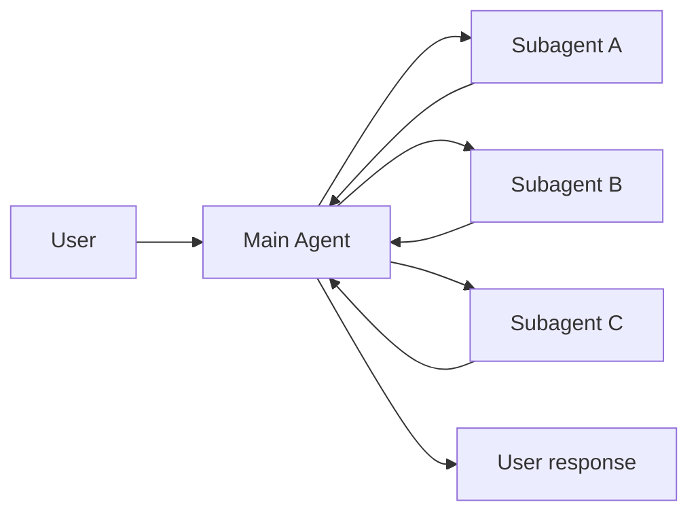
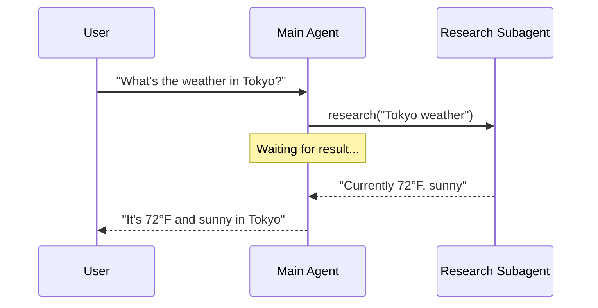
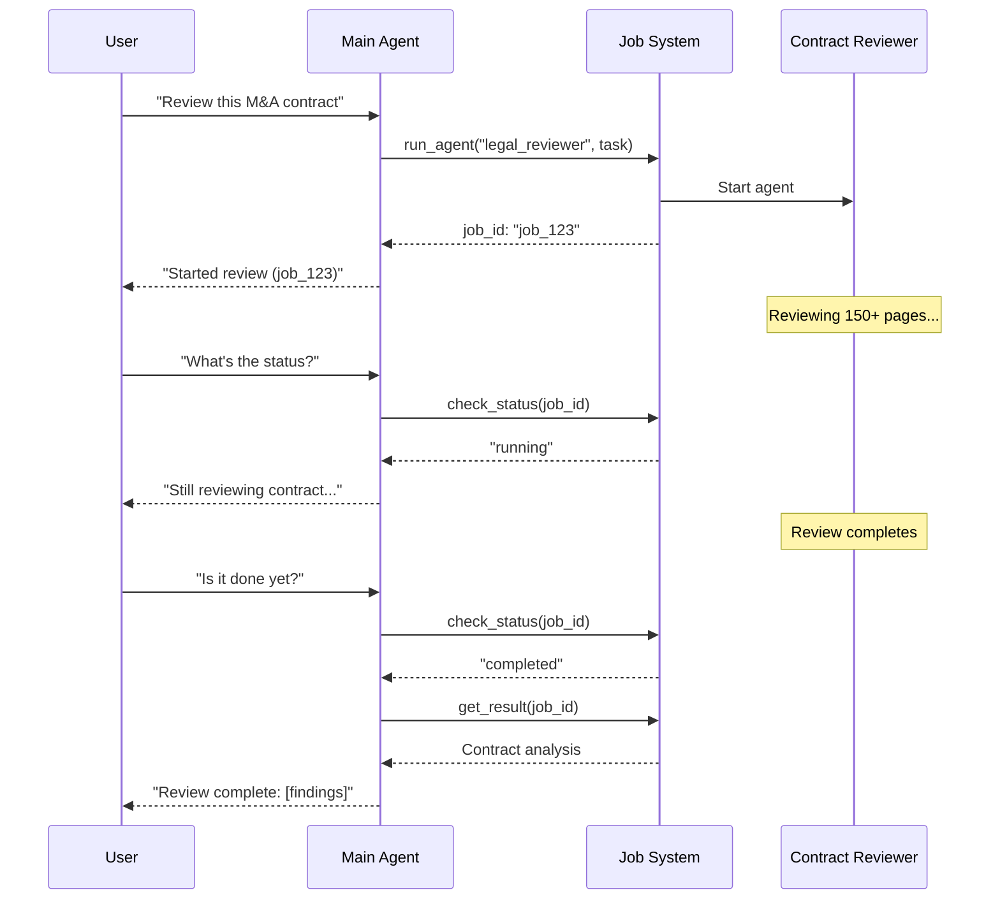
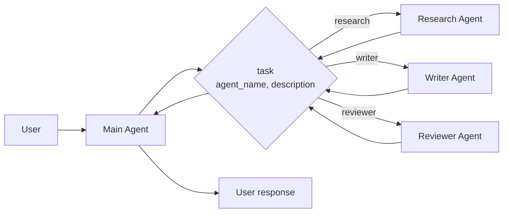

In the **subagents** architecture, a central main [agent](/oss/javascript/langchain/agents) (often referred to as a **supervisor**) coordinates subagents by calling them as [tools](/oss/javascript/langchain/tools). The main agent decides which subagent to invoke, what input to provide, and how to combine results. Subagents are stateless—they don't remember past interactions, with all conversation memory maintained by the main agent. This provides [context](/oss/javascript/langchain/context-engineering) isolation: each subagent invocation works in a clean context window, preventing context bloat in the main conversation.



## Key characteristics

* Centralized control: All routing passes through the main agent
* No direct user interaction: Subagents return results to the main agent, not the user (though you can use [interrupts](/oss/javascript/langgraph/human-in-the-loop#interrupt) within a subagent to allow user interaction)
* Subagents via tools: Subagents are invoked via tools
* Parallel execution: The main agent can invoke multiple subagents in a single turn

<Note>
**Subgraph state inspection may not be available with this pattern.** LangGraph can only inspect subgraph state for subgraphs it can [statically discover](/oss/javascript/langgraph/use-subgraphs#view-subgraph-state). Because subagents are called inside tool functions, they are not statically discoverable, so [`get_state` with `subgraphs`](/oss/javascript/langgraph/use-subgraphs#view-subgraph-state) will not return subagent state. If you need to read nested graph state (e.g., during an [interrupt](/oss/javascript/langgraph/human-in-the-loop#interrupt)), invoke the subagent from a [node function](/oss/javascript/langgraph/use-subgraphs#invoke-a-graph-from-a-node) in a custom graph instead.
</Note>

<Note>
**Supervisor vs. Router**: A supervisor agent (this pattern) is different from a [router](/oss/javascript/langchain/multi-agent/router). The supervisor is a full agent that maintains conversation context and dynamically decides which subagents to call across multiple turns. A router is typically a single classification step that dispatches to agents without maintaining ongoing conversation state.
</Note>

## When to use

Use the subagents pattern when you have multiple distinct domains (e.g., calendar, email, CRM, database), subagents don't need to converse directly with users, or you want centralized workflow control. For simpler cases with just a few [tools](/oss/javascript/langchain/tools), use a [single agent](/oss/javascript/langchain/agents).

<Tip>
**Need user interaction within a subagent?** While subagents typically return results to the main agent rather than conversing directly with users, you can use [interrupts](/oss/javascript/langgraph/human-in-the-loop#interrupt) within a subagent to pause execution and gather user input. This is useful when a subagent needs clarification or approval before proceeding. The main agent remains the orchestrator, but the subagent can collect information from the user mid-task.
</Tip>

## Basic implementation

The core mechanism wraps a subagent as a tool that the main agent can call:


```typescript
import { createAgent, tool } from "langchain";
import { z } from "zod";

// Create a subagent
const subagent = createAgent({ model: "anthropic:claude-sonnet-4-20250514", tools: [...] });

// Wrap it as a tool
const callResearchAgent = tool(
  async ({ query }) => {
    const result = await subagent.invoke({
      messages: [{ role: "user", content: query }]
    });
    return result.messages.at(-1)?.content;
  },
  {
    name: "research",
    description: "Research a topic and return findings",
    schema: z.object({ query: z.string() })
  }
);

// Main agent with subagent as a tool
const mainAgent = createAgent({ model: "anthropic:claude-sonnet-4-20250514", tools: [callResearchAgent] });
```


<Card
    title="Tutorial: Build a personal assistant with subagents"
    icon="sitemap"
    href="/oss/javascript/langchain/multi-agent/subagents-personal-assistant"
    arrow cta="Learn more"
>
    Learn how to build a personal assistant using the subagents pattern, where a central main agent (supervisor) coordinates specialized worker agents.
</Card>

## Design decisions

When implementing the subagents pattern, you'll make several key design choices. This table summarizes the options—each is covered in detail in the sections below.

| Decision | Options |
|----------|---------|
| [**Sync vs. async**](#sync-vs-async) | Sync (blocking) vs. async (background) |
| [**Tool patterns**](#tool-patterns) | Tool per agent vs. single dispatch tool |
| [**Subagent specs**](#subagent-specs) | System prompt vs. enum constraint vs. tool-based discovery (single dispatch tool only) |
| [**Subagent inputs**](#subagent-inputs) | Query only vs. full context |
| [**Subagent outputs**](#subagent-outputs) | Subagent result vs full conversation history |

## Sync vs. async

Subagent execution can be **synchronous** (blocking) or **asynchronous** (background). Your choice depends on whether the main agent needs the result to continue.

| Mode | Main agent behavior | Best for | Tradeoff |
|------|---------------------|----------|----------|
| **Sync** | Waits for subagent to complete | Main agent needs result to continue | Simple, but blocks the conversation |
| **Async** | Continues while subagent runs in background | Independent tasks, user shouldn't wait | Responsive, but more complex |

<Tip>
Not to be confused with Python's `async`/`await`. Here, "async" means the main agent kicks off a background job (typically in a separate process or service) and continues without blocking.
</Tip>

### Synchronous (default)

By default, subagent calls are **synchronous**—the main agent waits for each subagent to complete before continuing. Use sync when the main agent's next action depends on the subagent's result.



**When to use sync:**
- Main agent needs the subagent's result to formulate its response
- Tasks have order dependencies (e.g., fetch data → analyze → respond)
- Subagent failures should block the main agent's response

**Tradeoffs:**
- Simple implementation—just call and wait
- User sees no response until all subagents complete
- Long-running tasks freeze the conversation

### Asynchronous

Use **asynchronous execution** when the subagent's work is independent—the main agent doesn't need the result to continue conversing with the user. The main agent kicks off a background job and remains responsive.



**When to use async:**
- Subagent work is independent of the main conversation flow
- Users should be able to continue chatting while work happens
- You want to run multiple independent tasks in parallel

**Three-tool pattern:**
1. **Start job**: Kicks off the background task, returns a job ID
2. **Check status**: Returns current state (pending, running, completed, failed)
3. **Get result**: Retrieves the completed result

**Handling job completion:** When a job finishes, your application needs to notify the user. One approach: surface a notification that, when clicked, sends a `HumanMessage` like "Check job_123 and summarize the results."

## Tool patterns

There are two main ways to expose subagents as tools:

| Pattern | Best for | Trade-off |
|---------|----------|-----------|
| [**Tool per agent**](#tool-per-agent) | Fine-grained control over each subagent's input/output | More setup, but more customization |
| [**Single dispatch tool**](#single-dispatch-tool) | Many agents, distributed teams, convention over configuration | Simpler composition, less per-agent customization |

### Tool per agent


The key idea is wrapping subagents as tools that the main agent can call:


```typescript
import { createAgent, tool } from "langchain";
import * as z from "zod";

// Create a sub-agent
const subagent = createAgent({...});  // [!code highlight]

// Wrap it as a tool  // [!code highlight]
const callSubagent = tool(  // [!code highlight]
  async ({ query }) => {  // [!code highlight]
    const result = await subagent.invoke({
      messages: [{ role: "user", content: query }]
    });
    return result.messages.at(-1)?.text;
  },
  {
    name: "subagent_name",
    description: "subagent_description",
    schema: z.object({
      query: z.string().describe("The query to send to subagent")
    })
  }
);

// Main agent with subagent as a tool  // [!code highlight]
const mainAgent = createAgent({ model, tools: [callSubagent] });  // [!code highlight]
```


The main agent invokes the subagent tool when it decides the task matches the subagent's description, receives the result, and continues orchestration. See [Context engineering](#context-engineering) for fine-grained control.

### Single dispatch tool

An alternative approach uses a single parameterized tool to invoke ephemeral sub-agents for independent tasks. Unlike the [tool per agent](#tool-per-agent) approach where each sub-agent is wrapped as a separate tool, this uses a convention-based approach with a single `task` tool: the task description is passed as a human message to the sub-agent, and the sub-agent's final message is returned as the tool result.

Use this approach when you want to distribute agent development across multiple teams, need to isolate complex tasks into separate context windows, need a scalable way to add new agents without modifying the coordinator, or prefer convention over customization. This approach trades flexibility in context engineering for simplicity in agent composition and strong context isolation.



**Key characteristics:**

* Single task tool: One parameterized tool that can invoke any registered sub-agent by name
* Convention-based invocation: Agent selected by name, task passed as human message, final message returned as tool result
* Team distribution: Different teams can develop and deploy agents independently
* Agent discovery: Sub-agents can be discovered via system prompt (listing available agents) or through [progressive disclosure](/oss/javascript/langchain/multi-agent/skills-sql-assistant) (loading agent information on-demand via tools)

<Tip>
An interesting aspect of this approach is that sub-agents may have the exact same capabilities as the main agent. In such cases, invoking a sub-agent is **really about context isolation** as the primary reason—allowing complex, multi-step tasks to run in isolated context windows without bloating the main agent's conversation history. The sub-agent completes its work autonomously and returns only a concise summary, keeping the main thread focused and efficient.
</Tip>

<Accordion title="Agent registry with task dispatcher">


```typescript
import { tool, createAgent } from "langchain";
import * as z from "zod";

// Sub-agents developed by different teams
const researchAgent = createAgent({
  model: "gpt-4.1",
  prompt: "You are a research specialist...",
});

const writerAgent = createAgent({
  model: "gpt-4.1",
  prompt: "You are a writing specialist...",
});

// Registry of available sub-agents
const SUBAGENTS = {
  research: researchAgent,
  writer: writerAgent,
};

const task = tool(
  async ({ agentName, description }) => {
    const agent = SUBAGENTS[agentName];
    const result = await agent.invoke({
      messages: [
        { role: "user", content: description }
      ],
    });
    return result.messages.at(-1)?.content;
  },
  {
    name: "task",
    description: `Launch an ephemeral subagent.

Available agents:
- research: Research and fact-finding
- writer: Content creation and editing`,
    schema: z.object({
      agentName: z
        .string()
        .describe("Name of agent to invoke"),
      description: z
        .string()
        .describe("Task description"),
    }),
  }
);

// Main coordinator agent
const mainAgent = createAgent({
  model: "gpt-4.1",
  tools: [task],
  prompt: (
    "You coordinate specialized sub-agents. " +
    "Available: research (fact-finding), " +
    "writer (content creation). " +
    "Use the task tool to delegate work."
  ),
});
```


</Accordion>

## Context engineering

Control how context flows between the main agent and its subagents:

| Category | Purpose | Impacts |
|----------|---------|---------|
| [**Subagent specs**](#subagent-specs) | Ensure subagents are invoked when they should be | Main agent routing decisions |
| [**Subagent inputs**](#subagent-inputs) | Ensure subagents can execute well with optimized context | Subagent performance |
| [**Subagent outputs**](#subagent-outputs) | Ensure the supervisor can act on subagent results | Main agent performance |

See also our comprehensive guide on [context engineering](/oss/javascript/langchain/context-engineering) for agents.

### Subagent specs

The **names** and **descriptions** associated with subagents are the primary way the main agent knows which subagents to invoke. These are prompting levers—choose them carefully.

* **Name**: How the main agent refers to the sub-agent. Keep it clear and action-oriented (e.g., `research_agent`, `code_reviewer`).
* **Description**: What the main agent knows about the sub-agent's capabilities. Be specific about what tasks it handles and when to use it.

For the [single dispatch tool](#single-dispatch-tool) design, you must additionally provide the main agent with information about the subagents it can invoke.
You can provide this information in different ways based on the number of agents and whether your registry is static or dynamic:

| Method | Best for | Tradeoff |
|--------|----------|----------|
| **System prompt enumeration** | Small, static agent lists (< 10 agents) | Simple, but requires prompt updates when agents change |
| **Enum constraint** | Small, static agent lists (< 10 agents) | Type-safe and explicit, but requires code changes when agents change |
| **Tool-based discovery** | Large or dynamic agent registries | Flexible and scalable, but adds complexity |

#### System prompt enumeration

List available agents directly in the main agent's system prompt. The main agent sees the list of agents and their descriptions as part of its instructions.

**When to use:**
- You have a small, fixed set of agents (< 10)
- Agent registry rarely changes
- You want the simplest implementation

**Example:**
```python
main_agent = create_agent(
    model="...",
    tools=[task],
    system_prompt=(
        "You coordinate specialized sub-agents. "
        "Available agents:\n"
        "- research: Research and fact-finding\n"
        "- writer: Content creation and editing\n"
        "- reviewer: Code and document review\n"
        "Use the task tool to delegate work."
    ),
)
```

#### Enum constraint on dispatch tool

Add an enum constraint to the `agent_name` parameter in your dispatch tool. This provides type safety and makes available agents explicit in the tool schema.

**When to use:**
- You have a small, fixed set of agents (< 10)
- You want type safety and explicit agent names
- You prefer schema-based validation over prompt-based guidance

**Example:**
```python
from enum import Enum

class AgentName(str, Enum):
    RESEARCH = "research"
    WRITER = "writer"
    REVIEWER = "reviewer"

@tool
def task(
    agent_name: AgentName,  # Enum constraint
    description: str
) -> str:
    """Launch an ephemeral subagent for a task."""
    # ...
```

#### Tool-based discovery

Provide a separate tool (e.g., `list_agents` or `search_agents`) that the main agent can call to discover available agents on-demand. This enables progressive disclosure and supports dynamic registries.

**When to use:**
- You have many agents (> 10) or a growing registry
- Agent registry changes frequently or is dynamic
- You want to reduce prompt size and token usage
- Different teams manage different agents independently

**Example:**
```python
@tool
def list_agents(query: str = "") -> str:
    """List available subagents, optionally filtered by query."""
    agents = search_agent_registry(query)
    return format_agent_list(agents)

@tool
def task(agent_name: str, description: str) -> str:
    """Launch an ephemeral subagent for a task."""
    # ...

main_agent = create_agent(
    model="...",
    tools=[task, list_agents],
    system_prompt="Use list_agents to discover available subagents, then use task to invoke them."
)
```

### Subagent inputs

Customize what context the subagent receives to execute its task. Add input that isn't practical to capture in a static prompt—full message history, prior results, or task metadata—by pulling from the agent's state.


```typescript Subagent inputs example expandable
import { createAgent, tool, AgentState, ToolMessage } from "langchain";
import { Command } from "@langchain/langgraph";
import * as z from "zod";

// Example of passing the full conversation history to the sub agent via the state.
const callSubagent1 = tool(
  async ({query}) => {
    const state = getCurrentTaskInput<AgentState>();
    // Apply any logic needed to transform the messages into a suitable input
    const subAgentInput = someLogic(query, state.messages);
    const result = await subagent1.invoke({
      messages: subAgentInput,
      // You could also pass other state keys here as needed.
      // Make sure to define these in both the main and subagent's
      // state schemas.
      exampleStateKey: state.exampleStateKey
    });
    return result.messages.at(-1)?.content;
  },
  {
    name: "subagent1_name",
    description: "subagent1_description",
  }
);
```


### Subagent outputs

Customize what the main agent receives back so it can make good decisions. Two strategies:

1. **Prompt the sub-agent**: Specify exactly what should be returned. A common failure mode is that the sub-agent performs tool calls or reasoning but doesn't include results in its final message—remind it that the supervisor only sees the final output.
2. **Format in code**: Adjust or enrich the response before returning it. For example, pass specific state keys back in addition to the final text using a [`Command`](/oss/javascript/langgraph/graph-api#command).


```typescript Subagent outputs example expandable
import { tool, ToolMessage } from "langchain";
import { Command } from "@langchain/langgraph";
import * as z from "zod";

const callSubagent1 = tool(
  async ({ query }, config) => {
    const result = await subagent1.invoke({
      messages: [{ role: "user", content: query }]
    });

    // Return a Command to update multiple state keys
    return new Command({
      update: {
        // Pass back additional state from the subagent
        exampleStateKey: result.exampleStateKey,
        messages: [
          new ToolMessage({
            content: result.messages.at(-1)?.text,
            tool_call_id: config.toolCall?.id!
          })
        ]
      }
    });
  },
  {
    name: "subagent1_name",
    description: "subagent1_description",
    schema: z.object({
      query: z.string().describe("The query to send to subagent1")
    })
  }
);
```

---

<Callout icon="pen-to-square" iconType="regular">
    [Edit this page on GitHub](https://github.com/langchain-ai/docs/edit/main/src/oss/langchain/multi-agent/subagents.mdx) or [file an issue](https://github.com/langchain-ai/docs/issues/new/choose).
</Callout>
<Tip icon="terminal" iconType="regular">
    [Connect these docs](/use-these-docs) to Claude, VSCode, and more via MCP for real-time answers.
</Tip>
