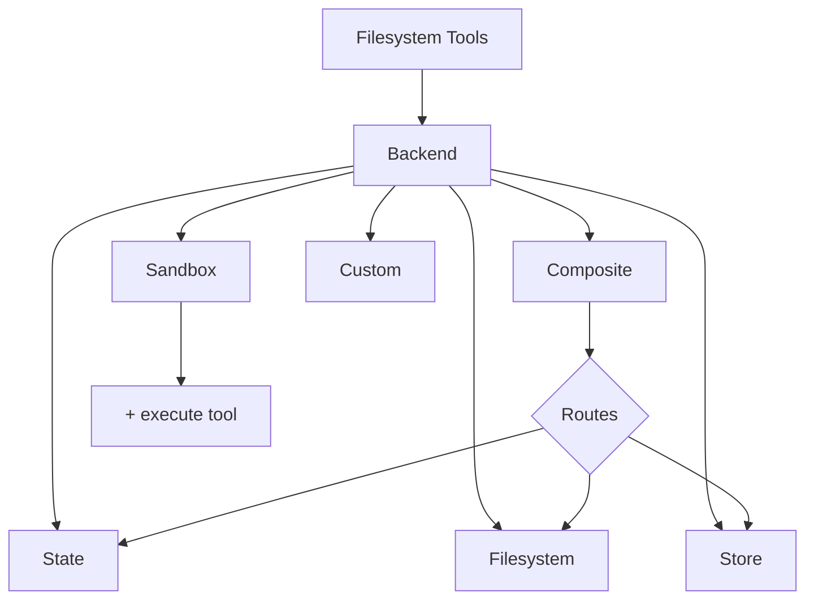

import BackendState from '/snippets/backend-state.mdx';
import BackendFilesystem from '/snippets/backend-filesystem.mdx';
import BackendStore from '/snippets/backend-store.mdx';
import BackendComposite from '/snippets/backend-composite.mdx';

Deep agents expose a filesystem surface to the agent via tools like `ls`, `read_file`, `write_file`, `edit_file`, `glob`, and `grep`. These tools operate through a pluggable backend.



This page explains how to [choose a backend](#specify-a-backend), [route different paths to different backends](#route-to-different-backends), [implement your own virtual filesystem](#use-a-virtual-filesystem) (e.g., S3 or Postgres), [add policy hooks](#add-policy-hooks), and [comply with the backend protocol](#protocol-reference).

## Quickstart

Here are a few pre-built filesystem backends that you can quickly use with your deep agent:

| Built-in backend | Description |
|---|---|
| [Default](#statebackend-ephemeral) | `agent = create_deep_agent()` <br></br> Ephemeral in state. The default filesystem backend for an agent is stored in `langgraph` state. Note that this filesystem only persists _for a single thread_. |
| [Local filesystem persistence](#filesystembackend-local-disk) | `agent = create_deep_agent(backend=FilesystemBackend(root_dir="/Users/nh/Desktop/"))` <br></br>This gives the deep agent access to your local machine's filesystem. You can specify the root directory that the agent has access to. Note that any provided `root_dir` must be an absolute path. |
| [Durable store (LangGraph store)](#storebackend-langgraph-store) | `agent = create_deep_agent(backend=lambda rt: StoreBackend(rt))` <br></br>This gives the agent access to long-term storage that is _persisted across threads_. This is great for storing longer term memories or instructions that are applicable to the agent over multiple executions. |
| [Sandbox](/oss/python/deepagents/sandboxes) | `agent = create_deep_agent(backend=sandbox)` <br></br>Execute code in isolated environments. Sandboxes provide filesystem tools plus the `execute` tool for running shell commands. Choose from Modal, Daytona, Deno, or local VFS. |
| [Composite](#compositebackend-router) | Ephemeral by default, `/memories/` persisted. The Composite backend is maximally flexible. You can specify different routes in the filesystem to point towards different backends. See Composite routing below for a ready-to-paste example. |


## Built-in backends

### StateBackend (ephemeral)

<BackendState />

**How it works:**
- Stores files in LangGraph agent state for the current thread.
- Persists across multiple agent turns on the same thread via checkpoints.

**Best for:**
- A scratch pad for the agent to write intermediate results.
- Automatic eviction of large tool outputs which the agent can then read back in piece by piece.

Note that this backend is shared between the supervisor agent and subagents, and any files a subagent writes will remain in the LangGraph agent state
even after that subagent's execution is complete. Those files will continue to be available to the supervisor agent and other subagents.

### FilesystemBackend (local disk)

<Warning>
This backend grants agents direct filesystem read/write access.
Use with caution and only in appropriate environments.

**Appropriate use cases:**
- Local development CLIs (coding assistants, development tools)
- CI/CD pipelines (see security considerations below)

**Inappropriate use cases:**
- Web servers or HTTP APIs - use `StateBackend`, `StoreBackend`, or a [sandbox backend](/oss/python/deepagents/sandboxes) instead

**Security risks:**
- Agents can read any accessible file, including secrets (API keys, credentials, `.env` files)
- Combined with network tools, secrets may be exfiltrated via SSRF attacks
- File modifications are permanent and irreversible

**Recommended safeguards:**
1. Enable [Human-in-the-Loop (HITL) middleware](/oss/python/deepagents/human-in-the-loop) to review sensitive operations.
1. Exclude secrets from accessible filesystem paths (especially in CI/CD).
1. Use a [sandbox backend](/oss/python/deepagents/sandboxes) for production environments requiring filesystem interaction.
1. **Always** use `virtual_mode=True` with `root_dir` to enable path-based access restrictions (blocks `..`, `~`, and absolute paths outside root).
   Note that the default (`virtual_mode=False`) provides no security even with `root_dir` set.
</Warning>

<BackendFilesystem />

**How it works:**
- Reads/writes real files under a configurable `root_dir`.
- You can optionally set `virtual_mode=True` to sandbox and normalize paths under `root_dir`.
- Uses secure path resolution, prevents unsafe symlink traversal when possible, can use ripgrep for fast `grep`.

**Best for:**
- Local projects on your machine
- CI sandboxes
- Mounted persistent volumes

### StoreBackend (LangGraph store)

<BackendStore />

**How it works:**
- Stores files in a LangGraph [`BaseStore`](https://reference.langchain.com/python/langgraph/store/#langgraph.store.base.BaseStore) provided by the runtime, enabling cross‑thread durable storage.

**Best for:**
- When you already run with a configured LangGraph store (for example, Redis, Postgres, or cloud implementations behind [`BaseStore`](https://reference.langchain.com/python/langgraph/store/#langgraph.store.base.BaseStore)).
- When you're deploying your agent through LangSmith Deployment (a store is automatically provisioned for your agent).


### CompositeBackend (router)

<BackendComposite />

**How it works:**
- Routes file operations to different backends based on path prefix.
- Preserves the original path prefixes in listings and search results.

**Best for:**
- When you want to give your agent both ephemeral and cross-thread storage, a `CompositeBackend` allows you provide both a `StateBackend` and `StoreBackend`
- When you have multiple sources of information that you want to provide to your agent as part of a single filesystem.
    - e.g. You have long-term memories stored under `/memories/` in one Store and you also have a custom backend that has documentation accessible at /docs/.

## Specify a backend

- Pass a backend to `create_deep_agent(backend=...)`. The filesystem middleware uses it for all tooling.
- You can pass either:
    - An instance implementing `BackendProtocol` (for example, `FilesystemBackend(root_dir=".")`), or
    - A factory `BackendFactory = Callable[[ToolRuntime], BackendProtocol]` (for backends that need runtime like `StateBackend` or `StoreBackend`).
- If omitted, the default is `lambda rt: StateBackend(rt)`.


## Route to different backends

Route parts of the namespace to different backends. Commonly used to persist `/memories/*` and keep everything else ephemeral.

```python
from deepagents import create_deep_agent
from deepagents.backends import CompositeBackend, StateBackend, FilesystemBackend

composite_backend = lambda rt: CompositeBackend(
    default=StateBackend(rt),
    routes={
        "/memories/": FilesystemBackend(root_dir="/deepagents/myagent", virtual_mode=True),
    },
)

agent = create_deep_agent(backend=composite_backend)
```


Behavior:
- `/workspace/plan.md` → `StateBackend` (ephemeral)
- `/memories/agent.md` → `FilesystemBackend` under `/deepagents/myagent`
- `ls`, `glob`, `grep` aggregate results and show original path prefixes.

Notes:
- Longer prefixes win (for example, route `"/memories/projects/"` can override `"/memories/"`).
- For StoreBackend routing, ensure the agent runtime provides a store (`runtime.store`).

## Use a virtual filesystem

Build a custom backend to project a remote or database filesystem (e.g., S3 or Postgres) into the tools namespace.

Design guidelines:

- Paths are absolute (`/x/y.txt`). Decide how to map them to your storage keys/rows.
- Implement `ls_info` and `glob_info` efficiently (server-side listing where available, otherwise local filter).
- Return user-readable error strings for missing files or invalid regex patterns.
- For external persistence, set `files_update=None` in results; only in-state backends should return a `files_update` dict.

S3-style outline:

```python
from deepagents.backends.protocol import BackendProtocol, WriteResult, EditResult
from deepagents.backends.utils import FileInfo, GrepMatch

class S3Backend(BackendProtocol):
    def __init__(self, bucket: str, prefix: str = ""):
        self.bucket = bucket
        self.prefix = prefix.rstrip("/")

    def _key(self, path: str) -> str:
        return f"{self.prefix}{path}"

    def ls_info(self, path: str) -> list[FileInfo]:
        # List objects under _key(path); build FileInfo entries (path, size, modified_at)
        ...

    def read(self, file_path: str, offset: int = 0, limit: int = 2000) -> str:
        # Fetch object; return numbered content or an error string
        ...

    def grep_raw(self, pattern: str, path: str | None = None, glob: str | None = None) -> list[GrepMatch] | str:
        # Optionally filter server‑side; else list and scan content
        ...

    def glob_info(self, pattern: str, path: str = "/") -> list[FileInfo]:
        # Apply glob relative to path across keys
        ...

    def write(self, file_path: str, content: str) -> WriteResult:
        # Enforce create‑only semantics; return WriteResult(path=file_path, files_update=None)
        ...

    def edit(self, file_path: str, old_string: str, new_string: str, replace_all: bool = False) -> EditResult:
        # Read → replace (respect uniqueness vs replace_all) → write → return occurrences
        ...
```


Postgres-style outline:

- Table `files(path text primary key, content text, created_at timestamptz, modified_at timestamptz)`
- Map tool operations onto SQL:
  - `ls_info` uses `WHERE path LIKE $1 || '%'`
  - `glob_info` filter in SQL or fetch then apply glob in Python
  - `grep_raw` can fetch candidate rows by extension or last modified time, then scan lines

## Add policy hooks

Enforce enterprise rules by subclassing or wrapping a backend.

Block writes/edits under selected prefixes (subclass):

```python
from deepagents.backends.filesystem import FilesystemBackend
from deepagents.backends.protocol import WriteResult, EditResult

class GuardedBackend(FilesystemBackend):
    def __init__(self, *, deny_prefixes: list[str], **kwargs):
        super().__init__(**kwargs)
        self.deny_prefixes = [p if p.endswith("/") else p + "/" for p in deny_prefixes]

    def write(self, file_path: str, content: str) -> WriteResult:
        if any(file_path.startswith(p) for p in self.deny_prefixes):
            return WriteResult(error=f"Writes are not allowed under {file_path}")
        return super().write(file_path, content)

    def edit(self, file_path: str, old_string: str, new_string: str, replace_all: bool = False) -> EditResult:
        if any(file_path.startswith(p) for p in self.deny_prefixes):
            return EditResult(error=f"Edits are not allowed under {file_path}")
        return super().edit(file_path, old_string, new_string, replace_all)
```


Generic wrapper (works with any backend):

```python
from deepagents.backends.protocol import BackendProtocol, WriteResult, EditResult
from deepagents.backends.utils import FileInfo, GrepMatch

class PolicyWrapper(BackendProtocol):
    def __init__(self, inner: BackendProtocol, deny_prefixes: list[str] | None = None):
        self.inner = inner
        self.deny_prefixes = [p if p.endswith("/") else p + "/" for p in (deny_prefixes or [])]

    def _deny(self, path: str) -> bool:
        return any(path.startswith(p) for p in self.deny_prefixes)

    def ls_info(self, path: str) -> list[FileInfo]:
        return self.inner.ls_info(path)
    def read(self, file_path: str, offset: int = 0, limit: int = 2000) -> str:
        return self.inner.read(file_path, offset=offset, limit=limit)
    def grep_raw(self, pattern: str, path: str | None = None, glob: str | None = None) -> list[GrepMatch] | str:
        return self.inner.grep_raw(pattern, path, glob)
    def glob_info(self, pattern: str, path: str = "/") -> list[FileInfo]:
        return self.inner.glob_info(pattern, path)
    def write(self, file_path: str, content: str) -> WriteResult:
        if self._deny(file_path):
            return WriteResult(error=f"Writes are not allowed under {file_path}")
        return self.inner.write(file_path, content)
    def edit(self, file_path: str, old_string: str, new_string: str, replace_all: bool = False) -> EditResult:
        if self._deny(file_path):
            return EditResult(error=f"Edits are not allowed under {file_path}")
        return self.inner.edit(file_path, old_string, new_string, replace_all)
```


## Protocol reference

Backends must implement the `BackendProtocol`.

Required endpoints:
- `ls_info(path: str) -> list[FileInfo]`
  - Return entries with at least `path`. Include `is_dir`, `size`, `modified_at` when available. Sort by `path` for deterministic output.
- `read(file_path: str, offset: int = 0, limit: int = 2000) -> str`
  - Return numbered content. On missing file, return `"Error: File '/x' not found"`.
- `grep_raw(pattern: str, path: Optional[str] = None, glob: Optional[str] = None) -> list[GrepMatch] | str`
  - Return structured matches. For an invalid regex, return a string like `"Invalid regex pattern: ..."` (do not raise).
- `glob_info(pattern: str, path: str = "/") -> list[FileInfo]`
  - Return matched files as `FileInfo` entries (empty list if none).
- `write(file_path: str, content: str) -> WriteResult`
  - Create-only. On conflict, return `WriteResult(error=...)`. On success, set `path` and for state backends set `files_update={...}`; external backends should use `files_update=None`.
- `edit(file_path: str, old_string: str, new_string: str, replace_all: bool = False) -> EditResult`
  - Enforce uniqueness of `old_string` unless `replace_all=True`. If not found, return error. Include `occurrences` on success.

Supporting types:
- `WriteResult(error, path, files_update)`
- `EditResult(error, path, files_update, occurrences)`
- `FileInfo` with fields: `path` (required), optionally `is_dir`, `size`, `modified_at`.
- `GrepMatch` with fields: `path`, `line`, `text`.

---

<Callout icon="pen-to-square" iconType="regular">
    [Edit this page on GitHub](https://github.com/langchain-ai/docs/edit/main/src/oss/deepagents/backends.mdx) or [file an issue](https://github.com/langchain-ai/docs/issues/new/choose).
</Callout>
<Tip icon="terminal" iconType="regular">
    [Connect these docs](/use-these-docs) to Claude, VSCode, and more via MCP for real-time answers.
</Tip>
