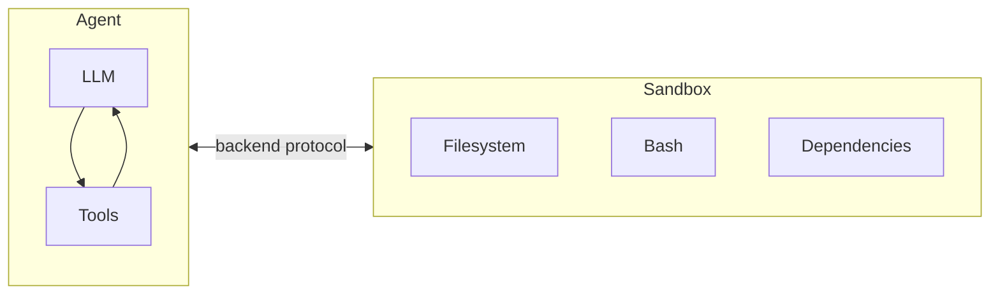
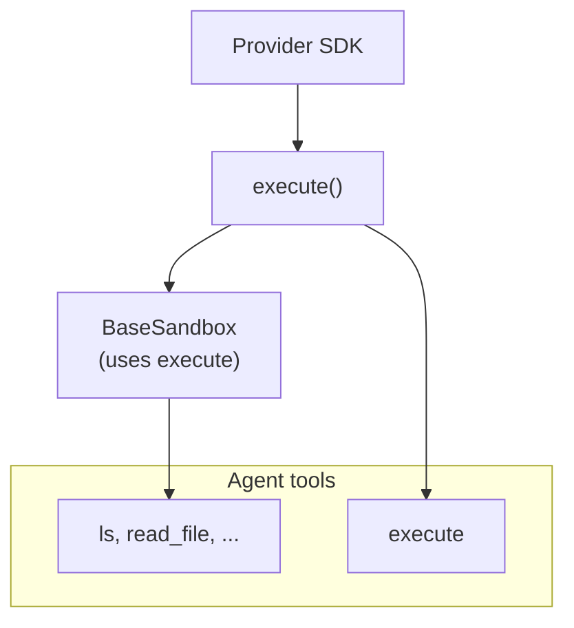
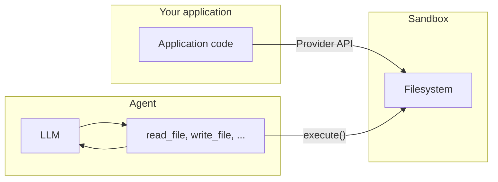

import SandboxBasicPy from '/snippets/deepagents-sandbox-basic-py.mdx';
import SandboxBasicJs from '/snippets/deepagents-sandbox-basic-js.mdx';

Agents generate code, interact with filesystems, and run shell commands. Because we can't predict what an agent might do, it's important that its environment is isolated so it can't access credentials, files, or the network. Sandboxes provide this isolation by creating a boundary between the agent's execution environment and your host system.

In deep agents, **sandboxes are [backends](/oss/python/deepagents/backends)** that define the environment where the agent operates. Unlike other backends (State, Filesystem, Store) which only expose file operations, sandbox backends also give the agent an `execute` tool for running shell commands. When you configure a sandbox backend, the agent gets:

- All standard filesystem tools (`ls`, `read_file`, `write_file`, `edit_file`, `glob`, `grep`)
- The `execute` tool for running arbitrary shell commands in the sandbox
- A secure boundary that protects your host system



## Why use sandboxes?

- **Security**: Code runs in isolation - can't access your credentials, files, or network
- **Clean environments**: Use specific dependencies or OS configurations without local setup
- **Reproducibility**: Consistent execution environments across teams
- **Flexibility**: Switch between cloud providers or use local VFS for development


## Available providers

<CardGroup cols={2}>
    <Card title="Modal" icon="/images/providers/modal-icon.svg" href="/oss/python/integrations/providers/modal">
        ML/AI workloads, GPU access.
    </Card>
    <Card title="Daytona" icon="/images/providers/daytona-icon.svg" href="/oss/python/integrations/providers/daytona">
        TypeScript/Python development, fast cold starts.
    </Card>
    <Card title="Runloop" href="/oss/python/integrations/providers/runloop">
        Disposable devboxes for isolated code execution.
    </Card>
</CardGroup>


## Basic usage

These examples assume you have already created a sandbox/devbox using the provider's SDK and have credentials set up. For signup, authentication, and provider-specific lifecycle details, see [Provider integrations](#provider-integrations).

<SandboxBasicPy />


## How sandboxes work

### Isolation boundaries

All sandbox providers protect your host system from the agent's filesystem and shell operations. The agent cannot read your local files, access environment variables on your machine, or interfere with other processes. However, sandboxes alone do **not** protect against:

- **Context injection** — An attacker who controls part of the agent's input can instruct it to run arbitrary commands inside the sandbox. The sandbox is isolated, but the agent has full control within it.
- **Network exfiltration** — Unless network access is blocked, a context-injected agent can send data out of the sandbox over HTTP or DNS. Some providers support blocking network access (e.g., `blockNetwork: true` on Modal).

See [security considerations](#security-considerations) for how to handle secrets and mitigate these risks.

### The `execute` method

Sandbox backends have a simple architecture: the only method a provider must implement is `execute()`, which runs a shell command and returns its output. Every other filesystem operation — `read`, `write`, `edit`, `ls`, `glob`, `grep` — is built on top of `execute()` by the `BaseSandbox` base class, which constructs scripts and runs them inside the sandbox via `execute()`.



This design means:
- **Adding a new provider is straightforward.** Implement `execute()` — the base class handles everything else.
- **The `execute` tool is conditionally available.** On every model call, the harness checks whether the backend implements `SandboxBackendProtocol`. If not, the tool is filtered out and the agent never sees it.

When the agent calls the `execute` tool, it provides a `command` string and gets back the combined stdout/stderr, exit code, and a truncation notice if the output was too large.

You can also call the backend `execute()` method directly in your application code.

<Tabs>
  <Tab title="Modal">

```python
import modal

from langchain_modal import ModalSandbox

app = modal.App.lookup("your-app")
modal_sandbox = modal.Sandbox.create(app=app)
backend = ModalSandbox(sandbox=modal_sandbox)

result = backend.execute("python --version")
print(result.output)
```

  </Tab>
  <Tab title="Runloop">

<CodeGroup>
```bash pip
pip install langchain-runloop
```

```bash uv
uv add langchain-runloop
```
</CodeGroup>

```python
from runloop_api_client import RunloopSDK

from langchain_runloop import RunloopSandbox

api_key = "..."
client = RunloopSDK(bearer_token=api_key)

devbox = client.devbox.create()
backend = RunloopSandbox(devbox=devbox)

try:
    result = backend.execute("python --version")
    print(result.output)
finally:
    devbox.shutdown()
```

  </Tab>
  <Tab title="Daytona">

<CodeGroup>
```bash pip
pip install langchain-daytona
```

```bash uv
uv add langchain-daytona
```
</CodeGroup>

```python
from daytona import Daytona

from langchain_daytona import DaytonaSandbox

sandbox = Daytona().create()
backend = DaytonaSandbox(sandbox=sandbox)

result = backend.execute("python --version")
print(result.output)
```

  </Tab>
</Tabs>


For example:

```
4
[Command succeeded with exit code 0]
```

```
bash: foobar: command not found
[Command failed with exit code 127]
```

If a command produces very large output, the result is automatically saved to a file and the agent is instructed to use `read_file` to access it incrementally. This prevents context window overflow.

### Two planes of file access

There are two distinct ways files move in and out of a sandbox, and it's important to understand when to use each:

**Agent filesystem tools** — `read_file`, `write_file`, `edit_file`, `ls`, `glob`, `grep`, and `execute` are the tools the LLM calls during its execution. These go through `execute()` inside the sandbox. The agent uses them to read code, write files, and run commands as part of its task.

**File transfer APIs** — the `uploadFiles()` and `downloadFiles()` methods that your application code calls. These use the provider's native file transfer APIs (not shell commands) and are designed for moving files between your host environment and the sandbox. Use these to:
- **Seed the sandbox** with source code, configuration, or data before the agent runs
- **Retrieve artifacts** (generated code, build outputs, reports) after the agent finishes
- **Pre-populate dependencies** that the agent will need




## Working with files

The deepagents sandbox backends support file transfer APIs for moving files between your application and the sandbox.

### Seeding the sandbox

Use `upload_files()` to populate the sandbox before the agent runs. Paths must be absolute and contents are `bytes`:

<Tabs>
  <Tab title="Modal">

```python
import modal

from langchain_modal import ModalSandbox

app = modal.App.lookup("your-app")
modal_sandbox = modal.Sandbox.create(app=app)
backend = ModalSandbox(sandbox=modal_sandbox)

backend.upload_files(
    [
        ("/src/index.py", b"print('Hello')\n"),
        ("/pyproject.toml", b"[project]\nname = 'my-app'\n"),
    ]
)
```

  </Tab>
  <Tab title="Runloop">

<CodeGroup>
```bash pip
pip install langchain-runloop
```

```bash uv
uv add langchain-runloop
```
</CodeGroup>

```python
from runloop_api_client import RunloopSDK

from langchain_runloop import RunloopSandbox

api_key = "..."
client = RunloopSDK(bearer_token=api_key)

devbox = client.devbox.create()
backend = RunloopSandbox(devbox=devbox)

backend.upload_files(
    [
        ("/src/index.py", b"print('Hello')\n"),
        ("/pyproject.toml", b"[project]\nname = 'my-app'\n"),
    ]
)
```

  </Tab>
  <Tab title="Daytona">

<CodeGroup>
```bash pip
pip install langchain-daytona
```

```bash uv
uv add langchain-daytona
```
</CodeGroup>

```python
from daytona import Daytona

from langchain_daytona import DaytonaSandbox

sandbox = Daytona().create()
backend = DaytonaSandbox(sandbox=sandbox)

backend.upload_files(
    [
        ("/src/index.py", b"print('Hello')\n"),
        ("/pyproject.toml", b"[project]\nname = 'my-app'\n"),
    ]
)
```

  </Tab>
</Tabs>

### Retrieving artifacts

Use `download_files()` to retrieve files from the sandbox after the agent finishes:

<Tabs>
  <Tab title="Modal">

```python
import modal

from langchain_modal import ModalSandbox

app = modal.App.lookup("your-app")
modal_sandbox = modal.Sandbox.create(app=app)
backend = ModalSandbox(sandbox=modal_sandbox)

results = backend.download_files(["/src/index.py", "/output.txt"])
for result in results:
    if result.content is not None:
        print(f"{result.path}: {result.content.decode()}")
    else:
        print(f"Failed to download {result.path}: {result.error}")
```

  </Tab>
  <Tab title="Runloop">

<CodeGroup>
```bash pip
pip install langchain-runloop
```

```bash uv
uv add langchain-runloop
```
</CodeGroup>

```python
from runloop_api_client import RunloopSDK

from langchain_runloop import RunloopSandbox

api_key = "..."
client = RunloopSDK(bearer_token=api_key)

devbox = client.devbox.create()
backend = RunloopSandbox(devbox=devbox)

results = backend.download_files(["/src/index.py", "/output.txt"])
for result in results:
    if result.content is not None:
        print(f"{result.path}: {result.content.decode()}")
    else:
        print(f"Failed to download {result.path}: {result.error}")
```

  </Tab>
  <Tab title="Daytona">

<CodeGroup>
```bash pip
pip install langchain-daytona
```

```bash uv
uv add langchain-daytona
```
</CodeGroup>

```python
from daytona import Daytona

from langchain_daytona import DaytonaSandbox

sandbox = Daytona().create()
backend = DaytonaSandbox(sandbox=sandbox)

results = backend.download_files(["/src/index.py", "/output.txt"])
for result in results:
    if result.content is not None:
        print(f"{result.path}: {result.content.decode()}")
    else:
        print(f"Failed to download {result.path}: {result.error}")
```

  </Tab>
</Tabs>

<Note>
Inside the sandbox, the agent uses filesystem tools (`read_file`, `write_file`). The `upload_files` and `download_files` methods are for your application code to move files across the boundary between your host and the sandbox.
</Note>


## Provider integrations

If you are looking for provider-specific setup and lifecycle details, see:

<CardGroup cols={2}>
    <Card title="Modal" icon="/images/providers/modal-icon.svg" href="/oss/python/integrations/providers/modal" />
    <Card title="Runloop" href="/oss/python/integrations/providers/runloop" />
    <Card title="Daytona" icon="/images/providers/daytona-icon.svg" href="/oss/python/integrations/providers/daytona" />
</CardGroup>


## Security considerations

Sandboxes isolate code execution from your host system, but they don't protect against **context injection**. An attacker who controls part of the agent's input can instruct it to read files, run commands, or exfiltrate data from within the sandbox. This makes credentials inside the sandbox especially dangerous.

<Warning>
**Never put secrets inside a sandbox.** API keys, tokens, database credentials, and other secrets injected into a sandbox (via environment variables, mounted files, or the `secrets` option) can be read and exfiltrated by a context-injected agent. This applies even to short-lived or scoped credentials — if an agent can access them, so can an attacker.
</Warning>

### Handling secrets safely

If your agent needs to call authenticated APIs or access protected resources, you have two options:

1. **Keep secrets in tools outside the sandbox.** Define tools that run in your host environment (not inside the sandbox) and handle authentication there. The agent calls these tools by name, but never sees the credentials. This is the recommended approach.

2. **Use a network proxy that injects credentials.** Some sandbox providers support proxies that intercept outgoing HTTP requests from the sandbox and attach credentials (e.g., `Authorization` headers) before forwarding them. The agent never sees the secret — it just makes plain requests to a URL. This approach is not yet widely available across providers.

<Warning>
If you must inject secrets into a sandbox (not recommended), take these precautions:

- Enable [human-in-the-loop](/oss/python/deepagents/human-in-the-loop) approval for **all** tool calls, not just sensitive ones
- Block or restrict network access from the sandbox to limit exfiltration paths
- Use the narrowest possible credential scope and shortest possible lifetime
- Monitor sandbox network traffic for unexpected outbound requests

Even with these safeguards, this remains an unsafe workaround. A sufficiently creative enough context injection attack can bypass output filtering and HITL review.
</Warning>

### General best practices

- Review sandbox outputs before acting on them in your application
- Block sandbox network access when not needed
- Use [middleware](/oss/python/deepagents/middleware) to filter or redact sensitive patterns in tool outputs
- Treat everything produced inside the sandbox as untrusted input

---

<Callout icon="pen-to-square" iconType="regular">
    [Edit this page on GitHub](https://github.com/langchain-ai/docs/edit/main/src/oss/deepagents/sandboxes.mdx) or [file an issue](https://github.com/langchain-ai/docs/issues/new/choose).
</Callout>
<Tip icon="terminal" iconType="regular">
    [Connect these docs](/use-these-docs) to Claude, VSCode, and more via MCP for real-time answers.
</Tip>
