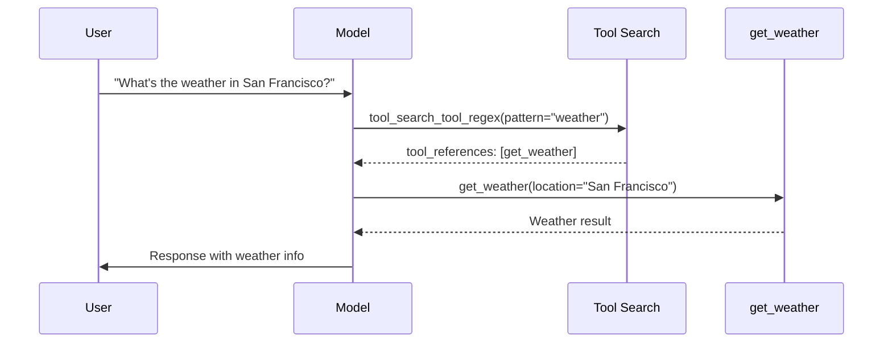

You can find information about Anthropic's latest models, their costs, context windows, and supported input types in the [Claude](https://platform.claude.com/docs/en/about-claude/models/overview) docs.

<Tip>
    **API Reference**

    For detailed documentation of all features and configuration options, head to the [`ChatAnthropic`](https://reference.langchain.com/python/integrations/langchain_anthropic/ChatAnthropic) API reference.
</Tip>

<Info>
    **AWS Bedrock and Google VertexAI**

    Note that certain Anthropic models can also be accessed via AWS Bedrock and Google VertexAI. See the [`ChatBedrock`](/oss/python/integrations/chat/bedrock/) and [`ChatVertexAI`](/oss/python/integrations/chat/google_vertex_ai#anthropic-on-vertex-ai) integrations to use Anthropic models via these services.
</Info>

## Overview

### Integration details

| Class | Package | Serializable | JS/TS Support | Downloads | Latest Version |
| :--- | :--- | :---: |  :---: | :---: | :---: |
| [`ChatAnthropic`](https://reference.langchain.com/python/integrations/langchain_anthropic/ChatAnthropic) | [`langchain-anthropic`](https://reference.langchain.com/python/integrations/langchain_anthropic) | beta | ✅ [(npm)](https://js.langchain.com/docs/integrations/chat/anthropic) | <a href="https://pypi.org/project/langchain-anthropic/" target="_blank"></a> | <a href="https://pypi.org/project/langchain-anthropic/" target="_blank"></a> |

### Model features

| [Tool calling](/oss/python/langchain/tools) | [Structured output](/oss/python/langchain/structured-output) | [Image input](/oss/python/langchain/messages#multimodal) | Audio input | Video input | [Token-level streaming](/oss/python/langchain/streaming/) | Native async | [Token usage](/oss/python/langchain/models#token-usage) | [Logprobs](/oss/python/langchain/models#log-probabilities) |
| :---: | :---: | :---: |  :---: | :---: | :---: | :---: | :---: | :---: |
| ✅ | ✅ | ✅ | ❌ | ❌ | ✅ | ✅ | ✅ | ❌ |

## Setup

To access Anthropic (Claude) models you'll need to install the `langchain-anthropic` integration package and acquire a [Claude](https://platform.claude.com/docs/en/get-started#prerequisites) API key.

### Installation

<CodeGroup>
    ```bash pip
    pip install -U langchain-anthropic
    ```
    ```bash uv
    uv add langchain-anthropic
    ```
</CodeGroup>

### Credentials

Head to the [Claude console](https://console.anthropic.com) to sign up and generate a Claude API key. Once you've done this set the `ANTHROPIC_API_KEY` environment variable:

```python
import getpass
import os

if "ANTHROPIC_API_KEY" not in os.environ:
    os.environ["ANTHROPIC_API_KEY"] = getpass.getpass("Enter your Anthropic API key: ")
```

To enable automated tracing of your model calls, set your [LangSmith](https://docs.langchain.com/langsmith/home) API key:

```python
os.environ["LANGSMITH_API_KEY"] = getpass.getpass("Enter your LangSmith API key: ")
os.environ["LANGSMITH_TRACING"] = "true"
```

## Instantiation

Now we can instantiate our model object and generate chat completions:

```python
from langchain_anthropic import ChatAnthropic

model = ChatAnthropic(
    model="claude-haiku-4-5-20251001",
    # temperature=,
    # max_tokens=,
    # timeout=,
    # max_retries=,
    # ...
)
```

See the [`ChatAnthropic`](https://reference.langchain.com/python/integrations/langchain_anthropic/ChatAnthropic) API reference for details on all available instantiation parameters.

{/* TODO: show use with a proxy or different base_url */}

## Invocation

<AccordionGroup>
    <Accordion
        title="Invoke"
    >
        ```python
        messages = [
            (
                "system",
                "You are a helpful translator. Translate the user sentence to French.",
            ),
            (
                "human",
                "I love programming.",
            ),
        ]
        model.invoke(messages)
        ```


        ```python
        print(ai_msg.text)
        ```

        ```text
        J'adore la programmation.
        ```
    </Accordion>
    <Accordion
        title="Stream"
    >
        ```python
        for chunk in model.stream(messages):
            print(chunk.text, end="")
        ```

        ```python
        AIMessageChunk(content="J", id="run-272ff5f9-8485-402c-b90d-eac8babc5b25")
        AIMessageChunk(content="'", id="run-272ff5f9-8485-402c-b90d-eac8babc5b25")
        AIMessageChunk(content="a", id="run-272ff5f9-8485-402c-b90d-eac8babc5b25")
        AIMessageChunk(content="ime", id="run-272ff5f9-8485-402c-b90d-eac8babc5b25")
        AIMessageChunk(content=" la", id="run-272ff5f9-8485-402c-b90d-eac8babc5b25")
        AIMessageChunk(content=" programm", id="run-272ff5f9-8485-402c-b90d-eac8babc5b25")
        AIMessageChunk(content="ation", id="run-272ff5f9-8485-402c-b90d-eac8babc5b25")
        AIMessageChunk(content=".", id="run-272ff5f9-8485-402c-b90d-eac8babc5b25")
        ```

        To aggregate the full message from the stream:

        ```python
        stream = model.stream(messages)
        full = next(stream)
        for chunk in stream:
            full += chunk
        full
        ```

        ```python
        AIMessageChunk(content="J'aime la programmation.", id="run-b34faef0-882f-4869-a19c-ed2b856e6361")
        ```
    </Accordion>
    <Accordion
        title="Async"
    >
        ```python
        await model.ainvoke(messages)

        # stream
        async for chunk in (await model.astream(messages))

        # batch
        await model.abatch([messages])
        ```

        ```python
        AIMessage(
            content="J'aime la programmation.",
            response_metadata={
                "id": "msg_01Trik66aiQ9Z1higrD5XFx3",
                "model": "claude-sonnet-4-5-20250929",
                "stop_reason": "end_turn",
                "stop_sequence": None,
                "usage": {"input_tokens": 25, "output_tokens": 11},
            },
            id="run-5886ac5f-3c2e-49f5-8a44-b1e92808c929-0",
            usage_metadata={
                "input_tokens": 25,
                "output_tokens": 11,
                "total_tokens": 36,
            },
        )
        ```
    </Accordion>
</AccordionGroup>

Learn more about supported invocation methods in our [models](/oss/python/langchain/models#invocation) guide.


## Content blocks

When using tools, [extended thinking](#extended-thinking), and other features, content from a single Anthropic [`AIMessage`](https://reference.langchain.com/python/langchain/messages/#langchain.messages.AIMessage) can either be a single string or a list of Anthropic content blocks.

For example, when an Anthropic model invokes a tool, the tool invocation is part of the message content (as well as being exposed in the standardized [`AIMessage.tool_calls`](https://reference.langchain.com/python/langchain/messages/#langchain.messages.AIMessage.tool_calls)):

```python
from langchain_anthropic import ChatAnthropic
from typing_extensions import Annotated

model = ChatAnthropic(model="claude-haiku-4-5-20251001")


def get_weather(
    location: Annotated[str, ..., "Location as city and state."]
) -> str:
    """Get the weather at a location."""
    return "It's sunny."


model_with_tools = model.bind_tools([get_weather])
response = model_with_tools.invoke("Which city is hotter today: LA or NY?")
response.content
```

```python
[{'text': "I'll help you compare the temperatures of Los Angeles and New York by checking their current weather. I'll retrieve the weather for both cities.",
  'type': 'text'},
 {'id': 'toolu_01CkMaXrgmsNjTso7so94RJq',
  'input': {'location': 'Los Angeles, CA'},
  'name': 'get_weather',
  'type': 'tool_use'},
 {'id': 'toolu_01SKaTBk9wHjsBTw5mrPVSQf',
  'input': {'location': 'New York, NY'},
  'name': 'get_weather',
  'type': 'tool_use'}]
```

Using `content_blocks` will render the content in LangChain's standard format that is consistent across other model providers. Read more about [content blocks](/oss/python/langchain/messages#standard-content-blocks).

```python
response.content_blocks
```

You can also access tool calls specifically in a standard format using the
`tool_calls` attribute:

```python
response.tool_calls
```

```python
[{'name': 'GetWeather',
  'args': {'location': 'Los Angeles, CA'},
  'id': 'toolu_01Ddzj5PkuZkrjF4tafzu54A'},
 {'name': 'GetWeather',
  'args': {'location': 'New York, NY'},
  'id': 'toolu_012kz4qHZQqD4qg8sFPeKqpP'}]
```

## Tools

Anthropic's tool use features allow you to define external functions that Claude can call during a conversation. This enables dynamic information retrieval, computations, and interactions with external systems.

See [`ChatAnthropic.bind_tools`](https://reference.langchain.com/python/integrations/langchain_anthropic/ChatAnthropic/#langchain_anthropic.chat_models.ChatAnthropic.bind_tools) for details on how to bind tools to your model instance.

<Note>
    For information about Claude's built-in tools (code execution, web browsing, files API, etc), see the [Built-in tools](#built-in-tools).
</Note>

```python
from pydantic import BaseModel, Field


class GetWeather(BaseModel):
    '''Get the current weather in a given location'''

    location: str = Field(..., description="The city and state, e.g. San Francisco, CA")


class GetPopulation(BaseModel):
    '''Get the current population in a given location'''

    location: str = Field(..., description="The city and state, e.g. San Francisco, CA")


model_with_tools = model.bind_tools([GetWeather, GetPopulation]) # [!code highlight]
ai_msg = model_with_tools.invoke("Which city is hotter today and which is bigger: LA or NY?")
ai_msg.tool_calls
```

```python
[
    {
        "name": "GetWeather",
        "args": {"location": "Los Angeles, CA"},
        "id": "toolu_01KzpPEAgzura7hpBqwHbWdo",
    },
    {
        "name": "GetWeather",
        "args": {"location": "New York, NY"},
        "id": "toolu_01JtgbVGVJbiSwtZk3Uycezx",
    },
    {
        "name": "GetPopulation",
        "args": {"location": "Los Angeles, CA"},
        "id": "toolu_01429aygngesudV9nTbCKGuw",
    },
    {
        "name": "GetPopulation",
        "args": {"location": "New York, NY"},
        "id": "toolu_01JPktyd44tVMeBcPPnFSEJG",
    },
]
```

### Strict tool use

<Info>
    Strict tool use requires:

    - Claude Sonnet 4.5 or Opus 4.1.
    - `langchain-anthropic>=1.1.0`
</Info>

Anthropic supports opt-in [strict schema adherence to tool calls](https://platform.claude.com/docs/en/build-with-claude/structured-outputs). This guarantees that tool names and arguments are validated and correctly typed through constrained decoding.

Without strict mode, Claude can occasionally generate invalid tool inputs that break your applications:

- **Type mismatches**: `passengers: "2"` instead of `passengers: 2`
- **Missing required fields**: Omitting fields your function expects
- **Invalid enum values**: Values outside the allowed set
- **Schema violations**: Nested objects not matching expected structure

Strict tool use guarantees schema-compliant tool calls:

- Tool inputs strictly follow your `input_schema`
- Guaranteed field types and required fields
- Eliminate error handling for malformed inputs
- Tool `name` used is always from provided tools

| Use strict tool use | Use standard tool calling |
|---------------------|---------------------------|
| Building agentic workflows where reliability is critical | Simple, single-turn tool calls |
| Tools with many parameters or nested objects | Prototyping and experimentation |
| Functions that require specific types (e.g., `int` vs `str`) |  |

To enable strict tool use, specify `strict=True` when calling [`bind_tools`](https://reference.langchain.com/python/integrations/langchain_anthropic/ChatAnthropic/#langchain_anthropic.chat_models.ChatAnthropic.bind_tools).

```python
from langchain_anthropic import ChatAnthropic

model = ChatAnthropic(model="claude-sonnet-4-5-20250929")

def get_weather(location: str) -> str:
    """Get the weather at a location."""
    return "It's sunny."

model_with_tools = model.bind_tools([get_weather], strict=True)  # [!code highlight]
```

<Accordion
    title="Example: Type-safe booking system"
>
    Consider a booking system where `passengers` must be an integer:

    ```python
    from langchain_anthropic import ChatAnthropic
    from typing import Literal

    model = ChatAnthropic(model="claude-sonnet-4-5-20250929")

    def book_flight(
        destination: str,
        departure_date: str,
        passengers: int, # [!code highlight]
        cabin_class: Literal["economy", "business", "first"]
    ) -> str:
        """Book a flight to a destination.

        Args:
            destination: The destination city
            departure_date: Date in YYYY-MM-DD format
            passengers: Number of passengers (must be an integer)
            cabin_class: The cabin class for the flight
        """
        return f"Booked {passengers} passengers to {destination}"

    model_with_tools = model.bind_tools(
        [book_flight],
        strict=True, # [!code highlight]
        tool_choice="any",
    )
    response = model_with_tools.invoke("Book 2 passengers to Tokyo, business class, 2025-01-15")

    # With strict=True, passengers is guaranteed to be int, not "2" or "two"
    print(response.tool_calls[0]["args"]["passengers"])
    ```

    ```text
    2
    ```
</Accordion>

Strict tool use has some JSON schema limitations to be aware of. See the [Claude docs](https://platform.claude.com/docs/en/build-with-claude/structured-outputs#json-schema-limitations) for more details.

If your tool schema uses unsupported features, you'll receive a 400 error. In these cases, simplify the schema or use standard (non-strict) tool calling.

### Input examples

For complex tools, you can provide usage examples to help Claude understand how to use them correctly. This is done by setting `input_examples` in the tool's `extras` parameter.

```python
from langchain_anthropic import ChatAnthropic
from langchain.tools import tool

@tool(
    extras={ # [!code highlight]
        "input_examples": [ # [!code highlight]
            { # [!code highlight]
                "query": "weather report", # [!code highlight]
                "location": "San Francisco", # [!code highlight]
                "format": "detailed" # [!code highlight]
            }, # [!code highlight]
            { # [!code highlight]
                "query": "temperature", # [!code highlight]
                "location": "New York", # [!code highlight]
                "format": "brief" # [!code highlight]
            } # [!code highlight]
        ] # [!code highlight]
    } # [!code highlight]
)
def search_weather_data(query: str, location: str, format: str = "brief") -> str:
    """Search weather database with specific query and format preferences.

    Args:
        query: The type of weather information to retrieve
        location: City or region to search
        format: Output format, either 'brief' or 'detailed'
    """
    return f"{format.title()} {query} for {location}: Data found"

model = ChatAnthropic(model="claude-sonnet-4-5-20250929")
model_with_tools = model.bind_tools([search_weather_data])

response = model_with_tools.invoke(
    "Get me a detailed weather report for Seattle"
)
```

The `extras` parameter also supports:
- `defer_loading` (bool): Load tool on-demand for [tool search](#tool-search)
- `cache_control` (dict): Enable [prompt caching](#caching-tools) for the tool

### Token-efficient tool use

Anthropic supports a [token-efficient tool use](https://platform.claude.com/docs/en/agents-and-tools/tool-use/token-efficient-tool-use) feature. It is supported by default on all Claude 4 models and above.

<Accordion title="Enabling token-efficient tool use with Claude 3.7">
    To use token-efficient tool use with Claude 3.7, specify the `token-efficient-tools-2025-02-19` beta-header when instantiating the model:

    ```python
    from langchain_anthropic import ChatAnthropic
    from langchain.tools import tool

    model = ChatAnthropic(
        model="claude-3-7-sonnet-20250219",
        betas=["token-efficient-tools-2025-02-19"],  # [!code highlight]
    )


    @tool
    def get_weather(location: str) -> str:
        """Get the weather at a location."""
        return "It's sunny."


    model_with_tools = model.bind_tools([get_weather])
    response = model_with_tools.invoke("What's the weather in San Francisco?")
    print(response.tool_calls)
    print(f"\nTotal tokens: {response.usage_metadata['total_tokens']}")
    ```

    ```python
    [{'name': 'get_weather', 'args': {'location': 'San Francisco'}, 'id': 'toolu_01EoeE1qYaePcmNbUvMsWtmA', 'type': 'tool_call'}]

    Total tokens: 408
    ```
</Accordion>

<Tip>
    Anthropic automatically caches tool descriptions to reduce token usage on subsequent calls. See [Caching tools](#caching-tools) for details.
</Tip>

### Fine-grained tool streaming

Anthropic supports [fine-grained tool streaming](https://platform.claude.com/docs/en/agents-and-tools/tool-use/fine-grained-tool-streaming), a beta feature that reduces latency when streaming tool calls with large parameters.

Rather than buffering entire parameter values before transmission, fine-grained streaming sends parameter data as it becomes available. This can reduce the initial delay from 15 seconds to around 3 seconds for large tool parameters.

<Warning>
    Fine-grained streaming may return invalid or partial JSON inputs, especially if the response reaches `max_tokens` before completing. Implement appropriate error handling for incomplete JSON data.
</Warning>

To enable fine-grained tool streaming, specify the `fine-grained-tool-streaming-2025-05-14` beta header when initializing the model:

```python
from langchain_anthropic import ChatAnthropic

model = ChatAnthropic(
    model="claude-sonnet-4-5-20250929",
    betas=["fine-grained-tool-streaming-2025-05-14"],  # [!code highlight]
)

def write_document(title: str, content: str) -> str:
    """Write a document with the given title and content."""
    return f"Document '{title}' written successfully"

model_with_tools = model.bind_tools([write_document])

# Stream tool calls with reduced latency
for chunk in model_with_tools.stream(
    "Write a detailed technical document about the benefits of streaming APIs"
):
    print(chunk.content)
```

The streaming data arrives as `input_json_delta` blocks in `chunk.content`. You can accumulate these to build the complete tool arguments:

```python
import json

accumulated_json = ""

for chunk in model_with_tools.stream("Write a document about AI"):
    for block in chunk.content:
        if isinstance(block, dict) and block.get("type") == "input_json_delta":
            accumulated_json += block.get("partial_json", "")
            try:
                # Try to parse accumulated JSON
                parsed = json.loads(accumulated_json)
                print(f"Complete args: {parsed}")
            except json.JSONDecodeError:
                # JSON is still incomplete, continue accumulating
                pass
```

```python
Complete args: {'title': 'Artificial Intelligence: An Overview', 'content': '# Artificial Intelligence: An Overview...
```

### Programmatic tool calling

<Info>
    Programmatic tool calling requires:

    - Claude Sonnet 4.5 or Opus 4.5.
    - `langchain-anthropic>=1.3.0`

    You must specify the `advanced-tool-use-2025-11-20` beta header to enable programmatic tool calling.
</Info>

Tools can be configured to be callable from Claude's [code execution](#code-execution) environment, reducing latency and token consumption in contexts involving large data processing or multi-tool workflows.

Refer to Claude's [programmatic tool calling guide](https://platform.claude.com/docs/en/agents-and-tools/tool-use/programmatic-tool-calling) for details. To use this feature:

- Include the [code execution](#code-execution) built-in tool in your set of tools
- Specify `extras={"allowed_callers": ["code_execution_20250825"]}` on tools you wish to call programmatically

See below for a full example with [`create_agent`](/oss/python/langchain/agents).

<Tip>
    You can specify `reuse_last_container` on initialization to automatically reuse code execution containers from previous model responses.
</Tip>

```python
from langchain.agents import create_agent
from langchain.tools import tool
from langchain_anthropic import ChatAnthropic


@tool(extras={"allowed_callers": ["code_execution_20250825"]}) # [!code highlight]
def get_weather(location: str) -> str:
    """Get the weather at a location."""
    return "It's sunny."

tools = [
    {"type": "code_execution_20250825", "name": "code_execution"}, # [!code highlight]
    get_weather,
]

model = ChatAnthropic(
    model="claude-sonnet-4-5",
    betas=["advanced-tool-use-2025-11-20"], # [!code highlight]
    reuse_last_container=True,  # [!code highlight]
)

agent = create_agent(model, tools=tools)

input_query = {
    "role": "user",
    "content": "What's the weather in Boston?",
}

result = agent.invoke({"messages": [input_query]})
```

## Multimodal

Claude supports image and PDF inputs as content blocks, both in Anthropic's native format (see docs for [vision](https://platform.claude.com/docs/en/build-with-claude/vision) and [PDF support](https://platform.claude.com/docs/en/build-with-claude/pdf-support)) as well as LangChain's [standard format](/oss/python/langchain/messages#multimodal).

### Supported input methods

| Method | Image | PDF |
|--------|:-----:|:---:|
| Base64 inline data | ✅ | ✅ |
| HTTP/HTTPS URLs | ✅ | ✅ |
| [Files API](https://platform.claude.com/docs/en/build-with-claude/files) | ✅ | ✅ |

<Tip>
    The Files API can also be used to upload files to a container for use with Claude's built-in code-execution tools. See the [code execution](#code-execution) section for details.
</Tip>

### Image input

Provide image inputs along with text using a [`HumanMessage`](https://reference.langchain.com/python/langchain/messages/#langchain.messages.HumanMessage) with list content format.

<CodeGroup>
    ```python URL
    from langchain_anthropic import ChatAnthropic
    from langchain.messages import HumanMessage

    model = ChatAnthropic(model="claude-sonnet-4-5-20250929")

    message = HumanMessage(
        content=[
            {"type": "text", "text": "Describe the image at the URL."},
            {
                "type": "image",
                "url": "https://upload.wikimedia.org/wikipedia/commons/thumb/d/dd/Gfp-wisconsin-madison-the-nature-boardwalk.jpg/2560px-Gfp-wisconsin-madison-the-nature-boardwalk.jpg",
            },
        ]
    )
    response = model.invoke([message])
    ```

    ```python Base64 encoded
    import base64
    import httpx
    from langchain_anthropic import ChatAnthropic
    from langchain.messages import HumanMessage

    model = ChatAnthropic(model="claude-sonnet-4-5-20250929")

    image_url = "https://picsum.photos/id/237/200/300"
    image_data = base64.b64encode(httpx.get(image_url, follow_redirects=True).content).decode("utf-8")

    message = HumanMessage(
        content=[
            {"type": "text", "text": "Describe the image."},
            { # [!code highlight]
                "type": "image", # [!code highlight]
                "base64": image_data, # [!code highlight]
                "mime_type": "image/jpeg", # [!code highlight]
            }, # [!code highlight]
        ]
    )
    response = model.invoke([message])
    ```

    ```python Files API
    import anthropic
    from langchain_anthropic import ChatAnthropic
    from langchain.messages import HumanMessage

    client = anthropic.Anthropic()
    file = client.beta.files.upload(
        file=("image.png", open("/path/to/image.png", "rb"), "image/png"),
    )

    model = ChatAnthropic(
        model="claude-sonnet-4-5-20250929",
        betas=["files-api-2025-04-14"], # [!code highlight]
    )

    message = HumanMessage(
        content=[
            {"type": "text", "text": "Describe this image."},
            {
                "type": "image",
                "file_id": file.id, # [!code highlight]
            },
        ]
    )
    response = model.invoke([message])
    ```
</CodeGroup>

### PDF input

Provide PDF file inputs along with text.

<CodeGroup>
    ```python URL
    from langchain_anthropic import ChatAnthropic
    from langchain.messages import HumanMessage

    model = ChatAnthropic(model="claude-sonnet-4-5-20250929")

    message = HumanMessage(
        content=[
            {"type": "text", "text": "Summarize this document."},
            {
                "type": "file",
                "url": "https://www.w3.org/WAI/ER/tests/xhtml/testfiles/resources/pdf/dummy.pdf",
                "mime_type": "application/pdf",
            },
        ]
    )
    response = model.invoke([message])
    ```

    ```python Base64 encoded
    import base64
    import httpx
    from langchain_anthropic import ChatAnthropic
    from langchain.messages import HumanMessage

    model = ChatAnthropic(model="claude-sonnet-4-5-20250929")

    pdf_url = "https://www.w3.org/WAI/ER/tests/xhtml/testfiles/resources/pdf/dummy.pdf"
    pdf_data = base64.b64encode(httpx.get(pdf_url).content).decode("utf-8")

    message = HumanMessage(
        content=[
            {"type": "text", "text": "Summarize this document."},
            {
                "type": "file",
                "base64": pdf_data, # [!code highlight]
                "mime_type": "application/pdf", # [!code highlight]
            },
        ]
    )
    response = model.invoke([message])
    ```

    ```python Files API
    import anthropic
    from langchain_anthropic import ChatAnthropic
    from langchain.messages import HumanMessage

    client = anthropic.Anthropic()
    file = client.beta.files.upload(
        file=("document.pdf", open("/path/to/document.pdf", "rb"), "application/pdf"),
    )

    model = ChatAnthropic(
        model="claude-sonnet-4-5-20250929",
        betas=["files-api-2025-04-14"], # [!code highlight]
    )

    message = HumanMessage(
        content=[
            {"type": "text", "text": "Summarize this document."},
            {
                "type": "file",
                "file_id": file.id, # [!code highlight]
            },
        ]
    )
    response = model.invoke([message])
    ```
</CodeGroup>

## Extended thinking

Some Claude models support an [extended thinking](https://platform.claude.com/docs/en/build-with-claude/extended-thinking) feature, which will output the step-by-step reasoning process that led to its final answer.

See compatible models in the [Claude documentation](https://platform.claude.com/docs/en/build-with-claude/extended-thinking#supported-models).

To use extended thinking, specify the `thinking` parameter when initializing [`ChatAnthropic`](https://reference.langchain.com/python/integrations/langchain_anthropic/ChatAnthropic). If needed, it can also be passed in as a parameter during invocation.

For Claude Sonnet and earlier models, you will need to specify a token budget. For Claude Opus 4.6+, you can use adaptive thinking which automatically determines the budget.

<CodeGroup>
    ```python With token budget
    import json
    from langchain_anthropic import ChatAnthropic

    model = ChatAnthropic(
        model="claude-sonnet-4-5-20250929",
        max_tokens=5000,
        thinking={"type": "enabled", "budget_tokens": 2000}, # [!code highlight]
    )

    response = model.invoke("What is the cube root of 50.653?")
    print(json.dumps(response.content_blocks, indent=2))
    ```

    ```python Adaptive (Opus 4.6+)
    import json
    from langchain_anthropic import ChatAnthropic

    model = ChatAnthropic(
        model="claude-opus-4-6",
        max_tokens=5000,
        thinking={"type": "adaptive"}, # [!code highlight]
    )

    response = model.invoke("What is the cube root of 50.653?")
    print(json.dumps(response.content_blocks, indent=2))
    ```

    ```python Invocation param
    import json
    from langchain_anthropic import ChatAnthropic

    model = ChatAnthropic(model="claude-sonnet-4-5-20250929")

    response = model.invoke(
        "What is the cube root of 50.653?",
        max_tokens=5000,
        thinking={"type": "enabled", "budget_tokens": 2000} # [!code highlight]
    )
    print(json.dumps(response.content_blocks, indent=2))
    ```
</CodeGroup>

```json
[
  {
    "type": "reasoning",
    "reasoning": "To find the cube root of 50.653, I need to find the value of $x$ such that $x^3 = 50.653$.\n\nI can try to estimate this first. \n$3^3 = 27$\n$4^3 = 64$\n\nSo the cube root of 50.653 will be somewhere between 3 and 4, but closer to 4.\n\nLet me try to compute this more precisely. I can use the cube root function:\n\ncube root of 50.653 = 50.653^(1/3)\n\nLet me calculate this:\n50.653^(1/3) \u2248 3.6998\n\nLet me verify:\n3.6998^3 \u2248 50.6533\n\nThat's very close to 50.653, so I'm confident that the cube root of 50.653 is approximately 3.6998.\n\nActually, let me compute this more precisely:\n50.653^(1/3) \u2248 3.69981\n\nLet me verify once more:\n3.69981^3 \u2248 50.652998\n\nThat's extremely close to 50.653, so I'll say that the cube root of 50.653 is approximately 3.69981.",
    "extras": {"signature": "ErUBCkYIBxgCIkB0UjV..."}
  },
  {
    "type": "text",
    "text": "The cube root of 50.653 is approximately 3.6998.\n\nTo verify: 3.6998\u00b3 = 50.6530, which is very close to our original number.",
  }
]
```

<Warning>
    The Claude Messages API handles thinking differently across Claude Sonnet 3.7 and Claude 4 models.

    Refer to the [Claude docs](https://platform.claude.com/docs/en/build-with-claude/extended-thinking#differences-in-thinking-across-model-versions) for more info.
</Warning>

## Effort

Certain Claude models support an [effort](https://platform.claude.com/docs/en/build-with-claude/effort) feature, which controls how many tokens Claude uses when responding. This is useful for balancing response quality against latency and cost.

<Info>
    **Model Support**

    - Generally available: Claude Opus 4.6 and Claude Opus 4.5
    - The `max` effort level is only supported by Claude Opus 4.6
</Info>

```python
from langchain_anthropic import ChatAnthropic

model = ChatAnthropic(
    model="claude-opus-4-5-20251101",
    effort="medium",  # Options: "max", "high", "medium", "low" [!code highlight]
)

response = model.invoke("Analyze the trade-offs between microservices and monolithic architectures")
```

<Note>
    Setting `effort` to `"high"` produces exactly the same behavior as omitting the parameter altogether.
</Note>

See the [Claude documentation](https://platform.claude.com/docs/en/build-with-claude/effort) for detail on when to use different effort levels and to see supported models.

## Citations

Anthropic supports a [citations](https://platform.claude.com/docs/en/build-with-claude/citations) feature that lets Claude attach context to its answers based on source documents supplied by the user.

When [document](https://platform.claude.com/docs/en/build-with-claude/citations#document-types) or `search_result` content blocks with `"citations": {"enabled": True}` are included in a query, Claude may generate citations in its response.

### Simple example

In this example we pass a [plain text document](https://platform.claude.com/docs/en/build-with-claude/citations#plain-text-documents). In the background, Claude [automatically chunks](https://platform.claude.com/docs/en/build-with-claude/citations#plain-text-documents) the input text into sentences, which are used when generating citations.

```python
from langchain_anthropic import ChatAnthropic

model = ChatAnthropic(model="claude-haiku-4-5-20251001")

messages = [
    {
        "role": "user",
        "content": [
            {
                "type": "document",
                "source": {
                    "type": "text",
                    "media_type": "text/plain",
                    "data": "The grass is green. The sky is blue.",
                },
                "title": "My Document",
                "context": "This is a trustworthy document.",
                "citations": {"enabled": True},
            },
            {"type": "text", "text": "What color is the grass and sky?"},
        ],
    }
]
response = model.invoke(messages)
response.content
```

```python
[{'text': 'Based on the document, ', 'type': 'text'},
 {'text': 'the grass is green',
  'type': 'text',
  'citations': [{'type': 'char_location',
    'cited_text': 'The grass is green. ',
    'document_index': 0,
    'document_title': 'My Document',
    'start_char_index': 0,
    'end_char_index': 20}]},
 {'text': ', and ', 'type': 'text'},
 {'text': 'the sky is blue',
  'type': 'text',
  'citations': [{'type': 'char_location',
    'cited_text': 'The sky is blue.',
    'document_index': 0,
    'document_title': 'My Document',
    'start_char_index': 20,
    'end_char_index': 36}]},
 {'text': '.', 'type': 'text'}]
```

### In tool results (agentic RAG)

Claude supports a [search_result](https://platform.claude.com/docs/en/build-with-claude/search-results) content block representing citable results from queries against a knowledge base or other custom source. These content blocks can be passed to claude both top-line (as in the above example) and within a tool result. This allows Claude to cite elements of its response using the result of a tool call.

To pass search results in response to tool calls, define a tool that returns a list of `search_result` content blocks in Anthropic's native format. For example:

```python
def retrieval_tool(query: str) -> list[dict]:
    """Access my knowledge base."""

    # Run a search (e.g., with a LangChain vector store)
    results = vector_store.similarity_search(query=query, k=2)

    # Package results into search_result blocks
    return [
        {
            "type": "search_result",
            # Customize fields as desired, using document metadata or otherwise
            "title": "My Document Title",
            "source": "Source description or provenance",
            "citations": {"enabled": True},
            "content": [{"type": "text", "text": doc.page_content}],
        }
        for doc in results
    ]
```

<Accordion title="End to end example with LangGraph">
    Here we demonstrate an end-to-end example in which we populate a LangChain [vector store](/oss/python/integrations/vectorstores/) with sample documents and equip Claude with a tool that queries those documents.

    The tool here takes a search query and a `category` string literal, but any valid tool signature can be used.

    This example requires `langchain-openai` and `numpy` to be installed:

    ```bash
    pip install langchain-openai numpy
    ```

    ```python
    from typing import Literal

    from langchain.chat_models import init_chat_model
    from langchain.embeddings import init_embeddings
    from langchain_core.documents import Document
    from langchain_core.vectorstores import InMemoryVectorStore
    from langgraph.checkpoint.memory import InMemorySaver
    from langchain.agents import create_agent


    # Set up vector store
    # Ensure you set your OPENAI_API_KEY environment variable
    embeddings = init_embeddings("openai:text-embedding-3-small")
    vector_store = InMemoryVectorStore(embeddings)

    document_1 = Document(
        id="1",
        page_content=(
            "To request vacation days, submit a leave request form through the "
            "HR portal. Approval will be sent by email."
        ),
        metadata={
            "category": "HR Policy",
            "doc_title": "Leave Policy",
            "provenance": "Leave Policy - page 1",
        },
    )
    document_2 = Document(
        id="2",
        page_content="Managers will review vacation requests within 3 business days.",
        metadata={
            "category": "HR Policy",
            "doc_title": "Leave Policy",
            "provenance": "Leave Policy - page 2",
        },
    )
    document_3 = Document(
        id="3",
        page_content=(
            "Employees with over 6 months tenure are eligible for 20 paid vacation days "
            "per year."
        ),
        metadata={
            "category": "Benefits Policy",
            "doc_title": "Benefits Guide 2025",
            "provenance": "Benefits Policy - page 1",
        },
    )

    documents = [document_1, document_2, document_3]
    vector_store.add_documents(documents=documents)


    # Define tool
    async def retrieval_tool(
        query: str, category: Literal["HR Policy", "Benefits Policy"]
    ) -> list[dict]:
        """Access my knowledge base."""

        def _filter_function(doc: Document) -> bool:
            return doc.metadata.get("category") == category

        results = vector_store.similarity_search(
            query=query, k=2, filter=_filter_function
        )

        return [
            {
                "type": "search_result",
                "title": doc.metadata["doc_title"],
                "source": doc.metadata["provenance"],
                "citations": {"enabled": True},
                "content": [{"type": "text", "text": doc.page_content}],
            }
            for doc in results
        ]


    # Create agent
    model = init_chat_model("claude-haiku-4-5-20251001")

    checkpointer = InMemorySaver()
    agent = create_agent(model, [retrieval_tool], checkpointer=checkpointer)


    # Invoke on a query
    config = {"configurable": {"thread_id": "session_1"}}

    input_message = {
        "role": "user",
        "content": "How do I request vacation days?",
    }
    async for step in agent.astream(
        {"messages": [input_message]},
        config,
        stream_mode="values",
    ):
        step["messages"][-1].pretty_print()
    ```
</Accordion>

### Using with text splitters

Anthropic also lets you specify your own splits using [custom document](https://platform.claude.com/docs/en/build-with-claude/citations#custom-content-documents) types. LangChain [text splitters](/oss/python/integrations/splitters/) can be used to generate meaningful splits for this purpose. See the below example, where we split the LangChain `README.md` (a markdown document) and pass it to Claude as context:

This example requires [`langchain-text-splitters`](https://reference.langchain.com/python/langchain_text_splitters/) to be installed:

```bash
pip install langchain-text-splitters
```

```python expandable
import requests
from langchain_anthropic import ChatAnthropic
from langchain_text_splitters import MarkdownTextSplitter


def format_to_anthropic_documents(documents: list[str]):
    return {
        "type": "document",
        "source": {
            "type": "content",
            "content": [{"type": "text", "text": document} for document in documents],
        },
        "citations": {"enabled": True},
    }


# Pull readme
get_response = requests.get(
    "https://raw.githubusercontent.com/langchain-ai/langchain/master/README.md"
)
readme = get_response.text

# Split into chunks
splitter = MarkdownTextSplitter(
    chunk_overlap=0,
    chunk_size=50,
)
documents = splitter.split_text(readme)

# Construct message
message = {
    "role": "user",
    "content": [
        format_to_anthropic_documents(documents),
        {"type": "text", "text": "Give me a link to LangChain's tutorials."},
    ],
}

# Query model
model = ChatAnthropic(model="claude-haiku-4-5-20251001")
response = model.invoke([message])
```

## Prompt caching

Anthropic supports [caching](https://platform.claude.com/docs/en/build-with-claude/prompt-caching) of elements of your prompts, including messages, tool definitions, tool results, images and documents. This allows you to re-use large documents, instructions, [few-shot documents](/langsmith/create-few-shot-evaluators), and other data to reduce latency and costs.

To enable caching on an element of a prompt, mark its associated content block using the `cache_control` key. See examples below:

<Warning>
    Only certain Claude models support prompt caching. See the [Claude documentation](https://platform.claude.com/docs/en/build-with-claude/prompt-caching#supported-models) for details.
</Warning>

### Messages

```python expandable
import requests
from langchain_anthropic import ChatAnthropic


model = ChatAnthropic(model="claude-sonnet-4-5-20250929")

# Pull LangChain readme
get_response = requests.get(
    "https://raw.githubusercontent.com/langchain-ai/langchain/master/README.md"
)
readme = get_response.text

messages = [
    {
        "role": "system",
        "content": [
            {
                "type": "text",
                "text": "You are a technology expert.",
            },
            {
                "type": "text",
                "text": f"{readme}",
                "cache_control": {"type": "ephemeral"},  # [!code highlight]
            },
        ],
    },
    {
        "role": "user",
        "content": "What's LangChain, according to its README?",
    },
]

response_1 = model.invoke(messages)
response_2 = model.invoke(messages)

usage_1 = response_1.usage_metadata["input_token_details"]
usage_2 = response_2.usage_metadata["input_token_details"]

print(f"First invocation:\n{usage_1}")
print(f"\nSecond:\n{usage_2}")
```

```python
First invocation:
{'cache_read': 0, 'cache_creation': 1458}

Second:
{'cache_read': 1458, 'cache_creation': 0}
```

Alternatively, you may enable prompt caching at invocation time. You may want to conditionally cache based on runtime conditions, such as the length of the context. This is useful for app-level decisions about what to cache.

```python
response = model.invoke(
    messages,
    cache_control={"type": "ephemeral"},  # [!code highlight]
)
```

<Tip>
    **Extended caching**

    The cache lifetime is 5 minutes by default. If this is too short, you can apply one hour caching by enabling the `"extended-cache-ttl-2025-04-11"` beta header and specifying `"cache_control": {"type": "ephemeral", "ttl": "1h"}` on the message.

    <Accordion
        title="Example"
    >
        ```python
        model = ChatAnthropic(
            model="claude-sonnet-4-5-20250929",
            betas=["extended-cache-ttl-2025-04-11"],  # [!code highlight]
        )

        messages = [
            {
                "role": "user",
                "content": [
                    {
                        "type": "text",
                        "text": f"{long_text}",
                        "cache_control": {"type": "ephemeral", "ttl": "1h"}, # [!code highlight]
                    },
                ],
            }
        ]
        ```

        Details of cached token counts will be included on the [`InputTokenDetails`](https://reference.langchain.com/python/langchain/messages/#langchain.messages.InputTokenDetails) of response's [`usage_metadata`](https://reference.langchain.com/python/langchain/messages/#langchain.messages.UsageMetadata):

        ```python
        response = model.invoke(messages)
        response.usage_metadata
        ```
        ```json
        {
            "input_tokens": 1500,
            "output_tokens": 200,
            "total_tokens": 1700,
            "input_token_details": {
                "cache_read": 0,
                "cache_creation": 1000,
                "ephemeral_1h_input_tokens": 750,
                "ephemeral_5m_input_tokens": 250,
            }
        }
        ```
    </Accordion>

</Tip>

### Caching tools

```python expandable
from langchain_anthropic import ChatAnthropic
from langchain.tools import tool


# For demonstration purposes, we artificially expand the
# tool description.
description = (
    "Get the weather at a location. "
    f"By the way, check out this readme: {readme}"
)


@tool(description=description, extras={"cache_control": {"type": "ephemeral"}})  # [!code highlight]
def get_weather(location: str) -> str:
    return "It's sunny."


model = ChatAnthropic(model="claude-sonnet-4-5-20250929")
model_with_tools = model.bind_tools([get_weather])
query = "What's the weather in San Francisco?"

response_1 = model_with_tools.invoke(query)
response_2 = model_with_tools.invoke(query)

usage_1 = response_1.usage_metadata["input_token_details"]
usage_2 = response_2.usage_metadata["input_token_details"]

print(f"First invocation:\n{usage_1}")
print(f"\nSecond:\n{usage_2}")
```

```python
First invocation:
{'cache_read': 0, 'cache_creation': 1809}

Second:
{'cache_read': 1809, 'cache_creation': 0}
```

### Incremental caching in conversational applications

Prompt caching can be used in [multi-turn conversations](https://platform.claude.com/docs/en/build-with-claude/prompt-caching#continuing-a-multi-turn-conversation) to maintain context from earlier messages without redundant processing.

We can enable incremental caching by marking the final message with `cache_control`. Claude will automatically use the longest previously-cached prefix for follow-up messages.

Below, we implement a simple chatbot that incorporates this feature. We follow the LangChain [chatbot tutorial](/oss/python/langchain/quickstart), but add a custom [reducer](/oss/python/langgraph/graph-api#reducers) that automatically marks the last content block in each user message with `cache_control`:

<Accordion title="Chatbot with incremental prompt caching">
    ```python expandable
    import requests
    from langchain_anthropic import ChatAnthropic
    from langgraph.checkpoint.memory import MemorySaver
    from langgraph.graph import START, StateGraph, add_messages
    from typing_extensions import Annotated, TypedDict


    model = ChatAnthropic(model="claude-sonnet-4-5-20250929")

    # Pull LangChain readme
    get_response = requests.get(
        "https://raw.githubusercontent.com/langchain-ai/langchain/master/README.md"
    )
    readme = get_response.text


    def messages_reducer(left: list, right: list) -> list:
        # Update last user message
        for i in range(len(right) - 1, -1, -1):
            if right[i].type == "human":
                right[i].content[-1]["cache_control"] = {"type": "ephemeral"}
                break

        return add_messages(left, right)


    class State(TypedDict):
        messages: Annotated[list, messages_reducer]


    workflow = StateGraph(state_schema=State)


    # Define the function that calls the model
    def call_model(state: State):
        response = model.invoke(state["messages"])
        return {"messages": [response]}


    # Define the (single) node in the graph
    workflow.add_edge(START, "model")
    workflow.add_node("model", call_model)

    # Add memory
    memory = MemorySaver()
    app = workflow.compile(checkpointer=memory)
    ```

    ```python
    from langchain.messages import HumanMessage

    config = {"configurable": {"thread_id": "abc123"}}

    query = "Hi! I'm Bob."

    input_message = HumanMessage([{"type": "text", "text": query}])
    output = app.invoke({"messages": [input_message]}, config)
    output["messages"][-1].pretty_print()
    print(f"\n{output['messages'][-1].usage_metadata['input_token_details']}")
    ```

    ```python
    ================================== Ai Message ==================================

    Hello, Bob! It's nice to meet you. How are you doing today? Is there something I can help you with?

    {'cache_read': 0, 'cache_creation': 0, 'ephemeral_5m_input_tokens': 0, 'ephemeral_1h_input_tokens': 0}
    ```

    ```python
    query = f"Check out this readme: {readme}"

    input_message = HumanMessage([{"type": "text", "text": query}])
    output = app.invoke({"messages": [input_message]}, config)
    output["messages"][-1].pretty_print()
    print(f"\n{output['messages'][-1].usage_metadata['input_token_details']}")
    ```

    ```text
    ================================== Ai Message ==================================

    I can see you've shared the README from the LangChain GitHub repository. This is the documentation for LangChain, which is a popular framework for building applications powered by Large Language Models (LLMs). Here's a summary of what the README contains:

    LangChain is:
    - A framework for developing LLM-powered applications
    - Helps chain together components and integrations to simplify AI application development
    - Provides a standard interface for models, embeddings, vector stores, etc.

    Key features/benefits:
    - Real-time data augmentation (connect LLMs to diverse data sources)
    - Model interoperability (swap models easily as needed)
    - Large ecosystem of integrations

    The LangChain ecosystem includes:
    - LangSmith - For evaluations and observability
    - LangGraph - For building complex agents with customizable architecture
    - LangSmith - For deployment and scaling of agents

    The README also mentions installation instructions (`pip install -U langchain`) and links to various resources including tutorials, how-to guides, conceptual guides, and API references.

    Is there anything specific about LangChain you'd like to know more about, Bob?

    {'cache_read': 0, 'cache_creation': 1846, 'ephemeral_5m_input_tokens': 1846, 'ephemeral_1h_input_tokens': 0}
    ```

    ```python
    query = "What was my name again?"

    input_message = HumanMessage([{"type": "text", "text": query}])
    output = app.invoke({"messages": [input_message]}, config)
    output["messages"][-1].pretty_print()
    print(f"\n{output['messages'][-1].usage_metadata['input_token_details']}")
    ```

    ```text
    ================================== Ai Message ==================================

    Your name is Bob. You introduced yourself at the beginning of our conversation.

    {'cache_read': 1846, 'cache_creation': 278, 'ephemeral_5m_input_tokens': 278, 'ephemeral_1h_input_tokens': 0}
    ```

    In the [LangSmith trace](https://smith.langchain.com/public/4d0584d8-5f9e-4b91-8704-93ba2ccf416a/r), toggling "raw output" will show exactly what messages are sent to the chat model, including `cache_control` keys.
</Accordion>

## Token counting

You can count tokens in messages before sending them to the model using [`get_num_tokens_from_messages()`](https://reference.langchain.com/python/integrations/langchain_anthropic/ChatAnthropic/#langchain_anthropic.chat_models.ChatAnthropic.get_num_tokens_from_messages). This uses Anthropic's official [token counting API](https://platform.claude.com/docs/en/build-with-claude/token-counting).

<AccordionGroup>
    <Accordion
        title="Message token counting"
    >
        ```python
        from langchain_anthropic import ChatAnthropic
        from langchain.messages import HumanMessage, SystemMessage

        model = ChatAnthropic(model="claude-sonnet-4-5-20250929")

        messages = [
            SystemMessage(content="You are a scientist"),
            HumanMessage(content="Hello, Claude"),
        ]

        token_count = model.get_num_tokens_from_messages(messages)
        print(token_count)
        ```

        ```text
        14
        ```
    </Accordion>
    <Accordion
        title="Tool token counting"
    >
        You can also count tokens when using tools:

        ```python
        from langchain.tools import tool

        @tool(parse_docstring=True)
        def get_weather(location: str) -> str:
            """Get the current weather in a given location

            Args:
                location: The city and state, e.g. San Francisco, CA
            """
            return "Sunny"

        messages = [
            HumanMessage(content="What's the weather like in San Francisco?"),
        ]

        token_count = model.get_num_tokens_from_messages(messages, tools=[get_weather])
        print(token_count)
        ```

        ```text
        586
        ```
    </Accordion>
</AccordionGroup>

## Context management

Anthropic supports context management features that automatically manage the model's context window to optimize performance and cost.

See the [Claude documentation](https://platform.claude.com/docs/en/build-with-claude/context-editing) for more details and configuration options.

### Clearing tool uses

Clear tool results from the context to reduce token usage while preserving the conversation flow.

<Info>
    **Context management is supported since `langchain-anthropic>=0.3.21`**

    You must specify the `context-management-2025-06-27` beta header to apply context management to your model calls.
</Info>

```python
from langchain_anthropic import ChatAnthropic

model = ChatAnthropic(
    model="claude-sonnet-4-5-20250929",
    betas=["context-management-2025-06-27"], # [!code highlight]
    context_management={"edits": [{"type": "clear_tool_uses_20250919"}]}, # [!code highlight]
)
model_with_tools = model.bind_tools([{"type": "web_search_20250305", "name": "web_search"}])
response = model_with_tools.invoke("Search for recent developments in AI")
```

### Automatic compaction

Claude Opus 4.6 supports automatic [server-side compaction](https://platform.claude.com/docs/en/build-with-claude/compaction), which intelligently condenses conversation history when the context window approaches its limit. This allows for longer conversations without manual context management.

<Info>
    **Automatic compaction requirements:**

    - Claude Opus 4.6
    - `langchain-anthropic>=1.3.0`
    - `compact-2026-01-12` beta header
</Info>

```python
from langchain_anthropic import ChatAnthropic

model = ChatAnthropic(
    model="claude-opus-4-6",
    betas=["compact-2026-01-12"], # [!code highlight]
    max_tokens=4096,
    context_management={ # [!code highlight]
        "edits": [ # [!code highlight]
            { # [!code highlight]
                "type": "compact_20260112", # [!code highlight]
                "trigger": {"type": "input_tokens", "value": 50000}, # [!code highlight]
            } # [!code highlight]
        ] # [!code highlight]
    }, # [!code highlight]
)
```

See Anthropic's docs for details on [trigger configuration](https://platform.claude.com/docs/en/build-with-claude/compaction#trigger-configuration).

When a compaction event is triggered, `ChatAnthropic` will return [compaction blocks](https://platform.claude.com/docs/en/build-with-claude/compaction#working-with-compaction-blocks) representing the state of the prompt. These should be retained in the message history that is passed back to the model in multi-turn applications.

## Extended context window

Claude Sonnet 4 and 4.5 support a 1-million token context window, available in beta for organizations in usage tier 4 and organizations with custom rate limits.

To enable the extended context window, specify the `context-1m-2025-08-07` beta header:

```python
from langchain_anthropic import ChatAnthropic
from langchain.messages import HumanMessage

model = ChatAnthropic(
    model="claude-sonnet-4-5-20250929",
    betas=["context-1m-2025-08-07"],  # [!code highlight]
)

long_document = """
This is a very long document that would benefit from the extended 1M
context window...
[imagine this continues for hundreds of thousands of tokens]
"""

messages = [
    HumanMessage(f"""
Please analyze this document and provide a summary:

{long_document}

What are the key themes and main conclusions?
""")
]

response = model.invoke(messages)
```

See the [Claude documentation](https://platform.claude.com/docs/en/build-with-claude/context-windows#1-m-token-context-window) for detail.

## Structured output

<Info>
    Structured output requires:

    - Claude Sonnet 4.5 or Opus 4.1.
    - `langchain-anthropic>=1.1.0`
</Info>

Anthropic supports a native [structured output feature](https://platform.claude.com/docs/en/build-with-claude/structured-outputs), which guarantees that its responses adhere to a given schema.

You can access this feature in individual model calls, or by specifying the [response format](/oss/python/langchain/structured-output) of a LangChain [agent](/oss/python/langchain/agents). See below for examples.

<Accordion title="Individual model calls">

Use the [`with_structured_output`](/oss/python/langchain/models#structured-output) method to generate a structured model response. Specify `method="json_schema"` to enable Anthropic's native structured output feature; otherwise the method defaults to using function calling.

```python
from langchain_anthropic import ChatAnthropic
from pydantic import BaseModel, Field

model = ChatAnthropic(model="claude-sonnet-4-5-20250929")

class Movie(BaseModel):
    """A movie with details."""
    title: str = Field(..., description="The title of the movie")
    year: int = Field(..., description="The year the movie was released")
    director: str = Field(..., description="The director of the movie")
    rating: float = Field(..., description="The movie's rating out of 10")

model_with_structure = model.with_structured_output(Movie, method="json_schema")  # [!code highlight]
response = model_with_structure.invoke("Provide details about the movie Inception")
response
```

```python
Movie(title='Inception', year=2010, director='Christopher Nolan', rating=8.8)
```

</Accordion>

<Accordion title="Agent response format">

Specify `response_format` with [`ProviderStrategy`](/oss/python/langchain/agents#providerstrategy) to engage Anthropic's structured output feature when generating its final response.

```python
from langchain.agents import create_agent
from langchain.agents.structured_output import ProviderStrategy
from pydantic import BaseModel

class Weather(BaseModel):
    temperature: float
    condition: str

def weather_tool(location: str) -> str:
    """Get the weather at a location."""
    return "Sunny and 75 degrees F."

agent = create_agent(
    model="anthropic:claude-sonnet-4-5",
    tools=[weather_tool],
    response_format=ProviderStrategy(Weather),  # [!code highlight]
)

result = agent.invoke({
    "messages": [{"role": "user", "content": "What's the weather in SF?"}]
})

result["structured_response"]
```

```python
Weather(temperature=75.0, condition='Sunny')
```

</Accordion>

## Built-in tools

Anthropic supports a variety of built-in client and server-side [tools](/oss/python/langchain/tools/).

Server-side tools (e.g., [web search](#web-search)) are passed to the model and executed by Anthropic. Client-side tools (e.g., [bash tool](#bash-tool)) require you to implement the callback execution logic in your application and return results to the model.

In either case, you make tools accessible to your chat model by using [`bind_tools`](https://reference.langchain.com/python/integrations/langchain_anthropic/ChatAnthropic/#langchain_anthropic.chat_models.ChatAnthropic.bind_tools) on the model instance.

Importantly, client-side tools require you to implement the execution logic. See the relevant sections below for examples.

<Info>
    **Middleware vs tools**

    For client-side tools (e.g. [bash](#bash-tool), [text editor](#text-editor), [memory](#memory-tool)), you may opt to use [middleware](/oss/python/integrations/middleware/anthropic), which provide production-ready implementations that contain built-in execution, state management, and security policies.

    Use middleware when you want a turnkey solution; use tools (documented below) when you need custom execution logic or want to use [`bind_tools`](https://reference.langchain.com/python/integrations/langchain_anthropic/ChatAnthropic/#langchain_anthropic.chat_models.ChatAnthropic.bind_tools) directly.
</Info>

<Note>
    **Beta tools**

    If binding a beta tool to your chat model, LangChain will automatically add the required beta header for you.
</Note>

### Bash tool

Claude supports a client-side [bash tool](https://platform.claude.com/docs/en/agents-and-tools/tool-use/bash-tool) that allows it to execute shell commands in a persistent bash session. This enables system operations, script execution, and command-line automation.

<Note>
    **Important: You must provide the execution environment**

    LangChain handles the API integration (sending/receiving tool calls), but **you are responsible** for:

    - Setting up a sandboxed computing environment (Docker, VM, etc.)
    - Implementing command execution and output capture
    - Passing results back to Claude in an agent loop

    See the [Claude bash tool docs](https://platform.claude.com/docs/en/agents-and-tools/tool-use/bash-tool) for implementation guidance.
</Note>

<Info>
    **Requirements:**

    - Claude 4 models or Claude Sonnet 3.7
</Info>

<Tabs>
    <Tab title="Anthropic type">
        ```python expandable
        import subprocess

        from anthropic.types.beta import BetaToolBash20250124Param  # [!code highlight]
        from langchain_anthropic import ChatAnthropic
        from langchain.messages import HumanMessage, ToolMessage
        from langchain.tools import tool

        tool_spec = BetaToolBash20250124Param(  # [!code highlight]
            name="bash",  # [!code highlight]
            type="bash_20250124",  # [!code highlight]
        )  # [!code highlight]


        @tool(extras={"provider_tool_definition": tool_spec})  # [!code highlight]
        def bash(*, command: str, restart: bool = False, **kw):
            """Execute a bash command."""
            if restart:
                return "Bash session restarted"
            try:
                result = subprocess.run(
                    command,
                    shell=True,
                    capture_output=True,
                    text=True,
                    timeout=30,
                )
                return result.stdout + result.stderr
            except Exception as e:
                return f"Error: {e}"


        model = ChatAnthropic(model="claude-sonnet-4-5-20250929")
        model_with_bash = model.bind_tools([bash]) # [!code highlight]

        # Initial request
        messages = [HumanMessage("List all files in the current directory")]
        response = model_with_bash.invoke(messages)
        print(response.content_blocks)

        # Tool execution loop
        while response.tool_calls:
            # Execute each tool call
            tool_messages = []
            for tool_call in response.tool_calls:
                result = bash.invoke(tool_call)
                tool_messages.append(result)

            # Continue conversation with tool results
            messages = [*messages, response, *tool_messages]
            response = model_with_bash.invoke(messages)
            print(response.content_blocks)
        ```
    </Tab>

    <Tab title="create_agent">
        ```python expandable
        import subprocess

        from anthropic.types.beta import BetaToolBash20250124Param # [!code highlight]
        from langchain.agents import create_agent
        from langchain_anthropic import ChatAnthropic
        from langchain.tools import tool

        tool_spec = BetaToolBash20250124Param( # [!code highlight]
            name="bash", # [!code highlight]
            type="bash_20250124", # [!code highlight]
        ) # [!code highlight]


        @tool(extras={"provider_tool_definition": tool_spec}) # [!code highlight]
        def bash(*, command: str, restart: bool = False, **kw):
            """Execute a bash command."""
            if restart:
                return "Bash session restarted"
            result = subprocess.run(
                command,
                shell=True,
                capture_output=True,
                text=True,
            )
            return result.stdout + result.stderr


        agent = create_agent(
            model=ChatAnthropic(model="claude-sonnet-4-5-20250929"),
            tools=[bash],  # [!code highlight]
        )

        result = agent.invoke({"messages": [{"role": "user", "content": "List files"}]})

        for message in result["messages"]:
            message.pretty_print()
        ```
    </Tab>

    <Tab title="Dict">
        ```python
        from langchain_anthropic import ChatAnthropic

        model = ChatAnthropic(model="claude-sonnet-4-5-20250929")

        bash_tool = { # [!code highlight]
            "type": "bash_20250124", # [!code highlight]
            "name": "bash", # [!code highlight]
        } # [!code highlight]

        model_with_bash = model.bind_tools([bash_tool]) # [!code highlight]
        response = model_with_bash.invoke(
            "List all Python files in the current directory"
        )
        # You must handle execution of the bash command in response.tool_calls via a tool execution loop
        ```

        Using [`create_agent`](https://reference.langchain.com/python/langchain/agents/#langchain.agents.create_agent) handles the tool execution loop automatically.

        `response.tool_calls` will contain the bash command Claude wants to execute. You must run this command in your environment and pass the result back.

        ```python
        [{'type': 'text',
        'text': "I'll list the Python files in the current directory for you."},
        {'type': 'tool_call',
        'name': 'bash',
        'args': {'command': 'ls -la *.py'},
        'id': 'toolu_01ABC123...'}]
        ```
    </Tab>
</Tabs>


The bash tool supports two parameters:
- `command` (required): The bash command to execute
- `restart` (optional): Set to `true` to restart the bash session

<Tip>
    For a "batteries-included" implementation, consider using [`ClaudeBashToolMiddleware`](/oss/python/integrations/middleware/anthropic#bash-tool) which provides persistent sessions, Docker isolation, output redaction, and startup/shutdown commands out of the box.
</Tip>

### Code execution

Claude can use a server-side [code execution tool](https://platform.claude.com/docs/en/agents-and-tools/tool-use/code-execution-tool) to execute code in a sandboxed environment.

<Info>
    Anthropic's `2025-08-25` code execution tools are supported since `langchain-anthropic>=1.0.3`.

    The legacy [`2025-05-22`](https://platform.claude.com/docs/en/agents-and-tools/tool-use/code-execution-tool#upgrade-to-latest-tool-version) tool is supported since `langchain-anthropic>=0.3.14`.
</Info>

<Note>
    The code sandbox does not have internet access, thus you may only use packages that are pre-installed in the environment. See the [Claude docs](https://platform.claude.com/docs/en/agents-and-tools/tool-use/code-execution-tool#networking-and-security) for more info.
</Note>

<Tabs>
    <Tab title="Anthropic type">
        ```python
        from anthropic.types.beta import BetaCodeExecutionTool20250825Param # [!code highlight]
        from langchain_anthropic import ChatAnthropic

        model = ChatAnthropic(
            model="claude-sonnet-4-5-20250929",
            # (Optional) Enable the param below to automatically
            # pass back in container IDs from previous response
            reuse_last_container=True,
        )

        code_tool = BetaCodeExecutionTool20250825Param( # [!code highlight]
            name="code_execution", # [!code highlight]
            type="code_execution_20250825", # [!code highlight]
        ) # [!code highlight]
        model_with_tools = model.bind_tools([code_tool]) # [!code highlight]

        response = model_with_tools.invoke(
            "Calculate the mean and standard deviation of [1, 2, 3, 4, 5, 6, 7, 8, 9, 10]"
        )
        ```
    </Tab>

    <Tab title="create_agent">
        ```python
        from anthropic.types.beta import BetaCodeExecutionTool20250825Param # [!code highlight]
        from langchain.agents import create_agent
        from langchain_anthropic import ChatAnthropic

        code_tool = BetaCodeExecutionTool20250825Param( # [!code highlight]
            name="code_execution", # [!code highlight]
            type="code_execution_20250825", # [!code highlight]
        ) # [!code highlight]

        agent = create_agent(
            model=ChatAnthropic(model="claude-sonnet-4-5-20250929"),
            tools=[code_tool],  # [!code highlight]
        )

        result = agent.invoke({
            "messages": [{"role": "user", "content": "Calculate mean and std of [1,2,3,4,5]"}]
        })

        for message in result["messages"]:
            message.pretty_print()
        ```
    </Tab>

    <Tab title="Dict">
        ```python
        from langchain_anthropic import ChatAnthropic

        model = ChatAnthropic(
            model="claude-sonnet-4-5-20250929",
        )

        code_tool = {"type": "code_execution_20250825", "name": "code_execution"} # [!code highlight]
        model_with_tools = model.bind_tools([code_tool])

        response = model_with_tools.invoke(
            "Calculate the mean and standard deviation of [1, 2, 3, 4, 5, 6, 7, 8, 9, 10]"
        )
        ```
    </Tab>
</Tabs>

<Accordion title="Use with Files API">
    Using the Files API, Claude can write code to access files for data analysis and other purposes. See example below:

    ```python
    import anthropic
    from anthropic.types.beta import BetaCodeExecutionTool20250825Param # [!code highlight]
    from langchain_anthropic import ChatAnthropic


    client = anthropic.Anthropic()
    file = client.beta.files.upload(
        file=open("/path/to/sample_data.csv", "rb")
    )
    file_id = file.id


    # Run inference
    model = ChatAnthropic(
        model="claude-sonnet-4-5-20250929",
    )

    code_tool = BetaCodeExecutionTool20250825Param( # [!code highlight]
        name="code_execution", # [!code highlight]
        type="code_execution_20250825", # [!code highlight]
    ) # [!code highlight]
    model_with_tools = model.bind_tools([code_tool])

    input_message = {
        "role": "user",
        "content": [
            {
                "type": "text",
                "text": "Please plot these data and tell me what you see.",
            },
            {
                "type": "container_upload",
                "file_id": file_id,
            },
        ]
    }
    response = model_with_tools.invoke([input_message])
    ```

    Note that Claude may generate files as part of its code execution. You can access these files using the Files API:

    ```python
    # Take all file outputs for demonstration purposes
    file_ids = []
    for block in response.content:
        if block["type"] == "bash_code_execution_tool_result":
            file_ids.extend(
                content["file_id"]
                for content in block.get("content", {}).get("content", [])
                if "file_id" in content
            )

    for i, file_id in enumerate(file_ids):
        file_content = client.beta.files.download(file_id)
        file_content.write_to_file(f"/path/to/file_{i}.png")
    ```

    <Note>
        **Available tool versions:**

        - `code_execution_20250522` (legacy)
        - `code_execution_20250825` (recommended)
    </Note>
</Accordion>

### Computer use

Claude supports client-side [computer use](https://platform.claude.com/docs/en/agents-and-tools/tool-use/computer-use-tool) capabilities, allowing it to interact with desktop environments through screenshots, mouse control, and keyboard input.

<Note>
    **Important: You must provide the execution environment**

    LangChain handles the API integration (sending/receiving tool calls), but **you are responsible** for:
    - Setting up a sandboxed computing environment (Linux VM, Docker container, etc.)
    - Implementing a virtual display (e.g., Xvfb)
    - Executing Claude's tool calls (screenshot, mouse clicks, keyboard input)
    - Passing results back to Claude in an agent loop

    Anthropic provides a [reference implementation](https://github.com/anthropics/anthropic-quickstarts/tree/main/computer-use-demo) to help you get started.
</Note>

<Info>
    **Requirements:**

    - Claude Opus 4.5, Claude 4, or Claude Sonnet 3.7
</Info>

<Tabs>
    <Tab title="Anthropic type">
        ```python expandable
        import base64
        from typing import Literal

        from anthropic.types.beta import BetaToolComputerUse20250124Param # [!code highlight]
        from langchain_anthropic import ChatAnthropic
        from langchain.messages import HumanMessage, ToolMessage
        from langchain.tools import tool

        DISPLAY_WIDTH = 1024
        DISPLAY_HEIGHT = 768

        tool_spec = BetaToolComputerUse20250124Param( # [!code highlight]
            name="computer", # [!code highlight]
            type="computer_20250124", # [!code highlight]
            display_width_px=DISPLAY_WIDTH, # [!code highlight]
            display_height_px=DISPLAY_HEIGHT, # [!code highlight]
            display_number=1, # [!code highlight]
        ) # [!code highlight]

        @tool(extras={"provider_tool_definition": tool_spec}) # [!code highlight]
        def computer(
            *,
            action: Literal[
                "key", "type", "mouse_move", "left_click", "left_click_drag",
                "right_click", "middle_click", "double_click", "screenshot",
                "cursor_position", "scroll"
            ],
            coordinate: list[int] | None = None,
            text: str | None = None,
            **kw
        ):
            """Control the computer display."""
            if action == "screenshot":
                # Take screenshot and return base64-encoded image
                # Implementation depends on your display setup (e.g., Xvfb, pyautogui)
                return {"type": "image", "data": "base64_screenshot_data..."}
            elif action == "left_click" and coordinate:
                # Execute click at coordinate
                return f"Clicked at {coordinate}"
            elif action == "type" and text:
                # Type text
                return f"Typed: {text}"
            # ... implement other actions
            return f"Executed {action}"

        model = ChatAnthropic(model="claude-sonnet-4-5-20250929")
        model_with_computer = model.bind_tools([computer]) # [!code highlight]

        # Initial request
        messages = [HumanMessage("Take a screenshot to see what's on the screen")]
        response = model_with_computer.invoke(messages)
        print(response.content_blocks)

        # Tool execution loop
        while response.tool_calls:
            tool_messages = []
            for tool_call in response.tool_calls:
                result = computer.invoke(tool_call["args"])
                tool_messages.append(
                    ToolMessage(content=str(result), tool_call_id=tool_call["id"])
                )

            messages = [*messages, response, *tool_messages]
            response = model_with_computer.invoke(messages)
            print(response.content_blocks)
        ```
    </Tab>

    <Tab title="create_agent">
        ```python expandable
        from typing import Literal

        from anthropic.types.beta import BetaToolComputerUse20250124Param # [!code highlight]
        from langchain.agents import create_agent
        from langchain_anthropic import ChatAnthropic
        from langchain.tools import tool

        tool_spec = BetaToolComputerUse20250124Param( # [!code highlight]
            name="computer", # [!code highlight]
            type="computer_20250124", # [!code highlight]
            display_width_px=1024, # [!code highlight]
            display_height_px=768, # [!code highlight]
        ) # [!code highlight]


        @tool(extras={"provider_tool_definition": tool_spec}) # [!code highlight]
        def computer(
            *,
            action: Literal[
                "key", "type", "mouse_move", "left_click", "left_click_drag",
                "right_click", "middle_click", "double_click", "screenshot",
                "cursor_position", "scroll"
            ],
            coordinate: list[int] | None = None,
            text: str | None = None,
            **kw
        ):
            """Control the computer display."""
            if action == "screenshot":
                return {"type": "image", "data": "base64_screenshot_data..."}
            elif action == "left_click" and coordinate:
                return f"Clicked at {coordinate}"
            elif action == "type" and text:
                return f"Typed: {text}"
            return f"Executed {action}"


        agent = create_agent(
            model=ChatAnthropic(model="claude-sonnet-4-5-20250929"),
            tools=[computer],  # [!code highlight]
        )

        result = agent.invoke({
            "messages": [{"role": "user", "content": "Take a screenshot"}]
        })

        for message in result["messages"]:
            message.pretty_print()
        ```
    </Tab>

    <Tab title="Dict">
        ```python
        from langchain_anthropic import ChatAnthropic

        model = ChatAnthropic(model="claude-sonnet-4-5-20250929")

        computer_tool = {
            "type": "computer_20250124",
            "name": "computer",
            "display_width_px": 1024,
            "display_height_px": 768,
            "display_number": 1,
        }

        model_with_computer = model.bind_tools([computer_tool]) # [!code highlight]
        response = model_with_computer.invoke(
            "Take a screenshot to see what's on the screen"
        )
        # You must handle execution of the computer actions in response.tool_calls via a tool execution loop
        ```

        Using [`create_agent`](https://reference.langchain.com/python/langchain/agents/#langchain.agents.create_agent) handles the tool execution loop automatically.

        `response.tool_calls` will contain the computer action Claude wants to perform. You must execute this action in your environment and pass the result back.

        ```python
        [{'type': 'text',
        'text': "I'll take a screenshot to see what's currently on the screen."},
        {'type': 'tool_call',
        'name': 'computer',
        'args': {'action': 'screenshot'},
        'id': 'toolu_01RNsqAE7dDZujELtacNeYv9'}]
        ```
    </Tab>
</Tabs>

<Note>
    **Available tool versions:**

    - `computer_20250124` (for Claude 4 and Claude Sonnet 3.7)
    - `computer_20251124` (for Claude Opus 4.5)
</Note>

### Remote MCP

Claude can use a server-side [MCP connector tool](https://platform.claude.com/docs/en/agents-and-tools/mcp-connector) for model-generated calls to remote MCP servers.

<Info>
    **Remote MCP is supported since `langchain-anthropic>=0.3.14`**
</Info>

<Tabs>
    <Tab title="Anthropic type">
        ```python
        from anthropic.types.beta import BetaMCPToolsetParam # [!code highlight]
        from langchain_anthropic import ChatAnthropic

        mcp_servers = [
            {
                "type": "url",
                "url": "https://docs.langchain.com/mcp",
                "name": "LangChain Docs",
            }
        ]

        model = ChatAnthropic(
            model="claude-sonnet-4-5-20250929",
            mcp_servers=mcp_servers, # [!code highlight]
        )

        mcp_tool = BetaMCPToolsetParam( # [!code highlight]
            type="mcp_toolset", # [!code highlight]
            mcp_server_name="LangChain Docs", # [!code highlight]
        ) # [!code highlight]

        response = model.invoke(
            "What are LangChain content blocks?",
            tools=[mcp_tool], # [!code highlight]
        )
        ```
    </Tab>

    <Tab title="create_agent">
        ```python
        from anthropic.types.beta import BetaMCPToolsetParam # [!code highlight]
        from langchain.agents import create_agent
        from langchain_anthropic import ChatAnthropic

        mcp_servers = [
            {
                "type": "url",
                "url": "https://docs.langchain.com/mcp",
                "name": "LangChain Docs",
            }
        ]

        mcp_tool = BetaMCPToolsetParam( # [!code highlight]
            type="mcp_toolset", # [!code highlight]
            mcp_server_name="LangChain Docs", # [!code highlight]
        ) # [!code highlight]

        agent = create_agent(
            model=ChatAnthropic(
                model="claude-sonnet-4-5-20250929",
                mcp_servers=mcp_servers,  # [!code highlight]
            ),
            tools=[mcp_tool],  # [!code highlight]
        )

        result = agent.invoke({
            "messages": [{"role": "user", "content": "What are LangChain content blocks?"}]
        })

        for message in result["messages"]:
            message.pretty_print()
        ```
    </Tab>

    <Tab title="Dict">
        ```python
        from langchain_anthropic import ChatAnthropic

        mcp_servers = [
            {
                "type": "url",
                "url": "https://docs.langchain.com/mcp",
                "name": "LangChain Docs",
                # "tool_configuration": {  # optional configuration
                #     "enabled": True,
                #     "allowed_tools": ["ask_question"],
                # },
                # "authorization_token": "PLACEHOLDER",  # optional authorization if needed
            }
        ]

        model = ChatAnthropic(
            model="claude-sonnet-4-5-20250929",
            mcp_servers=mcp_servers, # [!code highlight]
        )

        response = model.invoke(
            "What are LangChain content blocks?",
            tools=[{"type": "mcp_toolset", "mcp_server_name": "LangChain Docs"}], # [!code highlight]
        )
        response.content_blocks
        ```
    </Tab>
</Tabs>

### Text editor

Claude supports a client-side text editor tool can be used to view and modify text local files. See docs [here](https://platform.claude.com/docs/en/agents-and-tools/tool-use/text-editor-tool) for details.

<Tabs>
    <Tab title="Anthropic type">
        ```python expandable
        from typing import Literal

        from anthropic.types.beta import BetaToolTextEditor20250728Param # [!code highlight]
        from langchain_anthropic import ChatAnthropic
        from langchain.messages import HumanMessage, ToolMessage
        from langchain.tools import tool

        tool_spec = BetaToolTextEditor20250728Param( # [!code highlight]
            name="str_replace_based_edit_tool", # [!code highlight]
            type="text_editor_20250728", # [!code highlight]
        ) # [!code highlight]

        # Simple in-memory file storage for demonstration
        files: dict[str, str] = {
            "/workspace/primes.py": "def is_prime(n):\n    if n < 2\n        return False\n    return True"
        }

        @tool(extras={"provider_tool_definition": tool_spec}) # [!code highlight]
        def str_replace_based_edit_tool(
            *,
            command: Literal["view", "create", "str_replace", "insert", "undo_edit"],
            path: str,
            file_text: str | None = None,
            old_str: str | None = None,
            new_str: str | None = None,
            insert_line: int | None = None,
            view_range: list[int] | None = None,
            **kw
        ):
            """View and edit text files."""
            if command == "view":
                if path not in files:
                    return f"Error: File {path} not found"
                content = files[path]
                if view_range:
                    lines = content.splitlines()
                    start, end = view_range[0] - 1, view_range[1]
                    return "\n".join(lines[start:end])
                return content
            elif command == "create":
                files[path] = file_text or ""
                return f"Created {path}"
            elif command == "str_replace" and old_str is not None:
                if path not in files:
                    return f"Error: File {path} not found"
                files[path] = files[path].replace(old_str, new_str or "", 1)
                return f"Replaced in {path}"
            # ... implement other commands
            return f"Executed {command} on {path}"

        model = ChatAnthropic(model="claude-sonnet-4-5-20250929")
        model_with_tools = model.bind_tools([str_replace_based_edit_tool]) # [!code highlight]

        # Initial request
        messages = [HumanMessage("There's a syntax error in my primes.py file. Can you fix it?")]
        response = model_with_tools.invoke(messages)
        print(response.content_blocks)

        # Tool execution loop
        while response.tool_calls:
            tool_messages = []
            for tool_call in response.tool_calls:
                result = str_replace_based_edit_tool.invoke(tool_call["args"])
                tool_messages.append(
                    ToolMessage(content=result, tool_call_id=tool_call["id"])
                )

            messages = [*messages, response, *tool_messages]
            response = model_with_tools.invoke(messages)
            print(response.content_blocks)
        ```
    </Tab>

    <Tab title="create_agent">
        ```python expandable
        from typing import Literal

        from anthropic.types.beta import BetaToolTextEditor20250728Param # [!code highlight]
        from langchain.agents import create_agent
        from langchain_anthropic import ChatAnthropic
        from langchain.tools import tool

        # Simple in-memory file storage
        files: dict[str, str] = {
            "/workspace/primes.py": "def is_prime(n):\n    if n < 2\n        return False\n    return True"
        }

        tool_spec = BetaToolTextEditor20250728Param( # [!code highlight]
            name="str_replace_based_edit_tool", # [!code highlight]
            type="text_editor_20250728", # [!code highlight]
        ) # [!code highlight]


        @tool(extras={"provider_tool_definition": tool_spec}) # [!code highlight]
        def str_replace_based_edit_tool(
            *,
            command: Literal["view", "create", "str_replace", "insert", "undo_edit"],
            path: str,
            file_text: str | None = None,
            old_str: str | None = None,
            new_str: str | None = None,
            **kw
        ):
            """View and edit text files."""
            if command == "view":
                return files.get(path, f"Error: File {path} not found")
            elif command == "create":
                files[path] = file_text or ""
                return f"Created {path}"
            elif command == "str_replace" and old_str is not None:
                if path not in files:
                    return f"Error: File {path} not found"
                files[path] = files[path].replace(old_str, new_str or "", 1)
                return f"Replaced in {path}"
            return f"Executed {command} on {path}"


        agent = create_agent(
            model=ChatAnthropic(model="claude-sonnet-4-5-20250929"),
            tools=[str_replace_based_edit_tool],  # [!code highlight]
        )

        result = agent.invoke({
            "messages": [{"role": "user", "content": "Fix the syntax error in /workspace/primes.py"}]
        })

        for message in result["messages"]:
            message.pretty_print()
        ```
    </Tab>

    <Tab title="Dict">
        ```python
        from langchain_anthropic import ChatAnthropic

        model = ChatAnthropic(model="claude-sonnet-4-5-20250929")

        editor_tool = {"type": "text_editor_20250728", "name": "str_replace_based_edit_tool"} # [!code highlight]

        model_with_tools = model.bind_tools([editor_tool]) # [!code highlight]

        response = model_with_tools.invoke(
            "There's a syntax error in my primes.py file. Can you help me fix it?"
        )
        # You must handle execution of the text editor commands in response.tool_calls via a tool execution loop
        ```

        Using [`create_agent`](https://reference.langchain.com/python/langchain/agents/#langchain.agents.create_agent) handles the tool execution loop automatically.

        ```python
        [{'name': 'str_replace_based_edit_tool',
        'args': {'command': 'view', 'path': '/root'},
        'id': 'toolu_011BG5RbqnfBYkD8qQonS9k9',
        'type': 'tool_call'}]
        ```
    </Tab>
</Tabs>

<Note>
    **Available tool versions:**

    - `text_editor_20250124` (legacy)
    - `text_editor_20250728` (recommended)
</Note>

<Tip>
    For a "batteries-included" implementation, consider using [`StateClaudeTextEditorMiddleware`](/oss/python/integrations/middleware/anthropic#text-editor) or [`FilesystemClaudeTextEditorMiddleware`](/oss/python/integrations/middleware/anthropic#text-editor) which provide LangGraph state integration or filesystem persistence, path validation, and other features.
</Tip>

### Web fetching

Claude can use a server-side [web fetching tool](https://platform.claude.com/docs/en/agents-and-tools/tool-use/web-fetch-tool) to retrieve full content from specified web pages and PDF documents and ground its responses with citations.

<Tabs>
    <Tab title="Anthropic type">
        ```python
        from anthropic.types.beta import BetaWebFetchTool20250910Param # [!code highlight]
        from langchain_anthropic import ChatAnthropic

        model = ChatAnthropic(model="claude-haiku-4-5-20251001")

        fetch_tool = BetaWebFetchTool20250910Param( # [!code highlight]
            name="web_fetch", # [!code highlight]
            type="web_fetch_20250910", # [!code highlight]
            max_uses=3, # [!code highlight]
        ) # [!code highlight]

        model_with_tools = model.bind_tools([fetch_tool]) # [!code highlight]

        response = model_with_tools.invoke(
            "Please analyze the content at https://docs.langchain.com/"
        )
        ```
    </Tab>

    <Tab title="create_agent">
        ```python
        from anthropic.types.beta import BetaWebFetchTool20250910Param # [!code highlight]
        from langchain.agents import create_agent
        from langchain_anthropic import ChatAnthropic

        fetch_tool = BetaWebFetchTool20250910Param( # [!code highlight]
            name="web_fetch", # [!code highlight]
            type="web_fetch_20250910", # [!code highlight]
            max_uses=3, # [!code highlight]
        ) # [!code highlight]

        agent = create_agent(
            model=ChatAnthropic(model="claude-haiku-4-5-20251001"),
            tools=[fetch_tool],  # [!code highlight]
        )

        result = agent.invoke({
            "messages": [{"role": "user", "content": "Analyze https://docs.langchain.com/"}]
        })

        for message in result["messages"]:
            message.pretty_print()
        ```
    </Tab>

    <Tab title="Dict">
        ```python
        from langchain_anthropic import ChatAnthropic

        model = ChatAnthropic(model="claude-haiku-4-5-20251001")

        fetch_tool = {"type": "web_fetch_20250910", "name": "web_fetch", "max_uses": 3} # [!code highlight]

        model_with_tools = model.bind_tools([fetch_tool]) # [!code highlight]

        response = model_with_tools.invoke(
            "Please analyze the content at https://docs.langchain.com/"
        )
        ```
    </Tab>
</Tabs>

### Web search

Claude can use a server-side [web search tool](https://platform.claude.com/docs/en/agents-and-tools/tool-use/web-search-tool) to run searches and ground its responses with citations.

<Info>
    **Web search tool is supported since `langchain-anthropic>=0.3.13`**
</Info>

<Tabs>
    <Tab title="Anthropic type">
        ```python
        from anthropic.types.beta import BetaWebSearchTool20250305Param # [!code highlight]
        from langchain_anthropic import ChatAnthropic

        model = ChatAnthropic(model="claude-sonnet-4-5-20250929")

        search_tool = BetaWebSearchTool20250305Param( # [!code highlight]
            name="web_search", # [!code highlight]
            type="web_search_20250305", # [!code highlight]
            max_uses=3, # [!code highlight]
        ) # [!code highlight]

        model_with_tools = model.bind_tools([search_tool]) # [!code highlight]

        response = model_with_tools.invoke("How do I update a web app to TypeScript 5.5?")
        ```
    </Tab>

    <Tab title="create_agent">
        ```python
        from anthropic.types.beta import BetaWebSearchTool20250305Param # [!code highlight]
        from langchain.agents import create_agent
        from langchain_anthropic import ChatAnthropic

        search_tool = BetaWebSearchTool20250305Param( # [!code highlight]
            name="web_search", # [!code highlight]
            type="web_search_20250305", # [!code highlight]
            max_uses=3, # [!code highlight]
        ) # [!code highlight]

        agent = create_agent(
            model=ChatAnthropic(model="claude-sonnet-4-5-20250929"),
            tools=[search_tool],  # [!code highlight]
        )

        result = agent.invoke({
            "messages": [{"role": "user", "content": "How do I update a web app to TypeScript 5.5?"}]
        })

        for message in result["messages"]:
            message.pretty_print()
        ```
    </Tab>

    <Tab title="Dict">
        ```python
        from langchain_anthropic import ChatAnthropic

        model = ChatAnthropic(model="claude-sonnet-4-5-20250929")

        search_tool = {"type": "web_search_20250305", "name": "web_search", "max_uses": 3} # [!code highlight]

        model_with_tools = model.bind_tools([search_tool]) # [!code highlight]

        response = model_with_tools.invoke("How do I update a web app to TypeScript 5.5?")
        ```
    </Tab>
</Tabs>

### Memory tool

Claude supports a memory tool for client-side storage and retrieval of context across conversational threads. See docs [here](https://platform.claude.com/docs/en/agents-and-tools/tool-use/memory-tool) for details.

<Info>
    **Anthropic's built-in memory tool is supported since `langchain-anthropic>=0.3.21`**
</Info>

<Tabs>
    <Tab title="Anthropic type">
        ```python expandable
        from typing import Literal

        from anthropic.types.beta import BetaMemoryTool20250818Param  # [!code highlight]
        from langchain_anthropic import ChatAnthropic
        from langchain.messages import HumanMessage, ToolMessage
        from langchain.tools import tool

        tool_spec = BetaMemoryTool20250818Param(  # [!code highlight]
            name="memory",  # [!code highlight]
            type="memory_20250818",  # [!code highlight]
        )  # [!code highlight]

        # Simple in-memory storage for demonstration purposes
        memory_store: dict[str, str] = {
            "/memories/interests": "User enjoys Python programming and hiking"
        }


        @tool(extras={"provider_tool_definition": tool_spec})  # [!code highlight]
        def memory(
            *,
            command: Literal["view", "create", "str_replace", "insert", "delete", "rename"],
            path: str,
            content: str | None = None,
            old_str: str | None = None,
            new_str: str | None = None,
            insert_line: int | None = None,
            new_path: str | None = None,
            **kw,
        ):
            """Manage persistent memory across conversations."""
            if command == "view":
                if path == "/memories":
                    # List all memories
                    return "\n".join(memory_store.keys()) or "No memories stored"
                return memory_store.get(path, f"No memory at {path}")
            elif command == "create":
                memory_store[path] = content or ""
                return f"Created memory at {path}"
            elif command == "str_replace" and old_str is not None:
                if path in memory_store:
                    memory_store[path] = memory_store[path].replace(old_str, new_str or "", 1)
                return f"Updated {path}"
            elif command == "delete":
                memory_store.pop(path, None)
                return f"Deleted {path}"
            # ... implement other commands
            return f"Executed {command} on {path}"


        model = ChatAnthropic(model="claude-sonnet-4-5-20250929")
        model_with_tools = model.bind_tools([memory]) # [!code highlight]

        # Initial request
        messages = [HumanMessage("What are my interests?")]
        response = model_with_tools.invoke(messages)
        print(response.content_blocks)

        # Tool execution loop
        while response.tool_calls:
            tool_messages = []
            for tool_call in response.tool_calls:
                result = memory.invoke(tool_call["args"])
                tool_messages.append(ToolMessage(content=result, tool_call_id=tool_call["id"]))

            messages = [*messages, response, *tool_messages]
            response = model_with_tools.invoke(messages)
            print(response.content_blocks)
        ```

        ```python
        [{'type': 'text',
        'text': "I'll check my memory to see what information I have about your interests."},
        {'type': 'tool_call',
        'name': 'memory',
        'args': {'command': 'view', 'path': '/memories'},
        'id': 'toolu_01XeP9sxx44rcZHFNqXSaKqh'}]
        ```
    </Tab>

    <Tab title="create_agent">
        ```python expandable
        from typing import Literal

        from anthropic.types.beta import BetaMemoryTool20250818Param # [!code highlight]
        from langchain.agents import create_agent
        from langchain_anthropic import ChatAnthropic
        from langchain.tools import tool

        # Simple in-memory storage
        memory_store: dict[str, str] = {
            "/memories/interests": "User enjoys Python programming and hiking"
        }

        tool_spec = BetaMemoryTool20250818Param( # [!code highlight]
            name="memory", # [!code highlight]
            type="memory_20250818", # [!code highlight]
        ) # [!code highlight]


        @tool(extras={"provider_tool_definition": tool_spec}) # [!code highlight]
        def memory(
            *,
            command: Literal["view", "create", "str_replace", "insert", "delete", "rename"],
            path: str,
            content: str | None = None,
            old_str: str | None = None,
            new_str: str | None = None,
            **kw
        ):
            """Manage persistent memory across conversations."""
            if command == "view":
                if path == "/memories":
                    return "\n".join(memory_store.keys()) or "No memories stored"
                return memory_store.get(path, f"No memory at {path}")
            elif command == "create":
                memory_store[path] = content or ""
                return f"Created memory at {path}"
            elif command == "str_replace" and old_str is not None:
                if path in memory_store:
                    memory_store[path] = memory_store[path].replace(old_str, new_str or "", 1)
                return f"Updated {path}"
            elif command == "delete":
                memory_store.pop(path, None)
                return f"Deleted {path}"
            return f"Executed {command} on {path}"


        agent = create_agent(
            model=ChatAnthropic(model="claude-sonnet-4-5-20250929"),
            tools=[memory],  # [!code highlight]
        )

        result = agent.invoke({
            "messages": [{"role": "user", "content": "What are my interests?"}]
        })

        for message in result["messages"]:
            message.pretty_print()
        ```

        Using [`create_agent`](https://reference.langchain.com/python/langchain/agents/#langchain.agents.create_agent) handles the tool execution loop automatically.
    </Tab>

    <Tab title="Dict">
        ```python
        from langchain_anthropic import ChatAnthropic

        model = ChatAnthropic(
            model="claude-sonnet-4-5-20250929",
        )
        model_with_tools = model.bind_tools([{"type": "memory_20250818", "name": "memory"}]) # [!code highlight]

        response = model_with_tools.invoke("What are my interests?")
        response.content_blocks
        # You must handle execution of the memory commands in response.tool_calls via a tool execution loop
        ```

        ```python
        [{'type': 'text',
        'text': "I'll check my memory to see what information I have about your interests."},
        {'type': 'tool_call',
        'name': 'memory',
        'args': {'command': 'view', 'path': '/memories'},
        'id': 'toolu_01XeP9sxx44rcZHFNqXSaKqh'}]
        ```
    </Tab>
</Tabs>

<Tip>
    For a "batteries-included" implementation, consider using [`StateClaudeMemoryMiddleware`](/oss/python/integrations/middleware/anthropic#memory) or [`FilesystemClaudeMemoryMiddleware`](/oss/python/integrations/middleware/anthropic#memory) which provide LangGraph state integration or filesystem persistence, automatic system prompt injection, and other features.
</Tip>

### Tool search

Claude supports a server-side [tool search](https://platform.claude.com/docs/en/agents-and-tools/tool-use/tool-search-tool) feature that enables dynamic tool discovery and loading. Instead of loading all tool definitions into the context window upfront, Claude can search your tool catalog and load only the tools it needs.

This is useful when:

- You have 10+ tools available in your system
- Tool definitions are consuming significant tokens
- You're experiencing tool selection accuracy issues with large tool sets

There are two tool search variants:

- **Regex** (`tool_search_tool_regex_20251119`): Claude constructs regex patterns to search for tools
- **BM25** (`tool_search_tool_bm25_20251119`): Claude uses natural language queries to search for tools

Use the `extras` parameter to specify `defer_loading` on LangChain tools:

<Tabs>
    <Tab title="Anthropic type">
        ```python expandable
        from anthropic.types.beta import BetaToolSearchToolRegex20251119Param # [!code highlight]
        from langchain_anthropic import ChatAnthropic
        from langchain.tools import tool

        @tool(extras={"defer_loading": True}) # [!code highlight]
        def get_weather(location: str, unit: str = "fahrenheit") -> str:
            """Get the current weather for a location.

            Args:
                location: City name
                unit: Temperature unit (celsius or fahrenheit)
            """
            return f"Weather in {location}: Sunny"

        @tool(extras={"defer_loading": True}) # [!code highlight]
        def search_files(query: str) -> str:
            """Search through files in the workspace.

            Args:
                query: Search query
            """
            return f"Found files matching '{query}'"

        model = ChatAnthropic(model="claude-sonnet-4-5-20250929")

        tool_search = BetaToolSearchToolRegex20251119Param( # [!code highlight]
            name="tool_search_tool_regex", # [!code highlight]
            type="tool_search_tool_regex_20251119", # [!code highlight]
        ) # [!code highlight]

        model_with_tools = model.bind_tools([
            tool_search, # [!code highlight]
            get_weather,
            search_files,
        ])
        response = model_with_tools.invoke("What's the weather in San Francisco?")
        ```
    </Tab>

    <Tab title="create_agent">
        ```python expandable
        from anthropic.types.beta import BetaToolSearchToolRegex20251119Param # [!code highlight]
        from langchain.agents import create_agent
        from langchain_anthropic import ChatAnthropic
        from langchain.tools import tool

        tool_search = BetaToolSearchToolRegex20251119Param( # [!code highlight]
            name="tool_search_tool_regex", # [!code highlight]
            type="tool_search_tool_regex_20251119", # [!code highlight]
        ) # [!code highlight]


        @tool(extras={"defer_loading": True}) # [!code highlight]
        def get_weather(location: str, unit: str = "fahrenheit") -> str:
            """Get the current weather for a location.

            Args:
                location: City name
                unit: Temperature unit (celsius or fahrenheit)
            """
            return f"Weather in {location}: Sunny"


        @tool(extras={"defer_loading": True}) # [!code highlight]
        def search_files(query: str) -> str:
            """Search through files in the workspace.

            Args:
                query: Search query
            """
            return f"Found files matching '{query}'"


        agent = create_agent(
            model=ChatAnthropic(model="claude-sonnet-4-5-20250929"),
            tools=[
                tool_search,  # [!code highlight]
                get_weather,
                search_files,
            ],
        )

        result = agent.invoke({
            "messages": [{"role": "user", "content": "What's the weather in San Francisco?"}]
        })

        for message in result["messages"]:
            message.pretty_print()
        ```
    </Tab>

    <Tab title="Dict">
        ```python
        from langchain_anthropic import ChatAnthropic
        from langchain.tools import tool

        @tool(extras={"defer_loading": True})  # [!code highlight]
        def get_weather(location: str, unit: str = "fahrenheit") -> str:
            """Get the current weather for a location.

            Args:
                location: City name
                unit: Temperature unit (celsius or fahrenheit)
            """
            return f"Weather in {location}: Sunny"

        @tool(extras={"defer_loading": True})  # [!code highlight]
        def search_files(query: str) -> str:
            """Search through files in the workspace.

            Args:
                query: Search query
            """
            return f"Found files matching '{query}'"

        model = ChatAnthropic(model="claude-sonnet-4-5-20250929")

        model_with_tools = model.bind_tools([
            {"type": "tool_search_tool_regex_20251119", "name": "tool_search_tool_regex"}, # [!code highlight]
            get_weather,
            search_files,
        ])
        response = model_with_tools.invoke("What's the weather in San Francisco?")
        ```
    </Tab>
</Tabs>



**Key points:**

- Tools with `defer_loading: True` are only loaded when Claude discovers them via search
- Keep your 3-5 most frequently used tools as non-deferred for optimal performance
- Both variants search tool names, descriptions, argument names, and argument descriptions

See the [Claude documentation](https://platform.claude.com/docs/en/agents-and-tools/tool-use/tool-search-tool) for more details on tool search, including usage with MCP servers and client-side implementations.


## Response metadata

```python
ai_msg = model.invoke(messages)
ai_msg.response_metadata
```

```python
{
    "id": "msg_013xU6FHEGEq76aP4RgFerVT",
    "model": "claude-sonnet-4-5-20250929",
    "stop_reason": "end_turn",
    "stop_sequence": None,
    "usage": {"input_tokens": 25, "output_tokens": 11},
}
```

## Token usage metadata

```python
ai_msg = model.invoke(messages)
ai_msg.usage_metadata
```

```python
{"input_tokens": 25, "output_tokens": 11, "total_tokens": 36}
```

Message chunks containing token usage will be included during streaming by
default:

```python
stream = model.stream(messages)
full = next(stream)
for chunk in stream:
    full += chunk
full.usage_metadata
```

```python
{"input_tokens": 25, "output_tokens": 11, "total_tokens": 36}
```

These can be disabled by setting `stream_usage=False` in the stream method or when initializing `ChatAnthropic`.

---

## API reference

For detailed documentation of all features and configuration options, head to the [`ChatAnthropic`](https://reference.langchain.com/python/integrations/langchain_anthropic/ChatAnthropic) API reference.

---

<Callout icon="pen-to-square" iconType="regular">
    [Edit this page on GitHub](https://github.com/langchain-ai/docs/edit/main/src/oss/python/integrations/chat/anthropic.mdx) or [file an issue](https://github.com/langchain-ai/docs/issues/new/choose).
</Callout>
<Tip icon="terminal" iconType="regular">
    [Connect these docs](/use-these-docs) to Claude, VSCode, and more via MCP for real-time answers.
</Tip>
