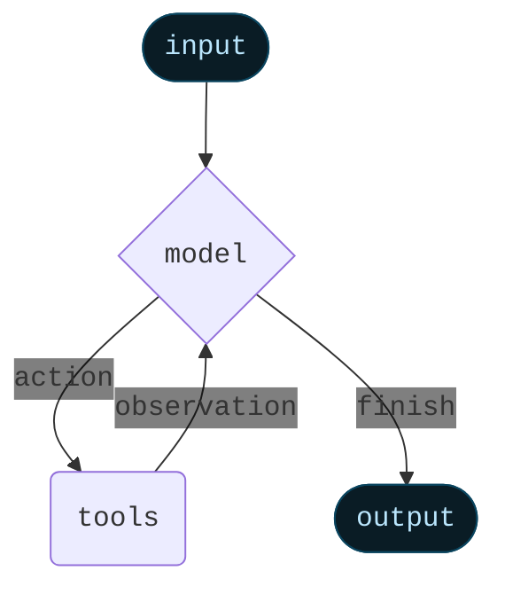

Agents combine language models with [tools](/oss/python/langchain/tools) to create systems that can reason about tasks, decide which tools to use, and iteratively work towards solutions.

[`create_agent`](https://reference.langchain.com/python/langchain/agents/#langchain.agents.create_agent) provides a production-ready agent implementation.


[An LLM Agent runs tools in a loop to achieve a goal](https://simonwillison.net/2025/Sep/18/agents/).
An agent runs until a stop condition is met - i.e., when the model emits a final output or an iteration limit is reached.



<Info>

[`create_agent`](https://reference.langchain.com/python/langchain/agents/#langchain.agents.create_agent) builds a **graph**-based agent runtime using [LangGraph](/oss/python/langgraph/overview). A graph consists of nodes (steps) and edges (connections) that define how your agent processes information. The agent moves through this graph, executing nodes like the model node (which calls the model), the tools node (which executes tools), or middleware.


Learn more about the [Graph API](/oss/python/langgraph/graph-api).

</Info>

## Core components

### Model

The [model](/oss/python/langchain/models) is the reasoning engine of your agent. It can be specified in multiple ways, supporting both static and dynamic model selection.

#### Static model

Static models are configured once when creating the agent and remain unchanged throughout execution. This is the most common and straightforward approach.

To initialize a static model from a <Tooltip tip="A string that follows the format `provider:model` (e.g. openai:gpt-5)" cta="See mappings" href="https://reference.langchain.com/python/langchain/models/#langchain.chat_models.init_chat_model(model)">model identifier string</Tooltip>:

```python wrap
from langchain.agents import create_agent

agent = create_agent("openai:gpt-5", tools=tools)
```


<Tip>
    Model identifier strings support automatic inference (e.g., `"gpt-5"` will be inferred as `"openai:gpt-5"`). Refer to the [reference](https://reference.langchain.com/python/langchain/models/#langchain.chat_models.init_chat_model(model)) to see a full list of model identifier string mappings.
</Tip>

For more control over the model configuration, initialize a model instance directly using the provider package. In this example, we use [`ChatOpenAI`](https://reference.langchain.com/python/integrations/langchain_openai/ChatOpenAI). See [Chat models](/oss/python/integrations/chat) for other available chat model classes.

```python wrap
from langchain.agents import create_agent
from langchain_openai import ChatOpenAI

model = ChatOpenAI(
    model="gpt-5",
    temperature=0.1,
    max_tokens=1000,
    timeout=30
    # ... (other params)
)
agent = create_agent(model, tools=tools)
```

Model instances give you complete control over configuration. Use them when you need to set specific [parameters](/oss/python/langchain/models#parameters) like `temperature`, `max_tokens`, `timeouts`, `base_url`, and other provider-specific settings. Refer to the [reference](/oss/python/integrations/providers/all_providers) to see available params and methods on your model.


#### Dynamic model

Dynamic models are selected at <Tooltip tip="The execution environment of your agent, containing immutable configuration and contextual data that persists throughout the agent's execution (e.g., user IDs, session details, or application-specific configuration).">runtime</Tooltip> based on the current <Tooltip tip="The data that flows through your agent's execution, including messages, custom fields, and any information that needs to be tracked and potentially modified during processing (e.g., user preferences or tool usage stats).">state</Tooltip> and context. This enables sophisticated routing logic and cost optimization.

To use a dynamic model, create middleware using the [`@wrap_model_call`](https://reference.langchain.com/python/langchain/middleware/#langchain.agents.middleware.wrap_model_call) decorator that modifies the model in the request:

```python
from langchain_openai import ChatOpenAI
from langchain.agents import create_agent
from langchain.agents.middleware import wrap_model_call, ModelRequest, ModelResponse


basic_model = ChatOpenAI(model="gpt-4.1-mini")
advanced_model = ChatOpenAI(model="gpt-4.1")

@wrap_model_call
def dynamic_model_selection(request: ModelRequest, handler) -> ModelResponse:
    """Choose model based on conversation complexity."""
    message_count = len(request.state["messages"])

    if message_count > 10:
        # Use an advanced model for longer conversations
        model = advanced_model
    else:
        model = basic_model

    return handler(request.override(model=model))

agent = create_agent(
    model=basic_model,  # Default model
    tools=tools,
    middleware=[dynamic_model_selection]
)
```

<Warning>
Pre-bound models (models with [`bind_tools`](https://reference.langchain.com/python/langchain_core/language_models/#langchain_core.language_models.chat_models.BaseChatModel.bind_tools) already called) are not supported when using structured output. If you need dynamic model selection with structured output, ensure the models passed to the middleware are not pre-bound.
</Warning>


<Tip>
For model configuration details, see [Models](/oss/python/langchain/models). For dynamic model selection patterns, see [Dynamic model in middleware](/oss/python/langchain/middleware#dynamic-model).
</Tip>

### Tools

Tools give agents the ability to take actions. Agents go beyond simple model-only tool binding by facilitating:

- Multiple tool calls in sequence (triggered by a single prompt)
- Parallel tool calls when appropriate
- Dynamic tool selection based on previous results
- Tool retry logic and error handling
- State persistence across tool calls

For more information, see [Tools](/oss/python/langchain/tools).

#### Static tools

Static tools are defined when creating the agent and remain unchanged throughout execution. This is the most common and straightforward approach.

To define an agent with static tools, pass a list of the tools to the agent.

<Tip>
Tools can be specified as plain Python functions or <Tooltip tip="A method that can suspend execution and resume at a later time">coroutines</Tooltip>.

The [tool decorator](/oss/python/langchain/tools#create-tools) can be used to customize tool names, descriptions, argument schemas, and other properties.
</Tip>

```python wrap
from langchain.tools import tool
from langchain.agents import create_agent


@tool
def search(query: str) -> str:
    """Search for information."""
    return f"Results for: {query}"

@tool
def get_weather(location: str) -> str:
    """Get weather information for a location."""
    return f"Weather in {location}: Sunny, 72°F"

agent = create_agent(model, tools=[search, get_weather])
```


If an empty tool list is provided, the agent will consist of a single LLM node without tool-calling capabilities.

#### Dynamic tools

With dynamic tools, the set of tools available to the agent is modified at runtime rather than defined all upfront. Not every tool is appropriate for every situation. Too many tools may overwhelm the model (overload context) and increase errors; too few limit capabilities. Dynamic tool selection enables adapting the available toolset based on authentication state, user permissions, feature flags, or conversation stage.

There are two approaches depending on whether tools are known ahead of time:

<Tabs>
  <Tab title="Filtering pre-registered tools">

    When all possible tools are known at agent creation time, you can pre-register them and dynamically filter which ones are exposed to the model based on state, permissions, or context.

    <Tabs>
      <Tab title="State">
        Enable advanced tools only after certain conversation milestones:

        ```python
        from langchain.agents import create_agent
        from langchain.agents.middleware import wrap_model_call, ModelRequest, ModelResponse
        from typing import Callable

        @wrap_model_call
        def state_based_tools(
            request: ModelRequest,
            handler: Callable[[ModelRequest], ModelResponse]
        ) -> ModelResponse:
            """Filter tools based on conversation State."""
            # Read from State: check if user has authenticated
            state = request.state
            is_authenticated = state.get("authenticated", False)
            message_count = len(state["messages"])

            # Only enable sensitive tools after authentication
            if not is_authenticated:
                tools = [t for t in request.tools if t.name.startswith("public_")]
                request = request.override(tools=tools)
            elif message_count < 5:
                # Limit tools early in conversation
                tools = [t for t in request.tools if t.name != "advanced_search"]
                request = request.override(tools=tools)

            return handler(request)

        agent = create_agent(
            model="gpt-4.1",
            tools=[public_search, private_search, advanced_search],
            middleware=[state_based_tools]
        )
        ```


      </Tab>

      <Tab title="Store">
        Filter tools based on user preferences or feature flags in Store:

        ```python
        from dataclasses import dataclass
        from langchain.agents import create_agent
        from langchain.agents.middleware import wrap_model_call, ModelRequest, ModelResponse
        from typing import Callable
        from langgraph.store.memory import InMemoryStore

        @dataclass
        class Context:
            user_id: str

        @wrap_model_call
        def store_based_tools(
            request: ModelRequest,
            handler: Callable[[ModelRequest], ModelResponse]
        ) -> ModelResponse:
            """Filter tools based on Store preferences."""
            user_id = request.runtime.context.user_id

            # Read from Store: get user's enabled features
            store = request.runtime.store
            feature_flags = store.get(("features",), user_id)

            if feature_flags:
                enabled_features = feature_flags.value.get("enabled_tools", [])
                # Only include tools that are enabled for this user
                tools = [t for t in request.tools if t.name in enabled_features]
                request = request.override(tools=tools)

            return handler(request)

        agent = create_agent(
            model="gpt-4.1",
            tools=[search_tool, analysis_tool, export_tool],
            middleware=[store_based_tools],
            context_schema=Context,
            store=InMemoryStore()
        )
        ```


      </Tab>

      <Tab title="Runtime Context">
        Filter tools based on user permissions from Runtime Context:

        ```python
        from dataclasses import dataclass
        from langchain.agents import create_agent
        from langchain.agents.middleware import wrap_model_call, ModelRequest, ModelResponse
        from typing import Callable

        @dataclass
        class Context:
            user_role: str

        @wrap_model_call
        def context_based_tools(
            request: ModelRequest,
            handler: Callable[[ModelRequest], ModelResponse]
        ) -> ModelResponse:
            """Filter tools based on Runtime Context permissions."""
            # Read from Runtime Context: get user role
            if request.runtime is None or request.runtime.context is None:
                # If no context provided, default to viewer (most restrictive)
                user_role = "viewer"
            else:
                user_role = request.runtime.context.user_role

            if user_role == "admin":
                # Admins get all tools
                pass
            elif user_role == "editor":
                # Editors can't delete
                tools = [t for t in request.tools if t.name != "delete_data"]
                request = request.override(tools=tools)
            else:
                # Viewers get read-only tools
                tools = [t for t in request.tools if t.name.startswith("read_")]
                request = request.override(tools=tools)

            return handler(request)

        agent = create_agent(
            model="gpt-4.1",
            tools=[read_data, write_data, delete_data],
            middleware=[context_based_tools],
            context_schema=Context
        )
        ```


      </Tab>
    </Tabs>

    This approach is best when:
    - All possible tools are known at compile/startup time
    - You want to filter based on permissions, feature flags, or conversation state
    - Tools are static but their availability is dynamic

    See [Dynamically selecting tools](/oss/python/langchain/middleware/custom#dynamically-selecting-tools) for more examples.

  </Tab>

  <Tab title="Runtime tool registration">

    When tools are discovered or created at runtime (e.g., loaded from an MCP server, generated based on user data, or fetched from a remote registry), you need to both register the tools and handle their execution dynamically.

    This requires two middleware hooks:
    1. `wrap_model_call` - Add the dynamic tools to the request
    2. `wrap_tool_call` - Handle execution of the dynamically added tools

    ```python
    from langchain.tools import tool
    from langchain.agents import create_agent
    from langchain.agents.middleware import AgentMiddleware, ModelRequest, ToolCallRequest

    # A tool that will be added dynamically at runtime
    @tool
    def calculate_tip(bill_amount: float, tip_percentage: float = 20.0) -> str:
        """Calculate the tip amount for a bill."""
        tip = bill_amount * (tip_percentage / 100)
        return f"Tip: ${tip:.2f}, Total: ${bill_amount + tip:.2f}"

    class DynamicToolMiddleware(AgentMiddleware):
        """Middleware that registers and handles dynamic tools."""

        def wrap_model_call(self, request: ModelRequest, handler):
            # Add dynamic tool to the request
            # This could be loaded from an MCP server, database, etc.
            updated = request.override(tools=[*request.tools, calculate_tip])
            return handler(updated)

        def wrap_tool_call(self, request: ToolCallRequest, handler):
            # Handle execution of the dynamic tool
            if request.tool_call["name"] == "calculate_tip":
                return handler(request.override(tool=calculate_tip))
            return handler(request)

    agent = create_agent(
        model="gpt-4o",
        tools=[get_weather],  # Only static tools registered here
        middleware=[DynamicToolMiddleware()],
    )

    # The agent can now use both get_weather AND calculate_tip
    result = agent.invoke({
        "messages": [{"role": "user", "content": "Calculate a 20% tip on $85"}]
    })
    ```


    This approach is best when:
    - Tools are discovered at runtime (e.g., from an MCP server)
    - Tools are generated dynamically based on user data or configuration
    - You're integrating with external tool registries

    <Note>
    The `wrap_tool_call` hook is required for runtime-registered tools because the agent needs to know how to execute tools that weren't in the original tool list. Without it, the agent won't know how to invoke the dynamically added tool.
    </Note>

  </Tab>
</Tabs>

<Tip>
To learn more about tools, see [Tools](/oss/python/langchain/tools).
</Tip>

#### Tool error handling

To customize how tool errors are handled, use the [`@wrap_tool_call`](https://reference.langchain.com/python/langchain/middleware/#langchain.agents.middleware.wrap_tool_call) decorator to create middleware:

```python wrap
from langchain.agents import create_agent
from langchain.agents.middleware import wrap_tool_call
from langchain.messages import ToolMessage


@wrap_tool_call
def handle_tool_errors(request, handler):
    """Handle tool execution errors with custom messages."""
    try:
        return handler(request)
    except Exception as e:
        # Return a custom error message to the model
        return ToolMessage(
            content=f"Tool error: Please check your input and try again. ({str(e)})",
            tool_call_id=request.tool_call["id"]
        )

agent = create_agent(
    model="gpt-4.1",
    tools=[search, get_weather],
    middleware=[handle_tool_errors]
)
```

The agent will return a [`ToolMessage`](https://reference.langchain.com/python/langchain/messages/#langchain.messages.ToolMessage) with the custom error message when a tool fails:

```python
[
    ...
    ToolMessage(
        content="Tool error: Please check your input and try again. (division by zero)",
        tool_call_id="..."
    ),
    ...
]
```


#### Tool use in the ReAct loop

Agents follow the ReAct ("Reasoning + Acting") pattern, alternating between brief reasoning steps with targeted tool calls and feeding the resulting observations into subsequent decisions until they can deliver a final answer.

<Accordion title="Example of ReAct loop">
**Prompt:** Identify the current most popular wireless headphones and verify availability.

```
================================ Human Message =================================

Find the most popular wireless headphones right now and check if they're in stock
```

* **Reasoning**: "Popularity is time-sensitive, I need to use the provided search tool."
* **Acting**: Call `search_products("wireless headphones")`

```
================================== Ai Message ==================================
Tool Calls:
  search_products (call_abc123)
 Call ID: call_abc123
  Args:
    query: wireless headphones
```
```
================================= Tool Message =================================

Found 5 products matching "wireless headphones". Top 5 results: WH-1000XM5, ...
```

* **Reasoning**: "I need to confirm availability for the top-ranked item before answering."
* **Acting**: Call `check_inventory("WH-1000XM5")`

```
================================== Ai Message ==================================
Tool Calls:
  check_inventory (call_def456)
 Call ID: call_def456
  Args:
    product_id: WH-1000XM5
```
```
================================= Tool Message =================================

Product WH-1000XM5: 10 units in stock
```

* **Reasoning**: "I have the most popular model and its stock status. I can now answer the user's question."
* **Acting**: Produce final answer

```
================================== Ai Message ==================================

I found wireless headphones (model WH-1000XM5) with 10 units in stock...
```
</Accordion>

### System prompt

You can shape how your agent approaches tasks by providing a prompt. The [`system_prompt`](https://reference.langchain.com/python/langchain/agents/#langchain.agents.create_agent(system_prompt)) parameter can be provided as a string:


```python wrap
agent = create_agent(
    model,
    tools,
    system_prompt="You are a helpful assistant. Be concise and accurate."
)
```


When no [`system_prompt`](https://reference.langchain.com/python/langchain/agents/#langchain.agents.create_agent(system_prompt)) is provided, the agent will infer its task from the messages directly.

The [`system_prompt`](https://reference.langchain.com/python/langchain/agents/#langchain.agents.create_agent(system_prompt)) parameter accepts either a `str` or a [`SystemMessage`](https://reference.langchain.com/python/langchain/messages/#langchain.messages.SystemMessage). Using a `SystemMessage` gives you more control over the prompt structure, which is useful for provider-specific features like [Anthropic's prompt caching](/oss/python/integrations/chat/anthropic#prompt-caching):

```python wrap
from langchain.agents import create_agent
from langchain.messages import SystemMessage, HumanMessage

literary_agent = create_agent(
    model="anthropic:claude-sonnet-4-5",
    system_prompt=SystemMessage(
        content=[
            {
                "type": "text",
                "text": "You are an AI assistant tasked with analyzing literary works.",
            },
            {
                "type": "text",
                "text": "<the entire contents of 'Pride and Prejudice'>",
                "cache_control": {"type": "ephemeral"}
            }
        ]
    )
)

result = literary_agent.invoke(
    {"messages": [HumanMessage("Analyze the major themes in 'Pride and Prejudice'.")]}
)
```

The `cache_control` field with `{"type": "ephemeral"}` tells Anthropic to cache that content block, reducing latency and costs for repeated requests that use the same system prompt.


#### Dynamic system prompt

For more advanced use cases where you need to modify the system prompt based on runtime context or agent state, you can use [middleware](/oss/python/langchain/middleware).

The [`@dynamic_prompt`](https://reference.langchain.com/python/langchain/middleware/#langchain.agents.middleware.dynamic_prompt) decorator creates middleware that generates system prompts based on the model request:

```python wrap
from typing import TypedDict

from langchain.agents import create_agent
from langchain.agents.middleware import dynamic_prompt, ModelRequest


class Context(TypedDict):
    user_role: str

@dynamic_prompt
def user_role_prompt(request: ModelRequest) -> str:
    """Generate system prompt based on user role."""
    user_role = request.runtime.context.get("user_role", "user")
    base_prompt = "You are a helpful assistant."

    if user_role == "expert":
        return f"{base_prompt} Provide detailed technical responses."
    elif user_role == "beginner":
        return f"{base_prompt} Explain concepts simply and avoid jargon."

    return base_prompt

agent = create_agent(
    model="gpt-4.1",
    tools=[web_search],
    middleware=[user_role_prompt],
    context_schema=Context
)

# The system prompt will be set dynamically based on context
result = agent.invoke(
    {"messages": [{"role": "user", "content": "Explain machine learning"}]},
    context={"user_role": "expert"}
)
```


<Tip>
For more details on message types and formatting, see [Messages](/oss/python/langchain/messages). For comprehensive middleware documentation, see [Middleware](/oss/python/langchain/middleware).
</Tip>

## Invocation

You can invoke an agent by passing an update to its [`State`](/oss/python/langgraph/graph-api#state). All agents include a [sequence of messages](/oss/python/langgraph/use-graph-api#messagesstate) in their state; to invoke the agent, pass a new message:

```python
result = agent.invoke(
    {"messages": [{"role": "user", "content": "What's the weather in San Francisco?"}]}
)
```


For streaming steps and / or tokens from the agent, refer to the [streaming](/oss/python/langchain/streaming) guide.

Otherwise, the agent follows the LangGraph [Graph API](/oss/python/langgraph/use-graph-api) and supports all associated methods, such as `stream` and `invoke`.

## Advanced concepts

### Structured output

In some situations, you may want the agent to return an output in a specific format. LangChain provides strategies for structured output via the [`response_format`](https://reference.langchain.com/python/langchain/agents/#langchain.agents.create_agent(response_format)) parameter.

#### ToolStrategy

`ToolStrategy` uses artificial tool calling to generate structured output. This works with any model that supports tool calling. `ToolStrategy` should be used when provider-native structured output (via [`ProviderStrategy`](#ProviderStrategy)) is not available or reliable.

```python wrap
from pydantic import BaseModel
from langchain.agents import create_agent
from langchain.agents.structured_output import ToolStrategy


class ContactInfo(BaseModel):
    name: str
    email: str
    phone: str

agent = create_agent(
    model="gpt-4.1-mini",
    tools=[search_tool],
    response_format=ToolStrategy(ContactInfo)
)

result = agent.invoke({
    "messages": [{"role": "user", "content": "Extract contact info from: John Doe, john@example.com, (555) 123-4567"}]
})

result["structured_response"]
# ContactInfo(name='John Doe', email='john@example.com', phone='(555) 123-4567')
```

#### ProviderStrategy

`ProviderStrategy` uses the model provider's native structured output generation. This is more reliable but only works with providers that support native structured output:

```python wrap
from langchain.agents.structured_output import ProviderStrategy

agent = create_agent(
    model="gpt-4.1",
    response_format=ProviderStrategy(ContactInfo)
)
```

<Note>
As of `langchain 1.0`, simply passing a schema (e.g., `response_format=ContactInfo`) will default to `ProviderStrategy` if the model supports native structured output. It will fall back to `ToolStrategy` otherwise.
</Note>


<Tip>
    To learn about structured output, see [Structured output](/oss/python/langchain/structured-output).
</Tip>

### Memory

Agents maintain conversation history automatically through the message state. You can also configure the agent to use a custom state schema to remember additional information during the conversation.

Information stored in the state can be thought of as the [short-term memory](/oss/python/langchain/short-term-memory) of the agent:

Custom state schemas must extend [`AgentState`](https://reference.langchain.com/python/langchain/agents/#langchain.agents.AgentState) as a `TypedDict`.

There are two ways to define custom state:
1. Via [middleware](/oss/python/langchain/middleware) (preferred)
2. Via [`state_schema`](https://reference.langchain.com/python/langchain/middleware/#langchain.agents.middleware.AgentMiddleware.state_schema) on [`create_agent`](https://reference.langchain.com/python/langchain/agents/#langchain.agents.create_agent)

#### Defining state via middleware

Use middleware to define custom state when your custom state needs to be accessed by specific middleware hooks and tools attached to said middleware.

```python
from langchain.agents import AgentState
from langchain.agents.middleware import AgentMiddleware
from typing import Any


class CustomState(AgentState):
    user_preferences: dict

class CustomMiddleware(AgentMiddleware):
    state_schema = CustomState
    tools = [tool1, tool2]

    def before_model(self, state: CustomState, runtime) -> dict[str, Any] | None:
        ...

agent = create_agent(
    model,
    tools=tools,
    middleware=[CustomMiddleware()]
)

# The agent can now track additional state beyond messages
result = agent.invoke({
    "messages": [{"role": "user", "content": "I prefer technical explanations"}],
    "user_preferences": {"style": "technical", "verbosity": "detailed"},
})
```

#### Defining state via `state_schema`

Use the [`state_schema`](https://reference.langchain.com/python/langchain/middleware/#langchain.agents.middleware.AgentMiddleware.state_schema) parameter as a shortcut to define custom state that is only used in tools.

```python
from langchain.agents import AgentState


class CustomState(AgentState):
    user_preferences: dict

agent = create_agent(
    model,
    tools=[tool1, tool2],
    state_schema=CustomState
)
# The agent can now track additional state beyond messages
result = agent.invoke({
    "messages": [{"role": "user", "content": "I prefer technical explanations"}],
    "user_preferences": {"style": "technical", "verbosity": "detailed"},
})
```

<Note>
As of `langchain 1.0`, custom state schemas **must** be `TypedDict` types. Pydantic models and dataclasses are no longer supported. See the [v1 migration guide](/oss/python/migrate/langchain-v1#state-type-restrictions) for more details.
</Note>


<Note>
    Defining custom state via middleware is preferred over defining it via [`state_schema`](https://reference.langchain.com/python/langchain/middleware/#langchain.agents.middleware.AgentMiddleware.state_schema) on [`create_agent`](https://reference.langchain.com/python/langchain/agents/#langchain.agents.create_agent) because it allows you to keep state extensions conceptually scoped to the relevant middleware and tools.

    [`state_schema`](https://reference.langchain.com/python/langchain/middleware/#langchain.agents.middleware.AgentMiddleware.state_schema) is still supported for backwards compatibility on [`create_agent`](https://reference.langchain.com/python/langchain/agents/#langchain.agents.create_agent).
</Note>


<Tip>
    To learn more about memory, see [Memory](/oss/python/concepts/memory). For information on implementing long-term memory that persists across sessions, see [Long-term memory](/oss/python/langchain/long-term-memory).
</Tip>

### Streaming

We've seen how the agent can be called with `invoke` to get a final response. If the agent executes multiple steps, this may take a while. To show intermediate progress, we can stream back messages as they occur.

```python
from langchain.messages import AIMessage, HumanMessage

for chunk in agent.stream({
    "messages": [{"role": "user", "content": "Search for AI news and summarize the findings"}]
}, stream_mode="values"):
    # Each chunk contains the full state at that point
    latest_message = chunk["messages"][-1]
    if latest_message.content:
        if isinstance(latest_message, HumanMessage):
            print(f"User: {latest_message.content}")
        elif isinstance(latest_message, AIMessage):
            print(f"Agent: {latest_message.content}")
    elif latest_message.tool_calls:
        print(f"Calling tools: {[tc['name'] for tc in latest_message.tool_calls]}")
```


<Tip>
For more details on streaming, see [Streaming](/oss/python/langchain/streaming).
</Tip>

### Middleware

[Middleware](/oss/python/langchain/middleware) provides powerful extensibility for customizing agent behavior at different stages of execution. You can use middleware to:

- Process state before the model is called (e.g., message trimming, context injection)
- Modify or validate the model's response (e.g., guardrails, content filtering)
- Handle tool execution errors with custom logic
- Implement dynamic model selection based on state or context
- Add custom logging, monitoring, or analytics

Middleware integrates seamlessly into the agent's execution, allowing you to intercept and modify data flow at key points without changing the core agent logic.

<Tip>
For comprehensive middleware documentation including decorators like [`@before_model`](https://reference.langchain.com/python/langchain/middleware/#langchain.agents.middleware.before_model), [`@after_model`](https://reference.langchain.com/python/langchain/middleware/#langchain.agents.middleware.after_model), and [`@wrap_tool_call`](https://reference.langchain.com/python/langchain/middleware/#langchain.agents.middleware.wrap_tool_call), see [Middleware](/oss/python/langchain/middleware).
</Tip>

---

<Callout icon="pen-to-square" iconType="regular">
    [Edit this page on GitHub](https://github.com/langchain-ai/docs/edit/main/src/oss/langchain/agents.mdx) or [file an issue](https://github.com/langchain-ai/docs/issues/new/choose).
</Callout>
<Tip icon="terminal" iconType="regular">
    [Connect these docs](/use-these-docs) to Claude, VSCode, and more via MCP for real-time answers.
</Tip>
