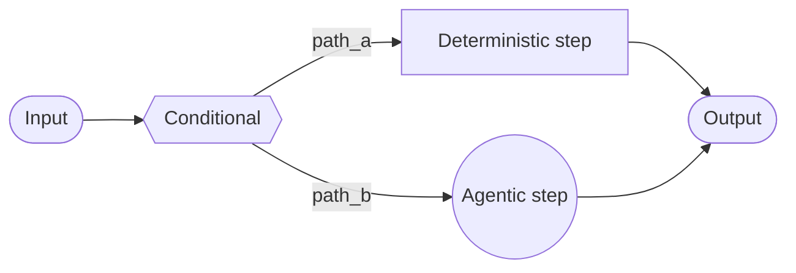
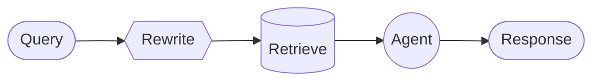

In the **custom workflow** architecture, you define your own bespoke execution flow using [LangGraph](/oss/python/langgraph/overview). You have complete control over the graph structure—including sequential steps, conditional branches, loops, and parallel execution.



## Key characteristics

* Complete control over graph structure
* Mix deterministic logic with agentic behavior
* Support for sequential steps, conditional branches, loops, and parallel execution
* Embed other patterns as nodes in your workflow

## When to use

Use custom workflows when standard patterns (subagents, skills, etc.) don't fit your requirements, you need to mix deterministic logic with agentic behavior, or your use case requires complex routing or multi-stage processing.

Each node in your workflow can be a simple function, an LLM call, or an entire [agent](/oss/python/langchain/agents) with [tools](/oss/python/langchain/tools). You can also compose other architectures within a custom workflow—for example, embedding a multi-agent system as a single node.

For a complete example of a custom workflow, see the tutorial below.

<Card
    title="Tutorial: Build a multi-source knowledge base with routing"
    icon="book"
    href="/oss/python/langchain/multi-agent/router-knowledge-base"
    arrow cta="Learn more"
>
    The [router pattern](/oss/python/langchain/multi-agent/router) is an example of a custom workflow. This tutorial walks through building a router that queries GitHub, Notion, and Slack in parallel, then synthesizes results.
>
</Card>

## Basic implementation

The core insight is that you can call a LangChain agent directly inside any LangGraph node, combining the flexibility of custom workflows with the convenience of pre-built agents:

```python
from langchain.agents import create_agent
from langgraph.graph import StateGraph, START, END

agent = create_agent(model="openai:gpt-4.1", tools=[...])

def agent_node(state: State) -> dict:
    """A LangGraph node that invokes a LangChain agent."""
    result = agent.invoke({
        "messages": [{"role": "user", "content": state["query"]}]
    })
    return {"answer": result["messages"][-1].content}

# Build a simple workflow
workflow = (
    StateGraph(State)
    .add_node("agent", agent_node)
    .add_edge(START, "agent")
    .add_edge("agent", END)
    .compile()
)
```


## Example: RAG pipeline

A common use case is combining [retrieval](/oss/python/langchain/retrieval) with an agent. This example builds a WNBA stats assistant that retrieves from a knowledge base and can fetch live news.

<Accordion title="Custom RAG workflow">

The workflow demonstrates three types of nodes:

- **Model node** (Rewrite): Rewrites the user query for better retrieval using [structured output](/oss/python/langchain/structured-output).
- **Deterministic node** (Retrieve): Performs vector similarity search — no LLM involved.
- **Agent node** (Agent): Reasons over retrieved context and can fetch additional information via tools.



<Tip>
You can use LangGraph state to pass information between workflow steps. This allows each part of your workflow to read and update structured fields, making it easy to share data and context across nodes.
</Tip>

```python
from typing import TypedDict
from pydantic import BaseModel
from langgraph.graph import StateGraph, START, END
from langchain.agents import create_agent
from langchain.tools import tool
from langchain_openai import ChatOpenAI, OpenAIEmbeddings
from langchain_core.vectorstores import InMemoryVectorStore

class State(TypedDict):
    question: str
    rewritten_query: str
    documents: list[str]
    answer: str

# WNBA knowledge base with rosters, game results, and player stats
embeddings = OpenAIEmbeddings()
vector_store = InMemoryVectorStore(embeddings)
vector_store.add_texts([
    # Rosters
    "New York Liberty 2024 roster: Breanna Stewart, Sabrina Ionescu, Jonquel Jones, Courtney Vandersloot.",
    "Las Vegas Aces 2024 roster: A'ja Wilson, Kelsey Plum, Jackie Young, Chelsea Gray.",
    "Indiana Fever 2024 roster: Caitlin Clark, Aliyah Boston, Kelsey Mitchell, NaLyssa Smith.",
    # Game results
    "2024 WNBA Finals: New York Liberty defeated Minnesota Lynx 3-2 to win the championship.",
    "June 15, 2024: Indiana Fever 85, Chicago Sky 79. Caitlin Clark had 23 points and 8 assists.",
    "August 20, 2024: Las Vegas Aces 92, Phoenix Mercury 84. A'ja Wilson scored 35 points.",
    # Player stats
    "A'ja Wilson 2024 season stats: 26.9 PPG, 11.9 RPG, 2.6 BPG. Won MVP award.",
    "Caitlin Clark 2024 rookie stats: 19.2 PPG, 8.4 APG, 5.7 RPG. Won Rookie of the Year.",
    "Breanna Stewart 2024 stats: 20.4 PPG, 8.5 RPG, 3.5 APG.",
])
retriever = vector_store.as_retriever(search_kwargs={"k": 5})

@tool
def get_latest_news(query: str) -> str:
    """Get the latest WNBA news and updates."""
    # Your news API here
    return "Latest: The WNBA announced expanded playoff format for 2025..."

agent = create_agent(
    model="openai:gpt-4.1",
    tools=[get_latest_news],
)

model = ChatOpenAI(model="gpt-4.1")

class RewrittenQuery(BaseModel):
    query: str

def rewrite_query(state: State) -> dict:
    """Rewrite the user query for better retrieval."""
    system_prompt = """Rewrite this query to retrieve relevant WNBA information.
The knowledge base contains: team rosters, game results with scores, and player statistics (PPG, RPG, APG).
Focus on specific player names, team names, or stat categories mentioned."""
    response = model.with_structured_output(RewrittenQuery).invoke([
        {"role": "system", "content": system_prompt},
        {"role": "user", "content": state["question"]}
    ])
    return {"rewritten_query": response.query}

def retrieve(state: State) -> dict:
    """Retrieve documents based on the rewritten query."""
    docs = retriever.invoke(state["rewritten_query"])
    return {"documents": [doc.page_content for doc in docs]}

def call_agent(state: State) -> dict:
    """Generate answer using retrieved context."""
    context = "\n\n".join(state["documents"])
    prompt = f"Context:\n{context}\n\nQuestion: {state['question']}"
    response = agent.invoke({"messages": [{"role": "user", "content": prompt}]})
    return {"answer": response["messages"][-1].content_blocks}

workflow = (
    StateGraph(State)
    .add_node("rewrite", rewrite_query)
    .add_node("retrieve", retrieve)
    .add_node("agent", call_agent)
    .add_edge(START, "rewrite")
    .add_edge("rewrite", "retrieve")
    .add_edge("retrieve", "agent")
    .add_edge("agent", END)
    .compile()
)

result = workflow.invoke({"question": "Who won the 2024 WNBA Championship?"})
print(result["answer"])
```


</Accordion>

---

<Callout icon="pen-to-square" iconType="regular">
    [Edit this page on GitHub](https://github.com/langchain-ai/docs/edit/main/src/oss/langchain/multi-agent/custom-workflow.mdx) or [file an issue](https://github.com/langchain-ai/docs/issues/new/choose).
</Callout>
<Tip icon="terminal" iconType="regular">
    [Connect these docs](/use-these-docs) to Claude, VSCode, and more via MCP for real-time answers.
</Tip>
