import ChatModelTabsPy from '/snippets/chat-model-tabs.mdx';
import ChatModelTabsJs from '/snippets/chat-model-tabs-js.mdx';

The [state machine pattern](/oss/python/langchain/multi-agent/handoffs) describes workflows where an agent's behavior changes as it moves through different states of a task. This tutorial shows how to implement a state machine by using tool calls to dynamically change a single agent's configuration—updating its available tools and instructions based on the current state. The state can be determined from multiple sources: the agent's past actions (tool calls), external state (such as API call results), or even initial user input (for example, by running a classifier to determine user intent).

In this tutorial, you'll build a customer support agent that does the following:

- Collects warranty information before proceeding.
- Classifies issues as hardware or software.
- Provides solutions or escalates to human support.
- Maintains conversation state across multiple turns.

Unlike the [subagents pattern](/oss/python/langchain/multi-agent/subagents-personal-assistant) where sub-agents are called as tools, the **state machine pattern** uses a single agent whose configuration changes based on workflow progress. Each "step" is just a different configuration (system prompt + tools) of the same underlying agent, selected dynamically based on state.

Here's the workflow we'll build:

```mermaid
%%{init: {'theme':'base', 'themeVariables': {'primaryColor':'#4CAF50','primaryTextColor':'#fff','primaryBorderColor':'#2E7D32','lineColor':'#666','secondaryColor':'#FF9800','tertiaryColor':'#2196F3'}}}%%
flowchart TD
    %% Start
    Start([💬 Customer reports<br>an issue]) --> Warranty{Is the device<br>under warranty?}

    %% Warranty check
    Warranty -->|✅ Yes| IssueType{What type<br>of issue?}
    Warranty -->|❌ No| OutOfWarranty{What type<br>of issue?}

    %% In-Warranty branch
    IssueType -->|🔩 Hardware| Repair[Provide warranty<br>repair instructions]
    IssueType -->|💻 Software| Troubleshoot[Provide troubleshooting<br>steps]

    %% Out-of-Warranty branch
    OutOfWarranty -->|🔩 Hardware| Escalate[Escalate to human<br>for paid repair options]
    OutOfWarranty -->|💻 Software| Troubleshoot

    %% Troubleshooting follow-up
    Troubleshoot --> Close([✅ Issue Resolved])
    Repair --> Close
    Escalate --> Close

    %% === Styling ===
    classDef startEnd fill:#4CAF50,stroke:#2E7D32,stroke-width:2px,color:#fff
    classDef decisionNode fill:#2196F3,stroke:#1565C0,stroke-width:2px,color:#fff
    classDef actionNode fill:#FF9800,stroke:#E65100,stroke-width:2px,color:#fff
    classDef escalateNode fill:#f44336,stroke:#c62828,stroke-width:2px,color:#fff

    class Start,Close startEnd
    class Warranty,IssueType,OutOfWarranty decisionNode
    class Repair,Troubleshoot actionNode
    class Escalate escalateNode
```



## Setup

### Installation

This tutorial requires the `langchain` package:

<CodeGroup>
```bash pip
pip install langchain
```
```bash uv
uv add langchain
```
```bash conda
conda install langchain -c conda-forge
```
</CodeGroup>


For more details, see our [Installation guide](/oss/python/langchain/install).

### LangSmith

Set up [LangSmith](https://smith.langchain.com) to inspect what is happening inside your agent. Then set the following environment variables:

<CodeGroup>
```bash bash
export LANGSMITH_TRACING="true"
export LANGSMITH_API_KEY="..."
```
```python python
import getpass
import os

os.environ["LANGSMITH_TRACING"] = "true"
os.environ["LANGSMITH_API_KEY"] = getpass.getpass()
```
</CodeGroup>


### Select an LLM

Select a chat model from LangChain's suite of integrations:

<ChatModelTabsPy />


## 1. Define custom state

First, define a custom state schema that tracks which step is currently active:

```python
from langchain.agents import AgentState
from typing_extensions import NotRequired
from typing import Literal

# Define the possible workflow steps
SupportStep = Literal["warranty_collector", "issue_classifier", "resolution_specialist"]  # [!code highlight]

class SupportState(AgentState):  # [!code highlight]
    """State for customer support workflow."""
    current_step: NotRequired[SupportStep]  # [!code highlight]
    warranty_status: NotRequired[Literal["in_warranty", "out_of_warranty"]]
    issue_type: NotRequired[Literal["hardware", "software"]]
```


The `current_step` field is the core of the state machine pattern - it determines which configuration (prompt + tools) is loaded on each turn.

## 2. Create tools that manage workflow state

Create tools that update the workflow state. These tools allow the agent to record information and transition to the next step.

The key is using `Command` to update state, including the `current_step` field:

```python
from langchain.tools import tool, ToolRuntime
from langchain.messages import ToolMessage
from langgraph.types import Command

@tool
def record_warranty_status(
    status: Literal["in_warranty", "out_of_warranty"],
    runtime: ToolRuntime[None, SupportState],
) -> Command:  # [!code highlight]
    """Record the customer's warranty status and transition to issue classification."""
    return Command(  # [!code highlight]
        update={  # [!code highlight]
            "messages": [
                ToolMessage(
                    content=f"Warranty status recorded as: {status}",
                    tool_call_id=runtime.tool_call_id,
                )
            ],
            "warranty_status": status,
            "current_step": "issue_classifier",  # [!code highlight]
        }
    )


@tool
def record_issue_type(
    issue_type: Literal["hardware", "software"],
    runtime: ToolRuntime[None, SupportState],
) -> Command:  # [!code highlight]
    """Record the type of issue and transition to resolution specialist."""
    return Command(  # [!code highlight]
        update={  # [!code highlight]
            "messages": [
                ToolMessage(
                    content=f"Issue type recorded as: {issue_type}",
                    tool_call_id=runtime.tool_call_id,
                )
            ],
            "issue_type": issue_type,
            "current_step": "resolution_specialist",  # [!code highlight]
        }
    )


@tool
def escalate_to_human(reason: str) -> str:
    """Escalate the case to a human support specialist."""
    # In a real system, this would create a ticket, notify staff, etc.
    return f"Escalating to human support. Reason: {reason}"


@tool
def provide_solution(solution: str) -> str:
    """Provide a solution to the customer's issue."""
    return f"Solution provided: {solution}"
```


Notice how `record_warranty_status` and `record_issue_type` return `Command` objects that update both the data (`warranty_status`, `issue_type`) AND the `current_step`. This is how the state machine works - tools control workflow progression.

## 3. Define step configurations

Define prompts and tools for each step. First, define the prompts for each step:

<Accordion title="View complete prompt definitions">

```python
# Define prompts as constants for easy reference
WARRANTY_COLLECTOR_PROMPT = """You are a customer support agent helping with device issues.

CURRENT STAGE: Warranty verification

At this step, you need to:
1. Greet the customer warmly
2. Ask if their device is under warranty
3. Use record_warranty_status to record their response and move to the next step

Be conversational and friendly. Don't ask multiple questions at once."""

ISSUE_CLASSIFIER_PROMPT = """You are a customer support agent helping with device issues.

CURRENT STAGE: Issue classification
CUSTOMER INFO: Warranty status is {warranty_status}

At this step, you need to:
1. Ask the customer to describe their issue
2. Determine if it's a hardware issue (physical damage, broken parts) or software issue (app crashes, performance)
3. Use record_issue_type to record the classification and move to the next step

If unclear, ask clarifying questions before classifying."""

RESOLUTION_SPECIALIST_PROMPT = """You are a customer support agent helping with device issues.

CURRENT STAGE: Resolution
CUSTOMER INFO: Warranty status is {warranty_status}, issue type is {issue_type}

At this step, you need to:
1. For SOFTWARE issues: provide troubleshooting steps using provide_solution
2. For HARDWARE issues:
   - If IN WARRANTY: explain warranty repair process using provide_solution
   - If OUT OF WARRANTY: escalate_to_human for paid repair options

Be specific and helpful in your solutions."""
```


</Accordion>

Then map step names to their configurations using a dictionary:

```python
# Step configuration: maps step name to (prompt, tools, required_state)
STEP_CONFIG = {
    "warranty_collector": {
        "prompt": WARRANTY_COLLECTOR_PROMPT,
        "tools": [record_warranty_status],
        "requires": [],
    },
    "issue_classifier": {
        "prompt": ISSUE_CLASSIFIER_PROMPT,
        "tools": [record_issue_type],
        "requires": ["warranty_status"],
    },
    "resolution_specialist": {
        "prompt": RESOLUTION_SPECIALIST_PROMPT,
        "tools": [provide_solution, escalate_to_human],
        "requires": ["warranty_status", "issue_type"],
    },
}
```


This dictionary-based configuration makes it easy to:
- See all steps at a glance
- Add new steps (just add another entry)
- Understand the workflow dependencies (`requires` field)
- Use prompt templates with state variables (e.g., `{warranty_status}`)

## 4. Create step-based middleware

Create middleware that reads `current_step` from state and applies the appropriate configuration. We'll use the `@wrap_model_call` decorator for a clean implementation:

```python
from langchain.agents.middleware import wrap_model_call, ModelRequest, ModelResponse
from typing import Callable


@wrap_model_call  # [!code highlight]
def apply_step_config(
    request: ModelRequest,
    handler: Callable[[ModelRequest], ModelResponse],
) -> ModelResponse:
    """Configure agent behavior based on the current step."""
    # Get current step (defaults to warranty_collector for first interaction)
    current_step = request.state.get("current_step", "warranty_collector")  # [!code highlight]

    # Look up step configuration
    stage_config = STEP_CONFIG[current_step]  # [!code highlight]

    # Validate required state exists
    for key in stage_config["requires"]:
        if request.state.get(key) is None:
            raise ValueError(f"{key} must be set before reaching {current_step}")

    # Format prompt with state values (supports {warranty_status}, {issue_type}, etc.)
    system_prompt = stage_config["prompt"].format(**request.state)

    # Inject system prompt and step-specific tools
    request = request.override(  # [!code highlight]
        system_prompt=system_prompt,  # [!code highlight]
        tools=stage_config["tools"],  # [!code highlight]
    )

    return handler(request)
```


This middleware:

1. **Reads current step**: Gets `current_step` from state (defaults to "warranty_collector").
2. **Looks up configuration**: Finds the matching entry in `STEP_CONFIG`.
3. **Validates dependencies**: Ensures required state fields exist.
4. **Formats prompt**: Injects state values into the prompt template.
5. **Applies configuration**: Overrides the system prompt and available tools.

The `request.override()` method is key - it allows us to dynamically change the agent's behavior based on state without creating separate agent instances.

## 5. Create the agent

Now create the agent with the step-based middleware and a checkpointer for state persistence:

```python
from langchain.agents import create_agent
from langgraph.checkpoint.memory import InMemorySaver

# Collect all tools from all step configurations
all_tools = [
    record_warranty_status,
    record_issue_type,
    provide_solution,
    escalate_to_human,
]

# Create the agent with step-based configuration
agent = create_agent(
    model,
    tools=all_tools,
    state_schema=SupportState,  # [!code highlight]
    middleware=[apply_step_config],  # [!code highlight]
    checkpointer=InMemorySaver(),  # [!code highlight]
)
```


<Note>
**Why a checkpointer?** The checkpointer maintains state across conversation turns. Without it, the `current_step` state would be lost between user messages, breaking the workflow.
</Note>

## 6. Test the workflow

Test the complete workflow:

```python
from langchain.messages import HumanMessage
import uuid

# Configuration for this conversation thread
thread_id = str(uuid.uuid4())
config = {"configurable": {"thread_id": thread_id}}

# Turn 1: Initial message - starts with warranty_collector step
print("=== Turn 1: Warranty Collection ===")
result = agent.invoke(
    {"messages": [HumanMessage("Hi, my phone screen is cracked")]},
    config
)
for msg in result['messages']:
    msg.pretty_print()

# Turn 2: User responds about warranty
print("\n=== Turn 2: Warranty Response ===")
result = agent.invoke(
    {"messages": [HumanMessage("Yes, it's still under warranty")]},
    config
)
for msg in result['messages']:
    msg.pretty_print()
print(f"Current step: {result.get('current_step')}")

# Turn 3: User describes the issue
print("\n=== Turn 3: Issue Description ===")
result = agent.invoke(
    {"messages": [HumanMessage("The screen is physically cracked from dropping it")]},
    config
)
for msg in result['messages']:
    msg.pretty_print()
print(f"Current step: {result.get('current_step')}")

# Turn 4: Resolution
print("\n=== Turn 4: Resolution ===")
result = agent.invoke(
    {"messages": [HumanMessage("What should I do?")]},
    config
)
for msg in result['messages']:
    msg.pretty_print()
```


Expected flow:
1. **Warranty verification step**: Asks about warranty status
2. **Issue classification step**: Asks about the problem, determines it's hardware
3. **Resolution step**: Provides warranty repair instructions

## 7. Understanding state transitions

Let's trace what happens at each turn:

### Turn 1: Initial message

```python
{
    "messages": [HumanMessage("Hi, my phone screen is cracked")],
    "current_step": "warranty_collector"  # Default value
}
```


Middleware applies:
- System prompt: `WARRANTY_COLLECTOR_PROMPT`
- Tools: `[record_warranty_status]`

### Turn 2: After warranty recorded

Tool call: `record_warranty_status("in_warranty")` returns:
```python
Command(update={
    "warranty_status": "in_warranty",
    "current_step": "issue_classifier"  # State transition!
})
```


Next turn, middleware applies:
- System prompt: `ISSUE_CLASSIFIER_PROMPT` (formatted with `warranty_status="in_warranty"`)
- Tools: `[record_issue_type]`

### Turn 3: After issue classified

Tool call: `record_issue_type("hardware")` returns:
```python
Command(update={
    "issue_type": "hardware",
    "current_step": "resolution_specialist"  # State transition!
})
```


Next turn, middleware applies:
- System prompt: `RESOLUTION_SPECIALIST_PROMPT` (formatted with `warranty_status` and `issue_type`)
- Tools: `[provide_solution, escalate_to_human]`

The key insight: **Tools drive the workflow** by updating `current_step`, and **middleware responds** by applying the appropriate configuration on the next turn.

## 8. Manage message history

As the agent progresses through steps, message history grows. Use [summarization middleware](/oss/python/langchain/short-term-memory#summarize-messages) to compress earlier messages while preserving conversational context:

```python
from langchain.agents import create_agent
from langchain.agents.middleware import SummarizationMiddleware  # [!code highlight]
from langgraph.checkpoint.memory import InMemorySaver

agent = create_agent(
    model,
    tools=all_tools,
    state_schema=SupportState,
    middleware=[
        apply_step_config,
        SummarizationMiddleware(  # [!code highlight]
            model="gpt-4.1-mini",
            trigger=("tokens", 4000),
            keep=("messages", 10)
        )
    ],
    checkpointer=InMemorySaver(),
)
```


See the [short-term memory guide](/oss/python/langchain/short-term-memory) for other memory management techniques.

## 9. Add flexibility: Go back

Some workflows need to allow users to return to previous steps to correct information (e.g., changing warranty status or issue classification). However, not all transitions make sense—for example, you typically can't go back once a refund has been processed. For this support workflow, we'll add tools to return to the warranty verification and issue classification steps.

<Tip>
If your workflow requires arbitrary transitions between most steps, consider whether you need a structured workflow at all. This pattern works best when steps follow a clear sequential progression with occasional backwards transitions for corrections.
</Tip>

Add "go back" tools to the resolution step:

```python
@tool
def go_back_to_warranty() -> Command:  # [!code highlight]
    """Go back to warranty verification step."""
    return Command(update={"current_step": "warranty_collector"})  # [!code highlight]


@tool
def go_back_to_classification() -> Command:  # [!code highlight]
    """Go back to issue classification step."""
    return Command(update={"current_step": "issue_classifier"})  # [!code highlight]


# Update the resolution_specialist configuration to include these tools
STEP_CONFIG["resolution_specialist"]["tools"].extend([
    go_back_to_warranty,
    go_back_to_classification
])
```


Update the resolution specialist's prompt to mention these tools:

```python
RESOLUTION_SPECIALIST_PROMPT = """You are a customer support agent helping with device issues.

CURRENT STAGE: Resolution
CUSTOMER INFO: Warranty status is {warranty_status}, issue type is {issue_type}

At this step, you need to:
1. For SOFTWARE issues: provide troubleshooting steps using provide_solution
2. For HARDWARE issues:
   - If IN WARRANTY: explain warranty repair process using provide_solution
   - If OUT OF WARRANTY: escalate_to_human for paid repair options

If the customer indicates any information was wrong, use:
- go_back_to_warranty to correct warranty status
- go_back_to_classification to correct issue type

Be specific and helpful in your solutions."""
```


Now the agent can handle corrections:

```python
result = agent.invoke(
    {"messages": [HumanMessage("Actually, I made a mistake - my device is out of warranty")]},
    config
)
# Agent will call go_back_to_warranty and restart the warranty verification step
```


## Complete example

Here's everything together in a runnable script:

<Expandable title="Complete code" defaultOpen={false}>
```python
"""
Customer Support State Machine Example

This example demonstrates the state machine pattern.
A single agent dynamically changes its behavior based on the current_step state,
creating a state machine for sequential information collection.
"""

import uuid

from langgraph.checkpoint.memory import InMemorySaver
from langgraph.types import Command
from typing import Callable, Literal
from typing_extensions import NotRequired

from langchain.agents import AgentState, create_agent
from langchain.agents.middleware import wrap_model_call, ModelRequest, ModelResponse, SummarizationMiddleware
from langchain.chat_models import init_chat_model
from langchain.messages import HumanMessage, ToolMessage
from langchain.tools import tool, ToolRuntime

model = init_chat_model("anthropic:claude-3-5-sonnet-latest")


# Define the possible workflow steps
SupportStep = Literal["warranty_collector", "issue_classifier", "resolution_specialist"]


class SupportState(AgentState):
    """State for customer support workflow."""

    current_step: NotRequired[SupportStep]
    warranty_status: NotRequired[Literal["in_warranty", "out_of_warranty"]]
    issue_type: NotRequired[Literal["hardware", "software"]]


@tool
def record_warranty_status(
    status: Literal["in_warranty", "out_of_warranty"],
    runtime: ToolRuntime[None, SupportState],
) -> Command:
    """Record the customer's warranty status and transition to issue classification."""
    return Command(
        update={
            "messages": [
                ToolMessage(
                    content=f"Warranty status recorded as: {status}",
                    tool_call_id=runtime.tool_call_id,
                )
            ],
            "warranty_status": status,
            "current_step": "issue_classifier",
        }
    )


@tool
def record_issue_type(
    issue_type: Literal["hardware", "software"],
    runtime: ToolRuntime[None, SupportState],
) -> Command:
    """Record the type of issue and transition to resolution specialist."""
    return Command(
        update={
            "messages": [
                ToolMessage(
                    content=f"Issue type recorded as: {issue_type}",
                    tool_call_id=runtime.tool_call_id,
                )
            ],
            "issue_type": issue_type,
            "current_step": "resolution_specialist",
        }
    )


@tool
def escalate_to_human(reason: str) -> str:
    """Escalate the case to a human support specialist."""
    # In a real system, this would create a ticket, notify staff, etc.
    return f"Escalating to human support. Reason: {reason}"


@tool
def provide_solution(solution: str) -> str:
    """Provide a solution to the customer's issue."""
    return f"Solution provided: {solution}"


# Define prompts as constants
WARRANTY_COLLECTOR_PROMPT = """You are a customer support agent helping with device issues.

CURRENT STEP: Warranty verification

At this step, you need to:
1. Greet the customer warmly
2. Ask if their device is under warranty
3. Use record_warranty_status to record their response and move to the next step

Be conversational and friendly. Don't ask multiple questions at once."""

ISSUE_CLASSIFIER_PROMPT = """You are a customer support agent helping with device issues.

CURRENT STEP: Issue classification
CUSTOMER INFO: Warranty status is {warranty_status}

At this step, you need to:
1. Ask the customer to describe their issue
2. Determine if it's a hardware issue (physical damage, broken parts) or software issue (app crashes, performance)
3. Use record_issue_type to record the classification and move to the next step

If unclear, ask clarifying questions before classifying."""

RESOLUTION_SPECIALIST_PROMPT = """You are a customer support agent helping with device issues.

CURRENT STEP: Resolution
CUSTOMER INFO: Warranty status is {warranty_status}, issue type is {issue_type}

At this step, you need to:
1. For SOFTWARE issues: provide troubleshooting steps using provide_solution
2. For HARDWARE issues:
   - If IN WARRANTY: explain warranty repair process using provide_solution
   - If OUT OF WARRANTY: escalate_to_human for paid repair options

Be specific and helpful in your solutions."""


# Step configuration: maps step name to (prompt, tools, required_state)
STEP_CONFIG = {
    "warranty_collector": {
        "prompt": WARRANTY_COLLECTOR_PROMPT,
        "tools": [record_warranty_status],
        "requires": [],
    },
    "issue_classifier": {
        "prompt": ISSUE_CLASSIFIER_PROMPT,
        "tools": [record_issue_type],
        "requires": ["warranty_status"],
    },
    "resolution_specialist": {
        "prompt": RESOLUTION_SPECIALIST_PROMPT,
        "tools": [provide_solution, escalate_to_human],
        "requires": ["warranty_status", "issue_type"],
    },
}


@wrap_model_call
def apply_step_config(
    request: ModelRequest,
    handler: Callable[[ModelRequest], ModelResponse],
) -> ModelResponse:
    """Configure agent behavior based on the current step."""
    # Get current step (defaults to warranty_collector for first interaction)
    current_step = request.state.get("current_step", "warranty_collector")

    # Look up step configuration
    step_config = STEP_CONFIG[current_step]

    # Validate required state exists
    for key in step_config["requires"]:
        if request.state.get(key) is None:
            raise ValueError(f"{key} must be set before reaching {current_step}")

    # Format prompt with state values
    system_prompt = step_config["prompt"].format(**request.state)

    # Inject system prompt and step-specific tools
    request = request.override(
        system_prompt=system_prompt,
        tools=step_config["tools"],
    )

    return handler(request)


# Collect all tools from all step configurations
all_tools = [
    record_warranty_status,
    record_issue_type,
    provide_solution,
    escalate_to_human,
]

# Create the agent with step-based configuration and summarization
agent = create_agent(
    model,
    tools=all_tools,
    state_schema=SupportState,
    middleware=[
        apply_step_config,
        SummarizationMiddleware(
            model="gpt-4.1-mini",
            trigger=("tokens", 4000),
            keep=("messages", 10)
        )
    ],
    checkpointer=InMemorySaver(),
)


# ============================================================================
# Test the workflow
# ============================================================================

if __name__ == "__main__":
    thread_id = str(uuid.uuid4())
    config = {"configurable": {"thread_id": thread_id}}

    result = agent.invoke(
        {"messages": [HumanMessage("Hi, my phone screen is cracked")]},
        config
    )

    result = agent.invoke(
        {"messages": [HumanMessage("Yes, it's still under warranty")]},
        config
    )

    result = agent.invoke(
        {"messages": [HumanMessage("The screen is physically cracked from dropping it")]},
        config
    )

    result = agent.invoke(
        {"messages": [HumanMessage("What should I do?")]},
        config
    )
    for msg in result['messages']:
        msg.pretty_print()
```


</Expandable>

## Next steps

- Learn about the [subagents pattern](/oss/python/langchain/multi-agent/subagents-personal-assistant) for centralized orchestration
- Explore [middleware](/oss/python/langchain/middleware) for more dynamic behaviors
- Read the [multi-agent overview](/oss/python/langchain/multi-agent) to compare patterns
- Use [LangSmith](https://smith.langchain.com) to debug and monitor your multi-agent system

---

<Callout icon="pen-to-square" iconType="regular">
    [Edit this page on GitHub](https://github.com/langchain-ai/docs/edit/main/src/oss/langchain/multi-agent/handoffs-customer-support.mdx) or [file an issue](https://github.com/langchain-ai/docs/issues/new/choose).
</Callout>
<Tip icon="terminal" iconType="regular">
    [Connect these docs](/use-these-docs) to Claude, VSCode, and more via MCP for real-time answers.
</Tip>
