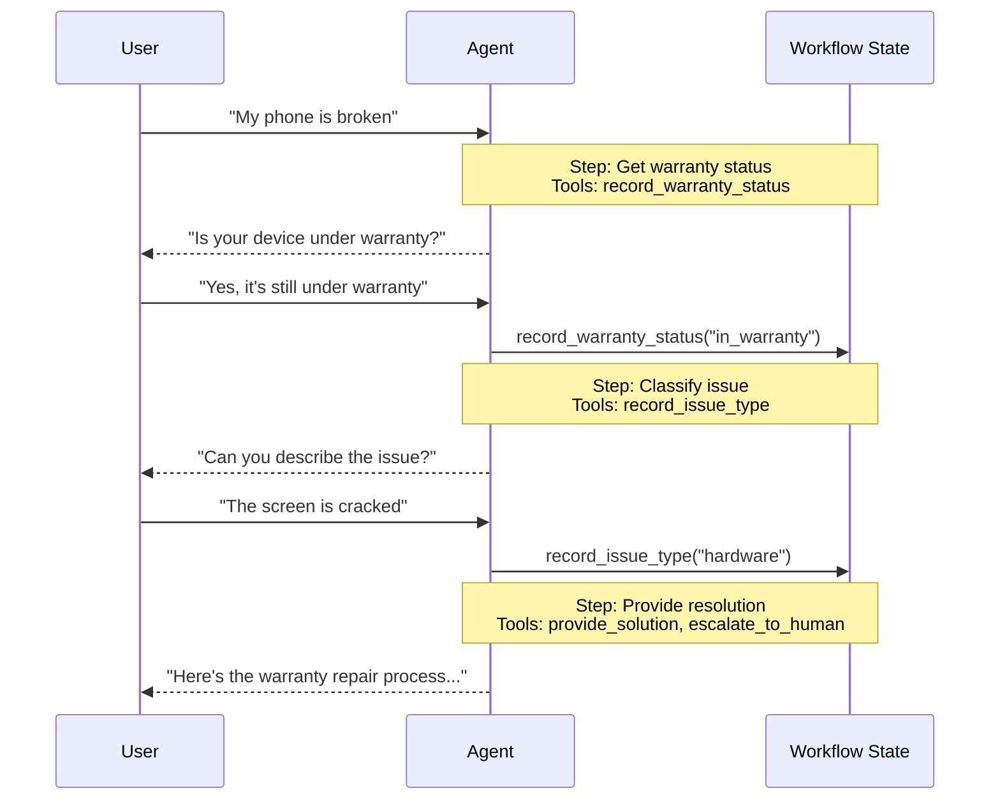

In the **handoffs** architecture, behavior changes dynamically based on state. The core mechanism: [tools](/oss/python/langchain/tools) update a state variable (e.g., `current_step` or `active_agent`) that persists across turns, and the system reads this variable to adjust behavior—either applying different configuration (system prompt, tools) or routing to a different [agent](/oss/python/langchain/agents). This pattern supports both handoffs between distinct agents and dynamic configuration changes within a single agent.

<Tip>
The term **handoffs** was coined by [OpenAI](https://openai.github.io/openai-agents-python/handoffs/) for using tool calls (e.g., `transfer_to_sales_agent`) to transfer control between agents or states.
</Tip>



## Key characteristics

* State-driven behavior: Behavior changes based on a state variable (e.g., `current_step` or `active_agent`)
* Tool-based transitions: Tools update the state variable to move between states
* Direct user interaction: Each state's configuration handles user messages directly
* Persistent state: State survives across conversation turns

## When to use

Use the handoffs pattern when you need to enforce sequential constraints (unlock capabilities only after preconditions are met), the agent needs to converse directly with the user across different states, or you're building multi-stage conversational flows. This pattern is particularly valuable for customer support scenarios where you need to collect information in a specific sequence — for example, collecting a warranty ID before processing a refund.

## Basic implementation

The core mechanism is a [tool](/oss/python/langchain/tools) that returns a [`Command`](/oss/python/langgraph/graph-api#command) to update state, triggering a transition to a new step or agent:

```python
from langchain.tools import tool
from langchain.messages import ToolMessage
from langgraph.types import Command

@tool
def transfer_to_specialist(runtime) -> Command:
    """Transfer to the specialist agent."""
    return Command(
        update={
            "messages": [
                ToolMessage(  # [!code highlight]
                    content="Transferred to specialist",
                    tool_call_id=runtime.tool_call_id  # [!code highlight]
                )
            ],
            "current_step": "specialist"  # Triggers behavior change
        }
    )
```


<Note>
**Why include a `ToolMessage`?** When an LLM calls a tool, it expects a response. The `ToolMessage` with matching `tool_call_id` completes this request-response cycle—without it, the conversation history becomes malformed. This is required whenever your handoff tool updates messages.
</Note>

For a complete implementation, see the tutorial below.

<Card
    title="Tutorial: Build customer support with handoffs"
    icon="people-arrows"
    href="/oss/python/langchain/multi-agent/handoffs-customer-support"
    arrow cta="Learn more"
>
    Learn how to build a customer support agent using the handoffs pattern, where a single agent transitions between different configurations.
</Card>

## Implementation approaches

There are two ways to implement handoffs: **[single agent with middleware](#single-agent-with-middleware)** (one agent with dynamic configuration) or **[multiple agent subgraphs](#multiple-agent-subgraphs)** (distinct agents as graph nodes).

### Single agent with middleware

A single agent changes its behavior based on state. Middleware intercepts each model call and dynamically adjusts the system prompt and available tools. Tools update the state variable to trigger transitions:

```python
from langchain.tools import ToolRuntime, tool
from langchain.messages import ToolMessage
from langgraph.types import Command

@tool
def record_warranty_status(
    status: str,
    runtime: ToolRuntime[None, SupportState]
) -> Command:
    """Record warranty status and transition to next step."""
    return Command(
        update={
            "messages": [
                ToolMessage(
                    content=f"Warranty status recorded: {status}",
                    tool_call_id=runtime.tool_call_id
                )
            ],
            "warranty_status": status,
            "current_step": "specialist"  # Update state to trigger transition
        }
    )
```


<Accordion title="Complete example: Customer support with middleware">

```python
from langchain.agents import AgentState, create_agent
from langchain.agents.middleware import wrap_model_call, ModelRequest, ModelResponse
from langchain.tools import tool, ToolRuntime
from langchain.messages import ToolMessage
from langgraph.types import Command
from typing import Callable

# 1. Define state with current_step tracker
class SupportState(AgentState):  # [!code highlight]
    """Track which step is currently active."""
    current_step: str = "triage"  # [!code highlight]
    warranty_status: str | None = None

# 2. Tools update current_step via Command
@tool
def record_warranty_status(
    status: str,
    runtime: ToolRuntime[None, SupportState]
) -> Command:  # [!code highlight]
    """Record warranty status and transition to next step."""
    return Command(update={  # [!code highlight]
        "messages": [  # [!code highlight]
            ToolMessage(
                content=f"Warranty status recorded: {status}",
                tool_call_id=runtime.tool_call_id
            )
        ],
        "warranty_status": status,
        # Transition to next step
        "current_step": "specialist"    # [!code highlight]
    })

# 3. Middleware applies dynamic configuration based on current_step
@wrap_model_call  # [!code highlight]
def apply_step_config(
    request: ModelRequest,
    handler: Callable[[ModelRequest], ModelResponse]
) -> ModelResponse:
    """Configure agent behavior based on current_step."""
    step = request.state.get("current_step", "triage")  # [!code highlight]

    # Map steps to their configurations
    configs = {
        "triage": {
            "prompt": "Collect warranty information...",
            "tools": [record_warranty_status]
        },
        "specialist": {
            "prompt": "Provide solutions based on warranty: {warranty_status}",
            "tools": [provide_solution, escalate]
        }
    }

    config = configs[step]
    request = request.override(  # [!code highlight]
        system_prompt=config["prompt"].format(**request.state),  # [!code highlight]
        tools=config["tools"]  # [!code highlight]
    )
    return handler(request)

# 4. Create agent with middleware
agent = create_agent(
    model,
    tools=[record_warranty_status, provide_solution, escalate],
    state_schema=SupportState,
    middleware=[apply_step_config],  # [!code highlight]
    checkpointer=InMemorySaver()  # Persist state across turns  # [!code highlight]
)
```


</Accordion>

### Multiple agent subgraphs

Multiple distinct agents exist as separate nodes in a graph. Handoff tools navigate between agent nodes using `Command.PARENT` to specify which node to execute next.

<Warning>
Subgraph handoffs require careful **[context engineering](/oss/python/langchain/context-engineering)**. Unlike single-agent middleware (where message history flows naturally), you must explicitly decide what messages pass between agents. Get this wrong and agents receive malformed conversation history or bloated context. See [Context engineering](#context-engineering) below.
</Warning>

```python
from langchain.messages import AIMessage, ToolMessage
from langchain.tools import tool, ToolRuntime
from langgraph.types import Command

@tool
def transfer_to_sales(
    runtime: ToolRuntime,
) -> Command:
    """Transfer to the sales agent."""
    last_ai_message = next(  # [!code highlight]
        msg for msg in reversed(runtime.state["messages"]) if isinstance(msg, AIMessage)  # [!code highlight]
    )  # [!code highlight]
    transfer_message = ToolMessage(  # [!code highlight]
        content="Transferred to sales agent",  # [!code highlight]
        tool_call_id=runtime.tool_call_id,  # [!code highlight]
    )  # [!code highlight]
    return Command(
        goto="sales_agent",
        update={
            "active_agent": "sales_agent",
            "messages": [last_ai_message, transfer_message],  # [!code highlight]
        },
        graph=Command.PARENT
    )
```


<Accordion title="Complete example: Sales and support with handoffs">

This example shows a multi-agent system with separate sales and support agents. Each agent is a separate graph node, and handoff tools allow agents to transfer conversations to each other.

```python
from typing import Literal

from langchain.agents import AgentState, create_agent
from langchain.messages import AIMessage, ToolMessage
from langchain.tools import tool, ToolRuntime
from langgraph.graph import StateGraph, START, END
from langgraph.types import Command
from typing_extensions import NotRequired


# 1. Define state with active_agent tracker
class MultiAgentState(AgentState):
    active_agent: NotRequired[str]


# 2. Create handoff tools
@tool
def transfer_to_sales(
    runtime: ToolRuntime,
) -> Command:
    """Transfer to the sales agent."""
    last_ai_message = next(  # [!code highlight]
        msg for msg in reversed(runtime.state["messages"]) if isinstance(msg, AIMessage)  # [!code highlight]
    )  # [!code highlight]
    transfer_message = ToolMessage(  # [!code highlight]
        content="Transferred to sales agent from support agent",  # [!code highlight]
        tool_call_id=runtime.tool_call_id,  # [!code highlight]
    )  # [!code highlight]
    return Command(
        goto="sales_agent",
        update={
            "active_agent": "sales_agent",
            "messages": [last_ai_message, transfer_message],  # [!code highlight]
        },
        graph=Command.PARENT,
    )


@tool
def transfer_to_support(
    runtime: ToolRuntime,
) -> Command:
    """Transfer to the support agent."""
    last_ai_message = next(  # [!code highlight]
        msg for msg in reversed(runtime.state["messages"]) if isinstance(msg, AIMessage)  # [!code highlight]
    )  # [!code highlight]
    transfer_message = ToolMessage(  # [!code highlight]
        content="Transferred to support agent from sales agent",  # [!code highlight]
        tool_call_id=runtime.tool_call_id,  # [!code highlight]
    )  # [!code highlight]
    return Command(
        goto="support_agent",
        update={
            "active_agent": "support_agent",
            "messages": [last_ai_message, transfer_message],  # [!code highlight]
        },
        graph=Command.PARENT,
    )


# 3. Create agents with handoff tools
sales_agent = create_agent(
    model="anthropic:claude-sonnet-4-20250514",
    tools=[transfer_to_support],
    system_prompt="You are a sales agent. Help with sales inquiries. If asked about technical issues or support, transfer to the support agent.",
)

support_agent = create_agent(
    model="anthropic:claude-sonnet-4-20250514",
    tools=[transfer_to_sales],
    system_prompt="You are a support agent. Help with technical issues. If asked about pricing or purchasing, transfer to the sales agent.",
)


# 4. Create agent nodes that invoke the agents
def call_sales_agent(state: MultiAgentState) -> Command:
    """Node that calls the sales agent."""
    response = sales_agent.invoke(state)
    return response


def call_support_agent(state: MultiAgentState) -> Command:
    """Node that calls the support agent."""
    response = support_agent.invoke(state)
    return response


# 5. Create router that checks if we should end or continue
def route_after_agent(
    state: MultiAgentState,
) -> Literal["sales_agent", "support_agent", "__end__"]:
    """Route based on active_agent, or END if the agent finished without handoff."""
    messages = state.get("messages", [])

    # Check the last message - if it's an AIMessage without tool calls, we're done
    if messages:
        last_msg = messages[-1]
        if isinstance(last_msg, AIMessage) and not last_msg.tool_calls:  # [!code highlight]
            return "__end__"  # [!code highlight]

    # Otherwise route to the active agent
    active = state.get("active_agent", "sales_agent")
    return active if active else "sales_agent"


def route_initial(
    state: MultiAgentState,
) -> Literal["sales_agent", "support_agent"]:
    """Route to the active agent based on state, default to sales agent."""
    return state.get("active_agent") or "sales_agent"


# 6. Build the graph
builder = StateGraph(MultiAgentState)
builder.add_node("sales_agent", call_sales_agent)
builder.add_node("support_agent", call_support_agent)

# Start with conditional routing based on initial active_agent
builder.add_conditional_edges(START, route_initial, ["sales_agent", "support_agent"])

# After each agent, check if we should end or route to another agent
builder.add_conditional_edges(
    "sales_agent", route_after_agent, ["sales_agent", "support_agent", END]
)
builder.add_conditional_edges(
    "support_agent", route_after_agent, ["sales_agent", "support_agent", END]
)

graph = builder.compile()
result = graph.invoke(
    {
        "messages": [
            {
                "role": "user",
                "content": "Hi, I'm having trouble with my account login. Can you help?",
            }
        ]
    }
)

for msg in result["messages"]:
    msg.pretty_print()
```


</Accordion>

<Tip>
Use **single agent with middleware** for most handoffs use cases—it's simpler. Only use **multiple agent subgraphs** when you need bespoke agent implementations (e.g., a node that's itself a complex graph with reflection or retrieval steps).
</Tip>

#### Context engineering

With subgraph handoffs, you control exactly what messages flow between agents. This precision is essential for maintaining valid conversation history and avoiding context bloat that could confuse downstream agents. For more on this topic, see [context engineering](/oss/python/langchain/context-engineering).

**Handling context during handoffs**

When handing off between agents, you need to ensure the conversation history remains valid. LLMs expect tool calls to be paired with their responses, so when using `Command.PARENT` to hand off to another agent, you must include both:

1. **The `AIMessage` containing the tool call** (the message that triggered the handoff)
2. **A `ToolMessage` acknowledging the handoff** (the artificial response to that tool call)

Without this pairing, the receiving agent will see an incomplete conversation and may produce errors or unexpected behavior.

The example below assumes only the handoff tool was called (no parallel tool calls):

```python
@tool
def transfer_to_sales(runtime: ToolRuntime) -> Command:
    # Get the AI message that triggered this handoff
    last_ai_message = runtime.state["messages"][-1]

    # Create an artificial tool response to complete the pair
    transfer_message = ToolMessage(
        content="Transferred to sales agent",
        tool_call_id=runtime.tool_call_id,
    )

    return Command(
        goto="sales_agent",
        update={
            "active_agent": "sales_agent",
            # Pass only these two messages, not the full subagent history
            "messages": [last_ai_message, transfer_message],
        },
        graph=Command.PARENT,
    )
```


<Note>
**Why not pass all subagent messages?** While you could include the full subagent conversation in the handoff, this often creates problems. The receiving agent may become confused by irrelevant internal reasoning, and token costs increase unnecessarily. By passing only the handoff pair, you keep the parent graph's context focused on high-level coordination. If the receiving agent needs additional context, consider summarizing the subagent's work in the ToolMessage content instead of passing raw message history.
</Note>

**Returning control to the user**

When returning control to the user (ending the agent's turn), ensure the final message is an `AIMessage`. This maintains valid conversation history and signals to the user interface that the agent has finished its work.

## Implementation considerations

As you design your multi-agent system, consider:

* **Context filtering strategy**: Will each agent receive full conversation history, filtered portions, or summaries? Different agents may need different context depending on their role.
* **Tool semantics**: Clarify whether handoff tools only update routing state or also perform side effects. For example, should `transfer_to_sales()` also create a support ticket, or should that be a separate action?
* **Token efficiency**: Balance context completeness against token costs. Summarization and selective context passing become more important as conversations grow longer.

---

<Callout icon="pen-to-square" iconType="regular">
    [Edit this page on GitHub](https://github.com/langchain-ai/docs/edit/main/src/oss/langchain/multi-agent/handoffs.mdx) or [file an issue](https://github.com/langchain-ai/docs/issues/new/choose).
</Callout>
<Tip icon="terminal" iconType="regular">
    [Connect these docs](/use-these-docs) to Claude, VSCode, and more via MCP for real-time answers.
</Tip>
