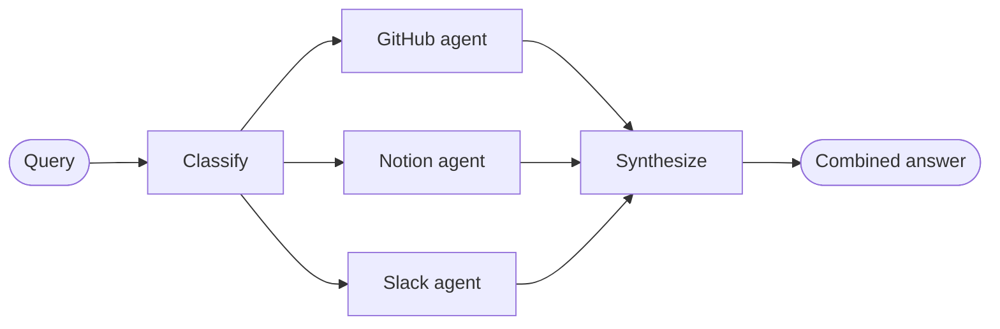

import ChatModelTabsPy from '/snippets/chat-model-tabs.mdx';
import ChatModelTabsJs from '/snippets/chat-model-tabs-js.mdx';

## Overview

The **router pattern** is a [multi-agent](/oss/python/langchain/multi-agent) architecture where a routing step classifies input and directs it to specialized agents, with results synthesized into a combined response. This pattern excels when your organization's knowledge lives across distinct **verticals**—separate knowledge domains that each require their own agent with specialized tools and prompts.

In this tutorial, you'll build a multi-source knowledge base router that demonstrates these benefits through a realistic enterprise scenario. The system will coordinate three specialists:

- A **GitHub agent** that searches code, issues, and pull requests.
- A **Notion agent** that searches internal documentation and wikis.
- A **Slack agent** that searches relevant threads and discussions.

When a user asks "How do I authenticate API requests?", the router decomposes the query into source-specific sub-questions, routes them to the relevant agents in parallel, and synthesizes results into a coherent answer.



### Why use a router?

The router pattern provides several advantages:

- **Parallel execution**: Query multiple sources simultaneously, reducing latency compared to sequential approaches.
- **Specialized agents**: Each vertical has focused tools and prompts optimized for its domain.
- **Selective routing**: Not every query needs every source—the router intelligently selects relevant verticals.
- **Targeted sub-questions**: Each agent receives a question tailored to its domain, improving result quality.
- **Clean synthesis**: Results from multiple sources are combined into a single, coherent response.

### Concepts

We will cover the following concepts:

- [Multi-agent systems](/oss/python/langchain/multi-agent)
- [StateGraph](/oss/python/langchain/graphs) for workflow orchestration
- [Send API](/oss/python/langchain/send) for parallel execution

<Tip>
**Router vs. Subagents**: The [subagents pattern](/oss/python/langchain/multi-agent/subagents) can also route to multiple agents. Use the router pattern when you need specialized preprocessing, custom routing logic, or want explicit control over parallel execution. Use the subagents pattern when you want the LLM to decide which agents to call dynamically.
</Tip>

## Setup

### Installation

This tutorial requires the `langchain` and `langgraph` packages:

<CodeGroup>
```bash pip
pip install langchain langgraph
```
```bash uv
uv add langchain langgraph
```
```bash conda
conda install langchain langgraph -c conda-forge
```
</CodeGroup>


For more details, see our [Installation guide](/oss/python/langchain/install).

### LangSmith

Set up [LangSmith](https://smith.langchain.com) to inspect what is happening inside your agent. Then set the following environment variables:

<CodeGroup>
```bash bash
export LANGSMITH_TRACING="true"
export LANGSMITH_API_KEY="..."
```
```python python
import getpass
import os

os.environ["LANGSMITH_TRACING"] = "true"
os.environ["LANGSMITH_API_KEY"] = getpass.getpass()
```
</CodeGroup>


### Select an LLM

Select a chat model from LangChain's suite of integrations:

<ChatModelTabsPy />


## 1. Define state

First, define the state schemas. We use three types:

- **`AgentInput`**: Simple state passed to each subagent (just a query)
- **`AgentOutput`**: Result returned by each subagent (source name + result)
- **`RouterState`**: Main workflow state tracking the query, classifications, results, and final answer

```python
from typing import Annotated, Literal, TypedDict
import operator


class AgentInput(TypedDict):
    """Simple input state for each subagent."""
    query: str


class AgentOutput(TypedDict):
    """Output from each subagent."""
    source: str
    result: str


class Classification(TypedDict):
    """A single routing decision: which agent to call with what query."""
    source: Literal["github", "notion", "slack"]
    query: str


class RouterState(TypedDict):
    query: str
    classifications: list[Classification]
    results: Annotated[list[AgentOutput], operator.add]  # Reducer collects parallel results
    final_answer: str
```


The `results` field uses a **reducer** (`operator.add` in Python, a concat function in JS) to collect outputs from parallel agent executions into a single list.

## 2. Define tools for each vertical

Create tools for each knowledge domain. In a production system, these would call actual APIs. For this tutorial, we use stub implementations that return mock data. We define 7 tools across 3 verticals: GitHub (search code, issues, PRs), Notion (search docs, get page), and Slack (search messages, get thread).

```python expandable
from langchain.tools import tool


@tool
def search_code(query: str, repo: str = "main") -> str:
    """Search code in GitHub repositories."""
    return f"Found code matching '{query}' in {repo}: authentication middleware in src/auth.py"


@tool
def search_issues(query: str) -> str:
    """Search GitHub issues and pull requests."""
    return f"Found 3 issues matching '{query}': #142 (API auth docs), #89 (OAuth flow), #203 (token refresh)"


@tool
def search_prs(query: str) -> str:
    """Search pull requests for implementation details."""
    return f"PR #156 added JWT authentication, PR #178 updated OAuth scopes"


@tool
def search_notion(query: str) -> str:
    """Search Notion workspace for documentation."""
    return f"Found documentation: 'API Authentication Guide' - covers OAuth2 flow, API keys, and JWT tokens"


@tool
def get_page(page_id: str) -> str:
    """Get a specific Notion page by ID."""
    return f"Page content: Step-by-step authentication setup instructions"


@tool
def search_slack(query: str) -> str:
    """Search Slack messages and threads."""
    return f"Found discussion in #engineering: 'Use Bearer tokens for API auth, see docs for refresh flow'"


@tool
def get_thread(thread_id: str) -> str:
    """Get a specific Slack thread."""
    return f"Thread discusses best practices for API key rotation"
```


## 3. Create specialized agents

Create an agent for each vertical. Each agent has domain-specific tools and a prompt optimized for its knowledge source. All three follow the same pattern—only the tools and system prompt differ.

```python expandable
from langchain.agents import create_agent
from langchain.chat_models import init_chat_model

model = init_chat_model("openai:gpt-4.1")

github_agent = create_agent(
    model,
    tools=[search_code, search_issues, search_prs],
    system_prompt=(
        "You are a GitHub expert. Answer questions about code, "
        "API references, and implementation details by searching "
        "repositories, issues, and pull requests."
    ),
)

notion_agent = create_agent(
    model,
    tools=[search_notion, get_page],
    system_prompt=(
        "You are a Notion expert. Answer questions about internal "
        "processes, policies, and team documentation by searching "
        "the organization's Notion workspace."
    ),
)

slack_agent = create_agent(
    model,
    tools=[search_slack, get_thread],
    system_prompt=(
        "You are a Slack expert. Answer questions by searching "
        "relevant threads and discussions where team members have "
        "shared knowledge and solutions."
    ),
)
```


## 4. Build the router workflow

Now build the router workflow using a StateGraph. The workflow has four main steps:

1. **Classify**: Analyze the query and determine which agents to invoke with what sub-questions
2. **Route**: Fan out to selected agents in parallel using `Send`
3. **Query agents**: Each agent receives a simple `AgentInput` and returns an `AgentOutput`
4. **Synthesize**: Combine collected results into a coherent response

```python
from pydantic import BaseModel, Field
from langgraph.graph import StateGraph, START, END
from langgraph.types import Send

router_llm = init_chat_model("openai:gpt-4.1-mini")


# Define structured output schema for the classifier
class ClassificationResult(BaseModel):  # [!code highlight]
    """Result of classifying a user query into agent-specific sub-questions."""
    classifications: list[Classification] = Field(
        description="List of agents to invoke with their targeted sub-questions"
    )


def classify_query(state: RouterState) -> dict:
    """Classify query and determine which agents to invoke."""
    structured_llm = router_llm.with_structured_output(ClassificationResult)  # [!code highlight]

    result = structured_llm.invoke([
        {
            "role": "system",
            "content": """Analyze this query and determine which knowledge bases to consult.
For each relevant source, generate a targeted sub-question optimized for that source.

Available sources:
- github: Code, API references, implementation details, issues, pull requests
- notion: Internal documentation, processes, policies, team wikis
- slack: Team discussions, informal knowledge sharing, recent conversations

Return ONLY the sources that are relevant to the query. Each source should have
a targeted sub-question optimized for that specific knowledge domain.

Example for "How do I authenticate API requests?":
- github: "What authentication code exists? Search for auth middleware, JWT handling"
- notion: "What authentication documentation exists? Look for API auth guides"
(slack omitted because it's not relevant for this technical question)"""
        },
        {"role": "user", "content": state["query"]}
    ])

    return {"classifications": result.classifications}


def route_to_agents(state: RouterState) -> list[Send]:
    """Fan out to agents based on classifications."""
    return [
        Send(c["source"], {"query": c["query"]})  # [!code highlight]
        for c in state["classifications"]
    ]


def query_github(state: AgentInput) -> dict:
    """Query the GitHub agent."""
    result = github_agent.invoke({
        "messages": [{"role": "user", "content": state["query"]}]  # [!code highlight]
    })
    return {"results": [{"source": "github", "result": result["messages"][-1].content}]}


def query_notion(state: AgentInput) -> dict:
    """Query the Notion agent."""
    result = notion_agent.invoke({
        "messages": [{"role": "user", "content": state["query"]}]  # [!code highlight]
    })
    return {"results": [{"source": "notion", "result": result["messages"][-1].content}]}


def query_slack(state: AgentInput) -> dict:
    """Query the Slack agent."""
    result = slack_agent.invoke({
        "messages": [{"role": "user", "content": state["query"]}]  # [!code highlight]
    })
    return {"results": [{"source": "slack", "result": result["messages"][-1].content}]}


def synthesize_results(state: RouterState) -> dict:
    """Combine results from all agents into a coherent answer."""
    if not state["results"]:
        return {"final_answer": "No results found from any knowledge source."}

    # Format results for synthesis
    formatted = [
        f"**From {r['source'].title()}:**\n{r['result']}"
        for r in state["results"]
    ]

    synthesis_response = router_llm.invoke([
        {
            "role": "system",
            "content": f"""Synthesize these search results to answer the original question: "{state['query']}"

- Combine information from multiple sources without redundancy
- Highlight the most relevant and actionable information
- Note any discrepancies between sources
- Keep the response concise and well-organized"""
        },
        {"role": "user", "content": "\n\n".join(formatted)}
    ])

    return {"final_answer": synthesis_response.content}
```


## 5. Compile the workflow

Now assemble the workflow by connecting nodes with edges. The key is using `add_conditional_edges` with the routing function to enable parallel execution:

```python
workflow = (
    StateGraph(RouterState)
    .add_node("classify", classify_query)
    .add_node("github", query_github)
    .add_node("notion", query_notion)
    .add_node("slack", query_slack)
    .add_node("synthesize", synthesize_results)
    .add_edge(START, "classify")
    .add_conditional_edges("classify", route_to_agents, ["github", "notion", "slack"])
    .add_edge("github", "synthesize")
    .add_edge("notion", "synthesize")
    .add_edge("slack", "synthesize")
    .add_edge("synthesize", END)
    .compile()
)
```


The `add_conditional_edges` call connects the classify node to the agent nodes through the `route_to_agents` function. When `route_to_agents` returns multiple `Send` objects, those nodes execute in parallel.

## 6. Use the router

Test your router with queries that span multiple knowledge domains:

```python
result = workflow.invoke({
    "query": "How do I authenticate API requests?"
})

print("Original query:", result["query"])
print("\nClassifications:")
for c in result["classifications"]:
    print(f"  {c['source']}: {c['query']}")
print("\n" + "=" * 60 + "\n")
print("Final Answer:")
print(result["final_answer"])
```


Expected output:
```
Original query: How do I authenticate API requests?

Classifications:
  github: What authentication code exists? Search for auth middleware, JWT handling
  notion: What authentication documentation exists? Look for API auth guides

============================================================

Final Answer:
To authenticate API requests, you have several options:

1. **JWT Tokens**: The recommended approach for most use cases.
   Implementation details are in `src/auth.py` (PR #156).

2. **OAuth2 Flow**: For third-party integrations, follow the OAuth2
   flow documented in Notion's 'API Authentication Guide'.

3. **API Keys**: For server-to-server communication, use Bearer tokens
   in the Authorization header.

For token refresh handling, see issue #203 and PR #178 for the latest
OAuth scope updates.
```

The router analyzed the query, classified it to determine which agents to invoke (GitHub and Notion, but not Slack for this technical question), queried both agents in parallel, and synthesized the results into a coherent answer.

## 7. Understanding the architecture

The router workflow follows a clear pattern:

### Classification phase

The `classify_query` function uses **structured output** to analyze the user's query and determine which agents to invoke. This is where the routing intelligence lives:

- Uses a Pydantic model (Python) or Zod schema (JS) to ensure valid output
- Returns a list of `Classification` objects, each with a `source` and targeted `query`
- Only includes relevant sources—irrelevant ones are simply omitted

This structured approach is more reliable than free-form JSON parsing and makes the routing logic explicit.

### Parallel execution with send

The `route_to_agents` function maps classifications to `Send` objects. Each `Send` specifies the target node and the state to pass:

```python
# Classifications: [{"source": "github", "query": "..."}, {"source": "notion", "query": "..."}]
# Becomes:
[Send("github", {"query": "..."}), Send("notion", {"query": "..."})]
# Both agents execute simultaneously, each receiving only the query it needs
```


Each agent node receives a simple `AgentInput` with just a `query` field—not the full router state. This keeps the interface clean and explicit.

### Result collection with reducers

Agent results flow back to the main state via a **reducer**. Each agent returns:

```python
{"results": [{"source": "github", "result": "..."}]}
```


The reducer (`operator.add` in Python) concatenates these lists, collecting all parallel results into `state["results"]`.

### Synthesis phase

After all agents complete, the `synthesize_results` function iterates over the collected results:

- Waits for all parallel branches to complete (LangGraph handles this automatically)
- References the original query to ensure the answer addresses what the user asked
- Combines information from all sources without redundancy

<Note>
**Partial results**: In this tutorial, all selected agents must complete before synthesis. For more advanced patterns where you want to handle partial results or timeouts, see the [map-reduce guide](/oss/python/langchain/map-reduce).
</Note>

## 8. Complete working example

Here's everything together in a runnable script:

<Expandable title="View complete code" defaultOpen={false}>

```python
"""
Multi-Source Knowledge Router Example

This example demonstrates the router pattern for multi-agent systems.
A router classifies queries, routes them to specialized agents in parallel,
and synthesizes results into a combined response.
"""

import operator
from typing import Annotated, Literal, TypedDict

from langchain.agents import create_agent
from langchain.chat_models import init_chat_model
from langchain.tools import tool
from langgraph.graph import StateGraph, START, END
from langgraph.types import Send
from pydantic import BaseModel, Field


# State definitions
class AgentInput(TypedDict):
    """Simple input state for each subagent."""
    query: str


class AgentOutput(TypedDict):
    """Output from each subagent."""
    source: str
    result: str


class Classification(TypedDict):
    """A single routing decision: which agent to call with what query."""
    source: Literal["github", "notion", "slack"]
    query: str


class RouterState(TypedDict):
    query: str
    classifications: list[Classification]
    results: Annotated[list[AgentOutput], operator.add]
    final_answer: str


# Structured output schema for classifier
class ClassificationResult(BaseModel):
    """Result of classifying a user query into agent-specific sub-questions."""
    classifications: list[Classification] = Field(
        description="List of agents to invoke with their targeted sub-questions"
    )


# Tools
@tool
def search_code(query: str, repo: str = "main") -> str:
    """Search code in GitHub repositories."""
    return f"Found code matching '{query}' in {repo}: authentication middleware in src/auth.py"


@tool
def search_issues(query: str) -> str:
    """Search GitHub issues and pull requests."""
    return f"Found 3 issues matching '{query}': #142 (API auth docs), #89 (OAuth flow), #203 (token refresh)"


@tool
def search_prs(query: str) -> str:
    """Search pull requests for implementation details."""
    return f"PR #156 added JWT authentication, PR #178 updated OAuth scopes"


@tool
def search_notion(query: str) -> str:
    """Search Notion workspace for documentation."""
    return f"Found documentation: 'API Authentication Guide' - covers OAuth2 flow, API keys, and JWT tokens"


@tool
def get_page(page_id: str) -> str:
    """Get a specific Notion page by ID."""
    return f"Page content: Step-by-step authentication setup instructions"


@tool
def search_slack(query: str) -> str:
    """Search Slack messages and threads."""
    return f"Found discussion in #engineering: 'Use Bearer tokens for API auth, see docs for refresh flow'"


@tool
def get_thread(thread_id: str) -> str:
    """Get a specific Slack thread."""
    return f"Thread discusses best practices for API key rotation"


# Models and agents
model = init_chat_model("openai:gpt-4.1")
router_llm = init_chat_model("openai:gpt-4.1-mini")

github_agent = create_agent(
    model,
    tools=[search_code, search_issues, search_prs],
    system_prompt=(
        "You are a GitHub expert. Answer questions about code, "
        "API references, and implementation details by searching "
        "repositories, issues, and pull requests."
    ),
)

notion_agent = create_agent(
    model,
    tools=[search_notion, get_page],
    system_prompt=(
        "You are a Notion expert. Answer questions about internal "
        "processes, policies, and team documentation by searching "
        "the organization's Notion workspace."
    ),
)

slack_agent = create_agent(
    model,
    tools=[search_slack, get_thread],
    system_prompt=(
        "You are a Slack expert. Answer questions by searching "
        "relevant threads and discussions where team members have "
        "shared knowledge and solutions."
    ),
)


# Workflow nodes
def classify_query(state: RouterState) -> dict:
    """Classify query and determine which agents to invoke."""
    structured_llm = router_llm.with_structured_output(ClassificationResult)

    result = structured_llm.invoke([
        {
            "role": "system",
            "content": """Analyze this query and determine which knowledge bases to consult.
For each relevant source, generate a targeted sub-question optimized for that source.

Available sources:
- github: Code, API references, implementation details, issues, pull requests
- notion: Internal documentation, processes, policies, team wikis
- slack: Team discussions, informal knowledge sharing, recent conversations

Return ONLY the sources that are relevant to the query."""
        },
        {"role": "user", "content": state["query"]}
    ])

    return {"classifications": result.classifications}


def route_to_agents(state: RouterState) -> list[Send]:
    """Fan out to agents based on classifications."""
    return [
        Send(c["source"], {"query": c["query"]})
        for c in state["classifications"]
    ]


def query_github(state: AgentInput) -> dict:
    """Query the GitHub agent."""
    result = github_agent.invoke({
        "messages": [{"role": "user", "content": state["query"]}]
    })
    return {"results": [{"source": "github", "result": result["messages"][-1].content}]}


def query_notion(state: AgentInput) -> dict:
    """Query the Notion agent."""
    result = notion_agent.invoke({
        "messages": [{"role": "user", "content": state["query"]}]
    })
    return {"results": [{"source": "notion", "result": result["messages"][-1].content}]}


def query_slack(state: AgentInput) -> dict:
    """Query the Slack agent."""
    result = slack_agent.invoke({
        "messages": [{"role": "user", "content": state["query"]}]
    })
    return {"results": [{"source": "slack", "result": result["messages"][-1].content}]}


def synthesize_results(state: RouterState) -> dict:
    """Combine results from all agents into a coherent answer."""
    if not state["results"]:
        return {"final_answer": "No results found from any knowledge source."}

    formatted = [
        f"**From {r['source'].title()}:**\n{r['result']}"
        for r in state["results"]
    ]

    synthesis_response = router_llm.invoke([
        {
            "role": "system",
            "content": f"""Synthesize these search results to answer the original question: "{state['query']}"

- Combine information from multiple sources without redundancy
- Highlight the most relevant and actionable information
- Note any discrepancies between sources
- Keep the response concise and well-organized"""
        },
        {"role": "user", "content": "\n\n".join(formatted)}
    ])

    return {"final_answer": synthesis_response.content}


# Build workflow
workflow = (
    StateGraph(RouterState)
    .add_node("classify", classify_query)
    .add_node("github", query_github)
    .add_node("notion", query_notion)
    .add_node("slack", query_slack)
    .add_node("synthesize", synthesize_results)
    .add_edge(START, "classify")
    .add_conditional_edges("classify", route_to_agents, ["github", "notion", "slack"])
    .add_edge("github", "synthesize")
    .add_edge("notion", "synthesize")
    .add_edge("slack", "synthesize")
    .add_edge("synthesize", END)
    .compile()
)


if __name__ == "__main__":
    result = workflow.invoke({
        "query": "How do I authenticate API requests?"
    })

    print("Original query:", result["query"])
    print("\nClassifications:")
    for c in result["classifications"]:
        print(f"  {c['source']}: {c['query']}")
    print("\n" + "=" * 60 + "\n")
    print("Final Answer:")
    print(result["final_answer"])
```


</Expandable>

## 9. Advanced: Stateful routers

The router we've built so far is **stateless**—each request is handled independently with no memory between calls. For multi-turn conversations, you need a **stateful** approach.

### Tool wrapper approach

The simplest way to add conversation memory is to wrap the stateless router as a tool that a conversational agent can call:

```python
from langgraph.checkpoint.memory import InMemorySaver


@tool
def search_knowledge_base(query: str) -> str:
    """Search across multiple knowledge sources (GitHub, Notion, Slack).

    Use this to find information about code, documentation, or team discussions.
    """
    result = workflow.invoke({"query": query})
    return result["final_answer"]


conversational_agent = create_agent(
    model,
    tools=[search_knowledge_base],
    system_prompt=(
        "You are a helpful assistant that answers questions about our organization. "
        "Use the search_knowledge_base tool to find information across our code, "
        "documentation, and team discussions."
    ),
    checkpointer=InMemorySaver(),
)
```


This approach keeps the router stateless while the conversational agent handles memory and context. The user can have a multi-turn conversation, and the agent will call the router tool as needed.

```python
config = {"configurable": {"thread_id": "user-123"}}

result = conversational_agent.invoke(
    {"messages": [{"role": "user", "content": "How do I authenticate API requests?"}]},
    config
)
print(result["messages"][-1].content)

result = conversational_agent.invoke(
    {"messages": [{"role": "user", "content": "What about rate limiting for those endpoints?"}]},
    config
)
print(result["messages"][-1].content)
```


<Tip>
The tool wrapper approach is recommended for most use cases. It provides clean separation: the router handles multi-source querying, while the conversational agent handles context and memory.
</Tip>

### Full persistence approach

If you need the router itself to maintain state—for example, to use previous search results in routing decisions—use [persistence](/oss/python/langchain/short-term-memory) to store message history at the router level.

<Warning>
**Stateful routers add complexity.** When routing to different agents across turns, conversations may feel inconsistent if agents have different tones or prompts. Consider the [handoffs pattern](/oss/python/langchain/multi-agent/handoffs) or [subagents pattern](/oss/python/langchain/multi-agent/subagents) instead—both provide clearer semantics for multi-turn conversations with different agents.
</Warning>

## 10. Key takeaways

The router pattern excels when you have:

- **Distinct verticals**: Separate knowledge domains that each require specialized tools and prompts
- **Parallel query needs**: Questions that benefit from querying multiple sources simultaneously
- **Synthesis requirements**: Results from multiple sources need to be combined into a coherent response

The pattern has three phases: **decompose** (analyze the query and generate targeted sub-questions), **route** (execute queries in parallel), and **synthesize** (combine results).

<Tip>
**When to use the router pattern**

Use the router pattern when you have multiple independent knowledge sources, need low-latency parallel queries, and want explicit control over routing logic.

For simpler cases with dynamic tool selection, consider the [subagents pattern](/oss/python/langchain/multi-agent/subagents). For workflows where agents need to converse with users sequentially, consider [handoffs](/oss/python/langchain/multi-agent/handoffs).
</Tip>

## Next steps

- Learn about [handoffs](/oss/python/langchain/multi-agent/handoffs) for agent-to-agent conversations
- Explore the [subagents pattern](/oss/python/langchain/multi-agent/subagents-personal-assistant) for centralized orchestration
- Read the [multi-agent overview](/oss/python/langchain/multi-agent) to compare different patterns
- Use [LangSmith](https://smith.langchain.com) to debug and monitor your router

---

<Callout icon="pen-to-square" iconType="regular">
    [Edit this page on GitHub](https://github.com/langchain-ai/docs/edit/main/src/oss/langchain/multi-agent/router-knowledge-base.mdx) or [file an issue](https://github.com/langchain-ai/docs/issues/new/choose).
</Callout>
<Tip icon="terminal" iconType="regular">
    [Connect these docs](/use-these-docs) to Claude, VSCode, and more via MCP for real-time answers.
</Tip>
