Tools extend what [agents](/oss/python/langchain/agents) can do—letting them fetch real-time data, execute code, query external databases, and take actions in the world.

Under the hood, tools are callable functions with well-defined inputs and outputs that get passed to a [chat model](/oss/python/langchain/models). The model decides when to invoke a tool based on the conversation context, and what input arguments to provide.

<Tip>
    For details on how models handle tool calls, see [Tool calling](/oss/python/langchain/models#tool-calling).
</Tip>

## Create tools

### Basic tool definition

The simplest way to create a tool is with the [`@tool`](https://reference.langchain.com/python/langchain/tools/#langchain.tools.tool) decorator. By default, the function's docstring becomes the tool's description that helps the model understand when to use it:

```python
from langchain.tools import tool

@tool
def search_database(query: str, limit: int = 10) -> str:
    """Search the customer database for records matching the query.

    Args:
        query: Search terms to look for
        limit: Maximum number of results to return
    """
    return f"Found {limit} results for '{query}'"
```

Type hints are **required** as they define the tool's input schema. The docstring should be informative and concise to help the model understand the tool's purpose.


<Note>
    **Server-side tool use:** Some chat models feature built-in tools (web search, code interpreters) that are executed server-side. See [Server-side tool use](#server-side-tool-use) for details.
</Note>

### Customize tool properties

#### Custom tool name

By default, the tool name comes from the function name. Override it when you need something more descriptive:

```python
@tool("web_search")  # Custom name
def search(query: str) -> str:
    """Search the web for information."""
    return f"Results for: {query}"

print(search.name)  # web_search
```

#### Custom tool description

Override the auto-generated tool description for clearer model guidance:

```python
@tool("calculator", description="Performs arithmetic calculations. Use this for any math problems.")
def calc(expression: str) -> str:
    """Evaluate mathematical expressions."""
    return str(eval(expression))
```

### Advanced schema definition

Define complex inputs with Pydantic models or JSON schemas:

<CodeGroup>
    ```python Pydantic model
    from pydantic import BaseModel, Field
    from typing import Literal

    class WeatherInput(BaseModel):
        """Input for weather queries."""
        location: str = Field(description="City name or coordinates")
        units: Literal["celsius", "fahrenheit"] = Field(
            default="celsius",
            description="Temperature unit preference"
        )
        include_forecast: bool = Field(
            default=False,
            description="Include 5-day forecast"
        )

    @tool(args_schema=WeatherInput)
    def get_weather(location: str, units: str = "celsius", include_forecast: bool = False) -> str:
        """Get current weather and optional forecast."""
        temp = 22 if units == "celsius" else 72
        result = f"Current weather in {location}: {temp} degrees {units[0].upper()}"
        if include_forecast:
            result += "\nNext 5 days: Sunny"
        return result
    ```

    ```python JSON Schema
    weather_schema = {
        "type": "object",
        "properties": {
            "location": {"type": "string"},
            "units": {"type": "string"},
            "include_forecast": {"type": "boolean"}
        },
        "required": ["location", "units", "include_forecast"]
    }

    @tool(args_schema=weather_schema)
    def get_weather(location: str, units: str = "celsius", include_forecast: bool = False) -> str:
        """Get current weather and optional forecast."""
        temp = 22 if units == "celsius" else 72
        result = f"Current weather in {location}: {temp} degrees {units[0].upper()}"
        if include_forecast:
            result += "\nNext 5 days: Sunny"
        return result
    ```
</CodeGroup>

### Reserved argument names

The following parameter names are reserved and cannot be used as tool arguments. Using these names will cause runtime errors.

| Parameter name | Purpose |
|----------------|---------|
| `config` | Reserved for passing `RunnableConfig` to tools internally |
| `runtime` | Reserved for `ToolRuntime` parameter (accessing state, context, store) |

To access runtime information, use the [`ToolRuntime`](https://reference.langchain.com/python/langchain/tools/#langchain.tools.ToolRuntime) parameter instead of naming your own arguments `config` or `runtime`.


## Access context

Tools are most powerful when they can access runtime information like conversation history, user data, and persistent memory. This section covers how to access and update this information from within your tools.

Tools can access runtime information through the [`ToolRuntime`](https://reference.langchain.com/python/langchain/tools/#langchain.tools.ToolRuntime) parameter, which provides:

| Component | Description | Use case |
|-----------|-------------|----------|
| **State** | Short-term memory - mutable data that exists for the current conversation (messages, counters, custom fields) | Access conversation history, track tool call counts |
| **Context** | Immutable configuration passed at invocation time (user IDs, session info) | Personalize responses based on user identity |
| **Store** | Long-term memory - persistent data that survives across conversations | Save user preferences, maintain knowledge base |
| **Stream Writer** | Emit real-time updates during tool execution | Show progress for long-running operations |
| **Config** | [`RunnableConfig`](https://reference.langchain.com/python/langchain_core/runnables/#langchain_core.runnables.RunnableConfig) for the execution | Access callbacks, tags, and metadata |
| **Tool Call ID** | Unique identifier for the current tool invocation | Correlate tool calls for logs and model invocations |

```mermaid
graph LR
    %% Runtime Context
    subgraph "🔧 Tool Runtime Context"
        A[Tool Call] --> B[ToolRuntime]
        B --> C[State Access]
        B --> D[Context Access]
        B --> E[Store Access]
        B --> F[Stream Writer]
    end

    %% Available Resources
    subgraph "📊 Available Resources"
        C --> G[Messages]
        C --> H[Custom State]
        D --> I[User ID]
        D --> J[Session Info]
        E --> K[Long-term Memory]
        E --> L[User Preferences]
    end

    %% Tool Capabilities
    subgraph "⚡ Enhanced Tool Capabilities"
        M[Context-Aware Tools]
        N[Stateful Tools]
        O[Memory-Enabled Tools]
        P[Streaming Tools]
    end

    %% Connections
    G --> M
    H --> N
    I --> M
    J --> M
    K --> O
    L --> O
    F --> P
```



### Short-term memory (State)

State represents short-term memory that exists for the duration of a conversation. It includes the message history and any custom fields you define in your [graph state](/oss/python/langgraph/graph-api#state).

<Info>
    Add `runtime: ToolRuntime` to your tool signature to access state. This parameter is automatically injected and hidden from the LLM - it won't appear in the tool's schema.
</Info>

#### Access state

Tools can access the current conversation state using `runtime.state`:

```python
from langchain.tools import tool, ToolRuntime
from langchain.messages import HumanMessage

@tool
def get_last_user_message(runtime: ToolRuntime) -> str:
    """Get the most recent message from the user."""
    messages = runtime.state["messages"]

    # Find the last human message
    for message in reversed(messages):
        if isinstance(message, HumanMessage):
            return message.content

    return "No user messages found"

# Access custom state fields
@tool
def get_user_preference(
    pref_name: str,
    runtime: ToolRuntime
) -> str:
    """Get a user preference value."""
    preferences = runtime.state.get("user_preferences", {})
    return preferences.get(pref_name, "Not set")
```

<Warning>
    The `runtime` parameter is hidden from the model. For the example above, the model only sees `pref_name` in the tool schema.
</Warning>

#### Update state

Use [`Command`](https://reference.langchain.com/python/langgraph/types/#langgraph.types.Command) to update the agent's state. This is useful for tools that need to update custom state fields:

```python
from langgraph.types import Command
from langchain.tools import tool

@tool
def set_user_name(new_name: str) -> Command:
    """Set the user's name in the conversation state."""
    return Command(update={"user_name": new_name})
```

<Tip>
    When tools update state variables, consider defining a [reducer](/oss/python/langgraph/graph-api#reducers) for those fields. Since LLMs can call multiple tools in parallel, a reducer determines how to resolve conflicts when the same state field is updated by concurrent tool calls.
</Tip>


### Context

Context provides immutable configuration data that is passed at invocation time. Use it for user IDs, session details, or application-specific settings that shouldn't change during a conversation.

Access context through `runtime.context`:

```python
from dataclasses import dataclass
from langchain_openai import ChatOpenAI
from langchain.agents import create_agent
from langchain.tools import tool, ToolRuntime


USER_DATABASE = {
    "user123": {
        "name": "Alice Johnson",
        "account_type": "Premium",
        "balance": 5000,
        "email": "alice@example.com"
    },
    "user456": {
        "name": "Bob Smith",
        "account_type": "Standard",
        "balance": 1200,
        "email": "bob@example.com"
    }
}

@dataclass
class UserContext:
    user_id: str

@tool
def get_account_info(runtime: ToolRuntime[UserContext]) -> str:
    """Get the current user's account information."""
    user_id = runtime.context.user_id

    if user_id in USER_DATABASE:
        user = USER_DATABASE[user_id]
        return f"Account holder: {user['name']}\nType: {user['account_type']}\nBalance: ${user['balance']}"
    return "User not found"

model = ChatOpenAI(model="gpt-4.1")
agent = create_agent(
    model,
    tools=[get_account_info],
    context_schema=UserContext,
    system_prompt="You are a financial assistant."
)

result = agent.invoke(
    {"messages": [{"role": "user", "content": "What's my current balance?"}]},
    context=UserContext(user_id="user123")
)
```


### Long-term memory (Store)

The [`BaseStore`](https://reference.langchain.com/python/langgraph/store/#langgraph.store.base.BaseStore) provides persistent storage that survives across conversations. Unlike state (short-term memory), data saved to the store remains available in future sessions.

Access the store through `runtime.store`. The store uses a namespace/key pattern to organize data:

<Tip>
    For production deployments, use a persistent store implementation like [`PostgresStore`](https://reference.langchain.com/python/langgraph/store/#langgraph.store.postgres.PostgresStore) instead of `InMemoryStore`. See the [memory documentation](/oss/python/langgraph/memory) for setup details.
</Tip>

```python expandable
from typing import Any
from langgraph.store.memory import InMemoryStore
from langchain.agents import create_agent
from langchain.tools import tool, ToolRuntime


# Access memory
@tool
def get_user_info(user_id: str, runtime: ToolRuntime) -> str:
    """Look up user info."""
    store = runtime.store
    user_info = store.get(("users",), user_id)
    return str(user_info.value) if user_info else "Unknown user"

# Update memory
@tool
def save_user_info(user_id: str, user_info: dict[str, Any], runtime: ToolRuntime) -> str:
    """Save user info."""
    store = runtime.store
    store.put(("users",), user_id, user_info)
    return "Successfully saved user info."

store = InMemoryStore()
agent = create_agent(
    model,
    tools=[get_user_info, save_user_info],
    store=store
)

# First session: save user info
agent.invoke({
    "messages": [{"role": "user", "content": "Save the following user: userid: abc123, name: Foo, age: 25, email: foo@langchain.dev"}]
})

# Second session: get user info
agent.invoke({
    "messages": [{"role": "user", "content": "Get user info for user with id 'abc123'"}]
})
# Here is the user info for user with ID "abc123":
# - Name: Foo
# - Age: 25
# - Email: foo@langchain.dev
```


### Stream writer

Stream real-time updates from tools during execution. This is useful for providing progress feedback to users during long-running operations.

Use `runtime.stream_writer` to emit custom updates:

```python
from langchain.tools import tool, ToolRuntime

@tool
def get_weather(city: str, runtime: ToolRuntime) -> str:
    """Get weather for a given city."""
    writer = runtime.stream_writer

    # Stream custom updates as the tool executes
    writer(f"Looking up data for city: {city}")
    writer(f"Acquired data for city: {city}")

    return f"It's always sunny in {city}!"
```

<Note>
If you use `runtime.stream_writer` inside your tool, the tool must be invoked within a LangGraph execution context. See [Streaming](/oss/python/langchain/streaming) for more details.
</Note>


## ToolNode

[`ToolNode`](https://reference.langchain.com/python/langgraph/agents/#langgraph.prebuilt.tool_node.ToolNode) is a prebuilt node that executes tools in LangGraph workflows. It handles parallel tool execution, error handling, and state injection automatically.

<Info>
    For custom workflows where you need fine-grained control over tool execution patterns, use [`ToolNode`](https://reference.langchain.com/python/langgraph/agents/#langgraph.prebuilt.tool_node.ToolNode) instead of [`create_agent`](https://reference.langchain.com/python/langchain/agents/#langchain.agents.create_agent). It's the building block that powers agent tool execution.
</Info>

### Basic usage

```python
from langchain.tools import tool
from langgraph.prebuilt import ToolNode
from langgraph.graph import StateGraph, MessagesState, START, END

@tool
def search(query: str) -> str:
    """Search for information."""
    return f"Results for: {query}"

@tool
def calculator(expression: str) -> str:
    """Evaluate a math expression."""
    return str(eval(expression))

# Create the ToolNode with your tools
tool_node = ToolNode([search, calculator])

# Use in a graph
builder = StateGraph(MessagesState)
builder.add_node("tools", tool_node)
# ... add other nodes and edges
```


### Error handling

Configure how tool errors are handled. See the [`ToolNode`](https://reference.langchain.com/python/langgraph/agents/#langgraph.prebuilt.tool_node.ToolNode) API reference for all options.

```python
from langgraph.prebuilt import ToolNode

# Default: catch invocation errors, re-raise execution errors
tool_node = ToolNode(tools)

# Catch all errors and return error message to LLM
tool_node = ToolNode(tools, handle_tool_errors=True)

# Custom error message
tool_node = ToolNode(tools, handle_tool_errors="Something went wrong, please try again.")

# Custom error handler
def handle_error(e: ValueError) -> str:
    return f"Invalid input: {e}"

tool_node = ToolNode(tools, handle_tool_errors=handle_error)

# Only catch specific exception types
tool_node = ToolNode(tools, handle_tool_errors=(ValueError, TypeError))
```


### Route with tools_condition

Use [`tools_condition`](https://reference.langchain.com/python/langgraph/agents/#langgraph.prebuilt.tool_node.tools_condition) for conditional routing based on whether the LLM made tool calls:

```python
from langgraph.prebuilt import ToolNode, tools_condition
from langgraph.graph import StateGraph, MessagesState, START, END

builder = StateGraph(MessagesState)
builder.add_node("llm", call_llm)
builder.add_node("tools", ToolNode(tools))

builder.add_edge(START, "llm")
builder.add_conditional_edges("llm", tools_condition)  # Routes to "tools" or END
builder.add_edge("tools", "llm")

graph = builder.compile()
```


### State injection

Tools can access the current graph state through [`ToolRuntime`](https://reference.langchain.com/python/langchain/tools/#langchain.tools.ToolRuntime):

```python
from langchain.tools import tool, ToolRuntime
from langgraph.prebuilt import ToolNode

@tool
def get_message_count(runtime: ToolRuntime) -> str:
    """Get the number of messages in the conversation."""
    messages = runtime.state["messages"]
    return f"There are {len(messages)} messages."

tool_node = ToolNode([get_message_count])
```


For more details on accessing state, context, and long-term memory from tools, see [Access context](#access-context).

## Prebuilt tools

LangChain provides a large collection of prebuilt tools and toolkits for common tasks like web search, code interpretation, database access, and more. These ready-to-use tools can be directly integrated into your agents without writing custom code.

See the [tools and toolkits](/oss/python/integrations/tools) integration page for a complete list of available tools organized by category.

## Server-side tool use

Some chat models feature built-in tools that are executed server-side by the model provider. These include capabilities like web search and code interpreters that don't require you to define or host the tool logic.

Refer to the individual [chat model integration pages](/oss/python/integrations/providers) and the [tool calling documentation](/oss/python/langchain/models#server-side-tool-use) for details on enabling and using these built-in tools.

---

<Callout icon="pen-to-square" iconType="regular">
    [Edit this page on GitHub](https://github.com/langchain-ai/docs/edit/main/src/oss/langchain/tools.mdx) or [file an issue](https://github.com/langchain-ai/docs/issues/new/choose).
</Callout>
<Tip icon="terminal" iconType="regular">
    [Connect these docs](/use-these-docs) to Claude, VSCode, and more via MCP for real-time answers.
</Tip>
