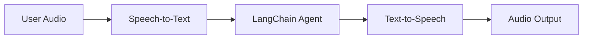
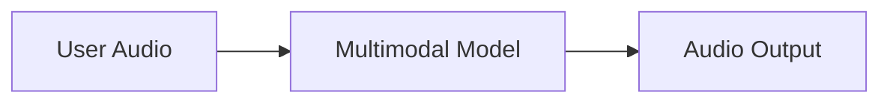

## Overview

Chat interfaces have dominated how we interact with AI, but recent breakthroughs in multimodal AI are opening up exciting new possibilities. High-quality generative models and expressive text-to-speech (TTS) systems now make it possible to build agents that feel less like tools and more like conversational partners.

Voice agents are one example of this. Instead of relying on a keyboard and mouse to type inputs into an agent, you can use spoken words to interact with it. This can be a more natural and engaging way to interact with AI, and can be especially useful for certain contexts.

### What are voice agents?

Voice agents are [agents](/oss/python/langchain/agents) that can engage in natural spoken conversations with users. These agents combine speech recognition, natural language processing, generative AI, and text-to-speech technologies to create seamless, natural conversations.

They're suited for a variety of use cases, including:

- Customer support
- Personal assistants
- Hands-free interfaces
- Coaching and training

### How do voice agents work?

At a high level, every voice agent needs to handle three tasks:

1. **Listen** - capture audio and transcribe it
2. **Think** - interpret intent, reason, plan
3. **Speak** - generate audio and stream it back to the user

The difference lies in how these steps are sequenced and coupled. In practice, production agents follow one of two main architectures:

#### 1. STT > Agent > TTS architecture (The "Sandwich")

The Sandwich architecture composes three distinct components: speech-to-text (STT), a text-based LangChain agent, and text-to-speech (TTS).



**Pros:**
- Full control over each component (swap STT/TTS providers as needed)
- Access to latest capabilities from modern text-modality models
- Transparent behavior with clear boundaries between components

**Cons:**
- Requires orchestrating multiple services
- Additional complexity in managing the pipeline
- Conversion from speech to text loses information (e.g., tone, emotion)

#### 2. Speech-to-Speech architecture (S2S)

Speech-to-speech uses a multimodal model that processes audio input and generates audio output natively.



**Pros:**
- Simpler architecture with fewer moving parts
- Typically lower latency for simple interactions
- Direct audio processing captures tone and other nuances of speech

**Cons:**
- Limited model options, greater risk of provider lock-in
- Features may lag behind text-modality models
- Less transparency in how audio is processed
- Reduced controllability and customization options

This guide demonstrates the **sandwich architecture** to balance performance, controllability, and access to modern model capabilities. The sandwich can achieve sub-700ms latency with some STT and TTS providers while maintaining control over modular components.

### Demo Application overview

We'll walk through building a voice-based agent using the sandwich architecture. The agent will manage orders for a sandwich shop. The application will demonstrate all three components of the sandwich architecture, using [AssemblyAI](https://www.assemblyai.com/) for STT and [Cartesia](https://cartesia.ai/) for TTS (although adapters can be built for most providers).

An end-to-end reference application is available in the [voice-sandwich-demo](https://github.com/langchain-ai/voice-sandwich-demo) repository. We will walk through that application here.

The demo uses WebSockets for real-time bidirectional communication between the browser and server. The same architecture can be adapted for other transports like telephony systems (Twilio, Vonage) or WebRTC connections.

### Architecture

The demo implements a streaming pipeline where each stage processes data asynchronously:

**Client (Browser)**
- Captures microphone audio and encodes it as PCM
- Establishes WebSocket connection to the backend server
- Streams audio chunks to the server in real-time
- Receives and plays back synthesized speech audio

**Server (Python)**


- Accepts WebSocket connections from clients
- Orchestrates the three-step pipeline:
  - [Speech-to-text (STT)](#1-speech-to-text): Forwards audio to the STT provider (e.g., AssemblyAI), receives transcript events
  - [Agent](#2-langchain-agent): Processes transcripts with LangChain agent, streams response tokens
  - [Text-to-speech (TTS)](#3-text-to-speech): Sends agent responses to the TTS provider (e.g., Cartesia), receives audio chunks

- Returns synthesized audio to the client for playback

The pipeline uses async generators to enable streaming at each stage. This allows downstream components to begin processing before upstream stages complete, minimizing end-to-end latency.


## Setup

For detailed installation instructions and setup, see the [repository README](https://github.com/langchain-ai/voice-sandwich-demo#readme).

## 1. Speech-to-text

The STT stage transforms an incoming audio stream into text transcripts. The implementation uses a producer-consumer pattern to handle audio streaming and transcript reception concurrently.

### Key concepts

**Producer-Consumer Pattern**: Audio chunks are sent to the STT service concurrently with receiving transcript events. This allows transcription to begin before all audio has arrived.

**Event Types**:
- `stt_chunk`: Partial transcripts provided as the STT service processes audio
- `stt_output`: Final, formatted transcripts that trigger agent processing

**WebSocket Connection**: Maintains a persistent connection to AssemblyAI's real-time STT API, configured for 16kHz PCM audio with automatic turn formatting.

### Implementation

```python
from typing import AsyncIterator
import asyncio
from assemblyai_stt import AssemblyAISTT
from events import VoiceAgentEvent

async def stt_stream(
    audio_stream: AsyncIterator[bytes],
) -> AsyncIterator[VoiceAgentEvent]:
    """
    Transform stream: Audio (Bytes) → Voice Events (VoiceAgentEvent)

    Uses a producer-consumer pattern where:
    - Producer: Reads audio chunks and sends them to AssemblyAI
    - Consumer: Receives transcription events from AssemblyAI
    """
    stt = AssemblyAISTT(sample_rate=16000)

    async def send_audio():
        """Background task that pumps audio chunks to AssemblyAI."""
        try:
            async for audio_chunk in audio_stream:
                await stt.send_audio(audio_chunk)
        finally:
            # Signal completion when audio stream ends
            await stt.close()

    # Launch audio sending in background
    send_task = asyncio.create_task(send_audio())

    try:
        # Receive and yield transcription events as they arrive
        async for event in stt.receive_events():
            yield event
    finally:
        # Cleanup
        with contextlib.suppress(asyncio.CancelledError):
            send_task.cancel()
            await send_task
        await stt.close()
```


The application implements an AssemblyAI client to manage the WebSocket connection and message parsing. See below for implementations; similar adapters can be constructed for other STT providers.

<Accordion title="AssemblyAI Client">

```python
class AssemblyAISTT:
    def __init__(self, api_key: str | None = None, sample_rate: int = 16000):
        self.api_key = api_key or os.getenv("ASSEMBLYAI_API_KEY")
        self.sample_rate = sample_rate
        self._ws: WebSocketClientProtocol | None = None

    async def send_audio(self, audio_chunk: bytes) -> None:
        """Send PCM audio bytes to AssemblyAI."""
        ws = await self._ensure_connection()
        await ws.send(audio_chunk)

    async def receive_events(self) -> AsyncIterator[STTEvent]:
        """Yield STT events as they arrive from AssemblyAI."""
        async for raw_message in self._ws:
            message = json.loads(raw_message)

            if message["type"] == "Turn":
                # Final formatted transcript
                if message.get("turn_is_formatted"):
                    yield STTOutputEvent.create(message["transcript"])
                # Partial transcript
                else:
                    yield STTChunkEvent.create(message["transcript"])

    async def _ensure_connection(self) -> WebSocketClientProtocol:
        """Establish WebSocket connection if not already connected."""
        if self._ws is None:
            url = f"wss://streaming.assemblyai.com/v3/ws?sample_rate={self.sample_rate}&format_turns=true"
            self._ws = await websockets.connect(
                url,
                additional_headers={"Authorization": self.api_key}
            )
        return self._ws
```


</Accordion>

## 2. LangChain agent

The agent stage processes text transcripts through a LangChain [agent](/oss/python/langchain/agents) and streams the response tokens. In this case, we stream all [text content blocks](/oss/python/langchain/messages#textcontentblock) generated by the agent.

### Key concepts

**Streaming Responses**: The agent uses [`stream_mode="messages"`](/oss/python/langchain/streaming#llm-tokens) to emit response tokens as they're generated, rather than waiting for the complete response. This enables the TTS stage to begin synthesis immediately.

**Conversation Memory**: A [checkpointer](/oss/python/langchain/short-term-memory) maintains conversation state across turns using a unique thread ID. This allows the agent to reference previous exchanges in the conversation.

### Implementation

```python
from uuid import uuid4
from langchain.agents import create_agent
from langchain.messages import HumanMessage
from langgraph.checkpoint.memory import InMemorySaver

# Define agent tools
def add_to_order(item: str, quantity: int) -> str:
    """Add an item to the customer's sandwich order."""
    return f"Added {quantity} x {item} to the order."

def confirm_order(order_summary: str) -> str:
    """Confirm the final order with the customer."""
    return f"Order confirmed: {order_summary}. Sending to kitchen."

# Create agent with tools and memory
agent = create_agent(
    model="anthropic:claude-haiku-4-5",  # Select your model
    tools=[add_to_order, confirm_order],
    system_prompt="""You are a helpful sandwich shop assistant.
    Your goal is to take the user's order. Be concise and friendly.
    Do NOT use emojis, special characters, or markdown.
    Your responses will be read by a text-to-speech engine.""",
    checkpointer=InMemorySaver(),
)

async def agent_stream(
    event_stream: AsyncIterator[VoiceAgentEvent],
) -> AsyncIterator[VoiceAgentEvent]:
    """
    Transform stream: Voice Events → Voice Events (with Agent Responses)

    Passes through all upstream events and adds agent_chunk events
    when processing STT transcripts.
    """
    # Generate unique thread ID for conversation memory
    thread_id = str(uuid4())

    async for event in event_stream:
        # Pass through all upstream events
        yield event

        # Process final transcripts through the agent
        if event.type == "stt_output":
            # Stream agent response with conversation context
            stream = agent.astream(
                {"messages": [HumanMessage(content=event.transcript)]},
                {"configurable": {"thread_id": thread_id}},
                stream_mode="messages",
            )

            # Yield agent response chunks as they arrive
            async for message, _ in stream:
                if message.text:
                    yield AgentChunkEvent.create(message.text)
```


## 3. Text-to-speech

The TTS stage synthesizes agent response text into audio and streams it back to the client. Like the STT stage, it uses a producer-consumer pattern to handle concurrent text sending and audio reception.

### Key concepts

**Concurrent Processing**: The implementation merges two async streams:
- **Upstream processing**: Passes through all events and sends agent text chunks to the TTS provider
- **Audio reception**: Receives synthesized audio chunks from the TTS provider

**Streaming TTS**: Some providers (such as [Cartesia](https://cartesia.ai/)) begin synthesizing audio as soon as it receives text, enabling audio playback to start before the agent finishes generating its complete response.

**Event Passthrough**: All upstream events flow through unchanged, allowing the client or other observers to track the full pipeline state.

### Implementation

```python
from cartesia_tts import CartesiaTTS
from utils import merge_async_iters

async def tts_stream(
    event_stream: AsyncIterator[VoiceAgentEvent],
) -> AsyncIterator[VoiceAgentEvent]:
    """
    Transform stream: Voice Events → Voice Events (with Audio)

    Merges two concurrent streams:
    1. process_upstream(): passes through events and sends text to Cartesia
    2. tts.receive_events(): yields audio chunks from Cartesia
    """
    tts = CartesiaTTS()

    async def process_upstream() -> AsyncIterator[VoiceAgentEvent]:
        """Process upstream events and send agent text to Cartesia."""
        async for event in event_stream:
            # Pass through all events
            yield event
            # Send agent text to Cartesia for synthesis
            if event.type == "agent_chunk":
                await tts.send_text(event.text)

    try:
        # Merge upstream events with TTS audio events
        # Both streams run concurrently
        async for event in merge_async_iters(
            process_upstream(),
            tts.receive_events()
        ):
            yield event
    finally:
        await tts.close()
```


The application implements an Cartesia client to manage the WebSocket connection and audio streaming. See below for implementations; similar adapters can be constructed for other TTS providers.

<Accordion title="Cartesia Client">

```python
import base64
import json
import websockets

class CartesiaTTS:
    def __init__(
        self,
        api_key: Optional[str] = None,
        voice_id: str = "f6ff7c0c-e396-40a9-a70b-f7607edb6937",
        model_id: str = "sonic-3",
        sample_rate: int = 24000,
        encoding: str = "pcm_s16le",
    ):
        self.api_key = api_key or os.getenv("CARTESIA_API_KEY")
        self.voice_id = voice_id
        self.model_id = model_id
        self.sample_rate = sample_rate
        self.encoding = encoding
        self._ws: WebSocketClientProtocol | None = None

    def _generate_context_id(self) -> str:
        """Generate a valid context_id for Cartesia."""
        timestamp = int(time.time() * 1000)
        counter = self._context_counter
        self._context_counter += 1
        return f"ctx_{timestamp}_{counter}"

    async def send_text(self, text: str | None) -> None:
        """Send text to Cartesia for synthesis."""
        if not text or not text.strip():
            return

        ws = await self._ensure_connection()
        payload = {
            "model_id": self.model_id,
            "transcript": text,
            "voice": {
                "mode": "id",
                "id": self.voice_id,
            },
            "output_format": {
                "container": "raw",
                "encoding": self.encoding,
                "sample_rate": self.sample_rate,
            },
            "language": self.language,
            "context_id": self._generate_context_id(),
        }
        await ws.send(json.dumps(payload))

    async def receive_events(self) -> AsyncIterator[TTSChunkEvent]:
        """Yield audio chunks as they arrive from Cartesia."""
        async for raw_message in self._ws:
            message = json.loads(raw_message)

            # Decode and yield audio chunks
            if "data" in message and message["data"]:
                audio_chunk = base64.b64decode(message["data"])
                if audio_chunk:
                    yield TTSChunkEvent.create(audio_chunk)

    async def _ensure_connection(self) -> WebSocketClientProtocol:
        """Establish WebSocket connection if not already connected."""
        if self._ws is None:
            url = (
                f"wss://api.cartesia.ai/tts/websocket"
                f"?api_key={self.api_key}&cartesia_version={self.cartesia_version}"
            )
            self._ws = await websockets.connect(url)

        return self._ws
```


</Accordion>


## Putting it all together

The complete pipeline chains the three stages together:

```python
from langchain_core.runnables import RunnableGenerator

pipeline = (
    RunnableGenerator(stt_stream)      # Audio → STT events
    | RunnableGenerator(agent_stream)  # STT events → Agent events
    | RunnableGenerator(tts_stream)    # Agent events → TTS audio
)

# Use in WebSocket endpoint
@app.websocket("/ws")
async def websocket_endpoint(websocket: WebSocket):
    await websocket.accept()

    async def websocket_audio_stream():
        """Yield audio bytes from WebSocket."""
        while True:
            data = await websocket.receive_bytes()
            yield data

    # Transform audio through pipeline
    output_stream = pipeline.atransform(websocket_audio_stream())

    # Send TTS audio back to client
    async for event in output_stream:
        if event.type == "tts_chunk":
            await websocket.send_bytes(event.audio)
```

We use [RunnableGenerators](https://reference.langchain.com/python/langchain_core/runnables/#langchain_core.runnables.base.RunnableGenerator) to compose each step of the pipeline. This is an abstraction LangChain uses internally to manage [streaming across components](https://reference.langchain.com/python/langchain_core/runnables/).


Each stage processes events independently and concurrently: audio transcription begins as soon as audio arrives, the agent starts reasoning as soon as a transcript is available, and speech synthesis begins as soon as agent text is generated. This architecture can achieve sub-700ms latency to support natural conversation.

For more on building agents with LangChain, see the [Agents guide](/oss/python/langchain/agents).

---

<Callout icon="pen-to-square" iconType="regular">
    [Edit this page on GitHub](https://github.com/langchain-ai/docs/edit/main/src/oss/langchain/voice-agent.mdx) or [file an issue](https://github.com/langchain-ai/docs/issues/new/choose).
</Callout>
<Tip icon="terminal" iconType="regular">
    [Connect these docs](/use-these-docs) to Claude, VSCode, and more via MCP for real-time answers.
</Tip>
